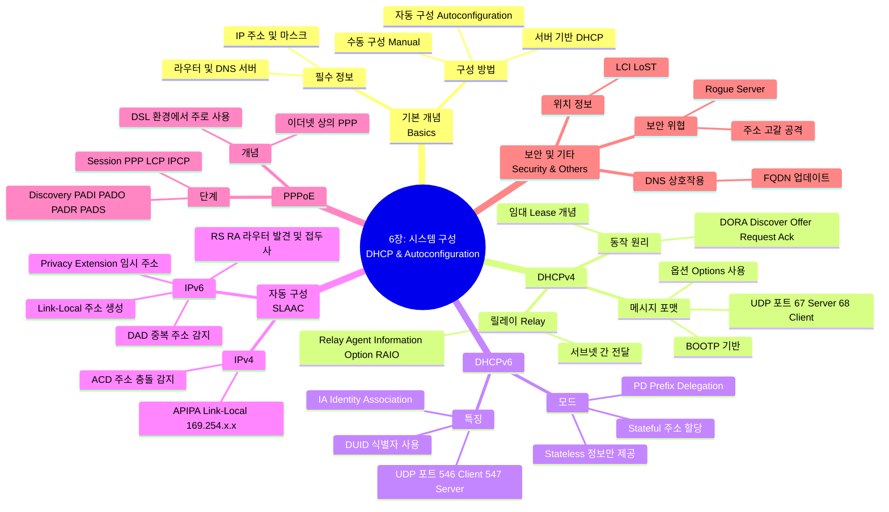

[[01_inbox/books/tcp_ip_illustrated_1/roadmap|📖 Return to Roadmap]]

### 1. Mermaid Mindmap

---

### 2. 중요 정보 및 맥락 요약

**6장: 시스템 구성: DHCP와 자동 구성 (System Configuration: DHCP and Autoconfiguration)**

이 장에서는 호스트가 TCP/IP 네트워크에서 통신하기 위해 필요한 IP 주소, 서브넷 마스크, 기본 라우터, DNS 서버 등의 필수 정보를 얻는 방법인 DHCP, SLAAC, 그리고 PPPoE에 대해 다룹니다.

#### 1. DHCP (Dynamic Host Configuration Protocol)

*   **개념 및 목적:** DHCP는 클라이언트/서버 프로토콜로, 호스트에 IP 주소와 기타 구성 정보를 동적으로 할당합니다. 이는 과거의 BOOTP(Bootstrap Protocol)를 확장한 것으로, **임대(Lease)** 개념을 도입하여 IP 주소를 효율적으로 관리합니다.
*   **동작 방식 (IPv4):** 클라이언트는 브로드캐스트를 통해 서버를 찾고 주소를 요청합니다. 전형적인 4단계 교환 과정은 다음과 같습니다,.
    1.  **DHCPDISCOVER:** 클라이언트가 서버를 찾기 위해 브로드캐스트.
    2.  **DHCPOFFER:** 서버가 IP 주소와 임대 시간을 제안.
    3.  **DHCPREQUEST:** 클라이언트가 특정 서버의 제안을 선택하고 주소 사용을 요청 (또는 임대 갱신).
    4.  **DHCPACK:** 서버가 요청을 승인하고 구성을 확정.
*   **메시지 포맷:** DHCP 메시지는 BOOTP 메시지 형식을 기반으로 하며, UDP 포트 67(서버)과 68(클라이언트)을 사용합니다. 추가적인 기능은 가변 길이의 **옵션(Options)** 필드를 통해 구현됩니다,.
*   **릴레이 에이전트 (Relay Agent):** 클라이언트와 서버가 서로 다른 서브넷에 있을 때, 라우터가 DHCP 메시지를 중계해 줍니다. 이때 **Relay Agent Information Option (RAIO)**을 사용하여 클라이언트의 회선 ID 등의 추가 정보를 서버에 전달할 수 있습니다,.

#### 2. DHCPv6

*   **IPv4와의 차이:** DHCPv6는 IPv6를 위해 재설계되었으며 UDP 포트 546(클라이언트)과 547(서버)을 사용합니다. MAC 주소 대신 **DUID (DHCP Unique Identifier)**를 사용하여 클라이언트와 서버를 식별하며, 주소 묶음을 관리하기 위해 **IA (Identity Association)** 개념을 사용합니다,.
*   **모드:**
    *   **Stateful:** 서버가 클라이언트에게 IPv6 주소와 기타 정보를 모두 할당하고 상태를 관리합니다.
    *   **Stateless:** 클라이언트는 SLAAC를 통해 주소를 생성하고, DHCPv6 서버는 DNS 서버 주소와 같은 부가 정보만 제공합니다,.
*   **Prefix Delegation (PD):** ISP가 고객 라우터에게 하위 네트워크에서 사용할 IPv6 프리픽스(주소 대역)를 할당해 주는 기능입니다.

#### 3. 무상태 주소 자동 구성 (SLAAC)

*   **IPv4 Link-Local (APIPA):** DHCP 서버가 없는 경우, 호스트는 169.254.0.0/16 대역에서 임의의 주소를 선택하여 링크 로컬 주소로 사용합니다. 주소 충돌을 방지하기 위해 ARP를 이용한 **ACD (Address Conflict Detection)**를 수행합니다,.
*   **IPv6 SLAAC:** IPv6 호스트는 라우터 없이도 링크 로컬 주소를 스스로 생성할 수 있습니다.
    *   **링크 로컬 주소 생성:** `fe80::` 접두사와 인터페이스 식별자(MAC 주소 기반 또는 무작위)를 조합합니다.
    *   **DAD (Duplicate Address Detection):** 생성된 주소가 중복되는지 확인하기 위해 ICMPv6 Neighbor Solicitation 메시지를 사용합니다.
    *   **글로벌 주소 생성:** 라우터가 보내는 **Router Advertisement (RA)** 메시지의 프리픽스 정보를 사용하여 글로벌 주소를 생성합니다. 보안을 위해 시간이 지나면 바뀌는 임시 주소(Temporary Address)를 사용할 수도 있습니다,.

#### 4. PPP over Ethernet (PPPoE)

*   **용도:** DSL과 같은 광대역 접속 환경에서 사용자 인증과 IP 할당을 위해 사용됩니다. 이더넷 프레임 안에 PPP 프레임을 캡슐화하여 전송합니다.
*   **단계:**
    *   **Discovery 단계:** 클라이언트와 액세스 콘센트레이터(AC)가 MAC 주소와 세션 ID를 교환합니다. PADI(개시), PADO(제안), PADR(요청), PADS(세션 확인) 메시지가 사용됩니다.
    *   **Session 단계:** PPP 세션이 수립되어 데이터가 전송되며, LCP와 IPCP를 통해 IP 주소가 할당됩니다,.

#### 5. 기타 기능 및 보안

*   **DNS 상호작용:** DHCP 서버는 클라이언트에게 할당한 IP 주소와 호스트 이름을 DNS 서버에 동적으로 업데이트하여 이름 풀이가 가능하도록 지원할 수 있습니다.
*   **위치 정보:** DHCP 옵션을 통해 클라이언트의 물리적 위치(LCI)나 긴급 서비스 위치(LoST) 정보를 제공할 수 있습니다.
*   **보안:** 기본적으로 DHCP와 ND는 인증 기능이 없어 스푸핑 공격이나 Rogue 서버 공격에 취약합니다. 이를 보완하기 위해 DHCP 인증 옵션이나 IPv6의 SEND(Secure Neighbor Discovery) 프로토콜, 스위치의 DHCP Snooping 기능 등이 제안되었습니다,.