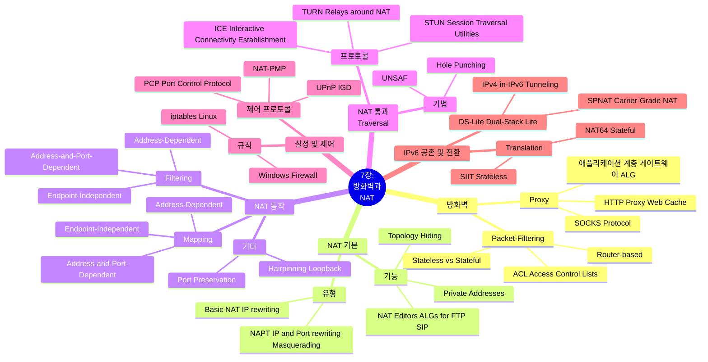

[📖 Return to Roadmap](roadmap.md)

---

## 중요 정보 및 맥락 요약

**7 장: 방화벽과 네트워크 주소 변환 (Firewalls and Network Address Translation)**

이 장에서는 인터넷 보안을 위한 방화벽의 원리와 IPv4 주소 고갈 문제를 완화하고 보안 기능을 제공하는 NAT(Network Address Translation) 의 동작 방식, 그리고 NAT 환경에서 통신을 원활하게 하기 위한 트래버설 (Traversal) 기술들을 다룹니다.

### 1. 방화벽 (Firewalls)

- **패킷 필터링 방화벽 (Packet-Filtering Firewalls):** 인터넷 라우터로서 동작하며 특정 기준 (IP 주소, 포트 번호, 프로토콜 등) 에 따라 패킷을 전달하거나 차단 (drop) 합니다. **Stateless** 방화벽은 각 데이터그램을 독립적으로 처리하지만, **Stateful** 방화벽은 이전 패킷과의 연관성 (예: TCP 연결 상태) 을 추적하여 더 정교한 필터링을 수행합니다.
- **프록시 방화벽 (Proxy Firewalls):** 라우터가 아닌 멀티홈 호스트나 ALG(Application-Level Gateway) 로 동작합니다. 클라이언트는 실제 서버 대신 프록시에 연결하고, 프록시가 대신 통신을 수행합니다. HTTP 프록시 (웹 캐시) 와 SOCKS 프로토콜이 대표적입니다.

### 2. 네트워크 주소 변환 (NAT)

- **개념:** 사설 주소 (Private Address) 영역과 글로벌 인터넷 주소 영역을 분리하고, 경계 라우터에서 패킷의 주소 (및 포트) 를 재작성하여 통신을 가능하게 합니다. 이는 IPv4 주소 고갈을 지연시키고 토폴로지 은폐 (Topology Hiding) 를 통한 보안 효과를 제공합니다.
- **유형:**
    - **Basic NAT:** IP 주소만 변환합니다.
    - **NAPT (Network Address Port Translation):** IP 주소와 전송 계층 식별자 (TCP/UDP 포트, ICMP 쿼리 ID) 를 모두 변환합니다. 여러 내부 호스트가 소수의 공인 IP(보통 1 개) 를 공유할 수 있어 가장 널리 사용됩니다 (IP 마스커레이딩이라고도 함).
- **동작 및 분류 (BEHAVE):** IETF BEHAVE 워킹 그룹은 NAT 의 동작을 명확히 분류했습니다.
    - **매핑 동작:** 내부의 `X:x` 가 외부 `Y1:y1`, `Y2:y2` 로 통신할 때 할당되는 외부 매핑 `X':x'` 의 일관성에 관한 것입니다. **Endpoint-Independent Mapping**은 목적지가 달라도 동일한 외부 매핑을 사용합니다,.
    - **필터링 동작:** 외부에서 내부로 들어오는 트래픽의 허용 기준입니다. **Endpoint-Independent Filtering**은 매핑이 생성되면 모든 외부 호스트의 패킷을 허용합니다.
    - **헤어피닝 (Hairpinning):** 내부 호스트가 내부 서버의 '공인 IP'로 접속할 때, NAT 가 이를 다시 내부로 라우팅해주는 기능 (NAT Loopback) 입니다.
- **NAT Editors (ALGs):** FTP 나 SIP 처럼 페이로드 안에 IP 주소를 포함하는 프로토콜을 지원하기 위해, NAT 는 패킷의 데이터를 검사하고 수정하는 기능이 필요할 수 있습니다.

### 3. NAT 통과 (NAT Traversal)

NAT 뒤에 있는 호스트끼리 직접 통신하거나 외부에서 접근해야 할 때 (예: P2P, VoIP) 발생하는 문제를 해결하기 위한 기술들입니다.

- **홀 펀칭 (Hole Punching):** 서버를 이용해 상대방의 외부 매핑 정보를 교환한 후, 피어들이 직접 연결을 시도하여 NAT 에 매핑 (핀홀) 을 생성하는 기법입니다.
- **STUN (Session Traversal Utilities for NAT):** 클라이언트가 자신의 공인 IP 와 포트를 발견하고 NAT 매핑을 유지 (Keepalive) 할 수 있게 해주는 프로토콜입니다.
- **TURN (Traversal Using Relays around NAT):** NAT 가 엄격하여 (Symmetric NAT 등) 직접 통신이 불가능할 때, 공인망에 있는 릴레이 서버를 통해 데이터를 중계하는 방식입니다. 최후의 수단으로 사용됩니다.
- **ICE (Interactive Connectivity Establishment):** STUN 과 TURN 을 결합하여 최적의 연결 경로 (직접 연결, 릴레이 등) 를 찾아내는 프레임워크로, SIP/VoIP 등에서 널리 사용됩니다,.

### 4. 설정 및 제어 (Configuration & Control)

- **규칙 설정:** Linux 의 `iptables` 와 같은 도구를 사용하여 필터링 규칙과 NAT(Masquerading) 동작을 설정할 수 있습니다.
- **제어 프로토콜:** 애플리케이션이 NAT/방화벽과 직접 통신하여 포트 매핑을 요청할 수 있는 프로토콜로, **UPnP (IGD)**와 Apple 의 **NAT-PMP**(현재는 **PCP**로 발전) 가 있습니다.

### 5. IPv4/IPv6 공존 및 전환 (Transition)

IPv4 주소 고갈과 IPv6 도입 지연에 대응하기 위한 NAT 기술들입니다.

- **SPNAT (Service Provider NAT):** ISP 레벨에서 대규모로 수행하는 NAT(CGN) 입니다.
- **DS-Lite (Dual-Stack Lite):** ISP 는 IPv6 망만 운영하고, 고객의 IPv4 트래픽은 IPv6 터널을 통해 ISP 의 CGN(AFTR) 으로 전달되어 인터넷에 접속하는 방식입니다.
- **NAT64/DNS64:** IPv6 전용 클라이언트가 IPv4 전용 서버와 통신할 수 있도록 해주는 번역 기술입니다. DNS64 는 A 레코드를 AAAA 레코드로 변환하고, NAT64 는 패킷 헤더를 변환합니다,,.

### 6. 보안 (Security)

- **단편화 공격:** 상태 기반 (Stateful) 방화벽이나 NAT 가 IP 단편화 (Fragmentation) 된 패킷을 처리할 때, 첫 번째 조각 (포트 정보 포함) 이 없으면 필터링 결정을 내리기 어려워 공격에 취약할 수 있습니다.
- **NAT 하이재킹:** 외부에서 NAT 의 공인 IP 로 위장하여 내부 네트워크를 공격하거나 트래픽을 가로채는 위험이 있습니다.
