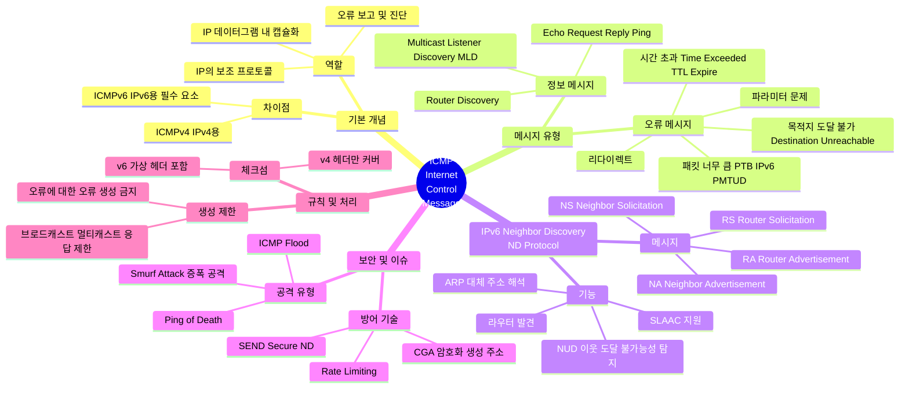

[📖 Return to Roadmap](roadmap.md)

## See Also
- [Routing TCP/IP Vol.1 - Ch.1 TCP/IP Review](chapter1.md)

## 1. Mermaid Mindmap

---

## 2. 중요 정보 및 맥락 요약

**8 장: ICMPv4 및 ICMPv6: 인터넷 제어 메시지 프로토콜**

이 장에서는 IP 프로토콜의 신뢰성과 진단 기능을 보완하는 ICMP 의 구조, 메시지 유형, 그리고 IPv6 에서 핵심적인 역할을 수행하는 Neighbor Discovery(ND) 에 대해 상세히 다룹니다.

### 1. 개요 및 캡슐화 (Introduction & Encapsulation)

- **역할:** IP 는 데이터 전달 중 발생한 문제 (예: 목적지 도달 불가) 를 전송원에게 알릴 직접적인 방법이 없기 때문에, ICMP 가 이를 보완하여 오류 보고 및 진단 정보를 제공합니다.
- **캡슐화:** ICMP 메시지는 IP 데이터그램 내부에 캡슐화되어 전송됩니다. ICMPv4 는 IPv4 헤더의 프로토콜 필드 값 1 을 사용하고, ICMPv6 는 IPv6 확장 헤더 체인에서 Next Header 값 58 을 사용합니다.
- **체크섬:** ICMPv4 체크섬은 ICMP 메시지만을 커버하지만, ICMPv6 체크섬은 IPv6 헤더의 일부 (주소 등) 를 포함하는 가상 헤더 (Pseudo-header) 까지 포함하여 계산한다는 차이가 있습니다.

### 2. ICMP 메시지 유형 (Message Types)

ICMP 메시지는 크게 **오류 메시지 (Error Messages)**와 **정보/쿼리 메시지 (Informational Messages)**로 나뉩니다.

- **오류 메시지:**
    - **Destination Unreachable (목적지 도달 불가):** 라우터나 호스트가 패킷을 전달할 수 없을 때 생성됩니다. IPv4 에서는 코드 3(Port Unreachable) 이 UDP 포트가 닫혀있을 때 주로 사용됩니다.
    - **Packet Too Big (PTB):** IPv6 에서 중요한 메시지로, 패킷 크기가 다음 링크의 MTU 보다 클 때 생성됩니다. 이는 IPv6 의 경로 MTU 발견 (PMTUD) 메커니즘의 핵심입니다.
    - **Time Exceeded (시간 초과):** TTL(IPv4) 이나 Hop Limit(IPv6) 이 0 이 되어 패킷이 폐기될 때 생성됩니다. `traceroute` 도구가 이 메시지를 이용하여 경로상의 라우터를 식별합니다.
    - **Redirect (리다이렉트):** 라우터가 호스트에게 더 나은 경로 (다른 라우터) 가 있음을 알릴 때 사용합니다.
- **정보 메시지:**
    - **Echo Request/Reply:** `ping` 프로그램이 사용하는 메시지로, 호스트의 도달 가능성을 테스트합니다.
    - **Router Discovery:** 라우터 권유 (RS) 와 광고 (RA) 를 통해 호스트가 로컬 라우터를 찾습니다. IPv4 에서는 DHCP 가 주로 쓰여 잘 사용되지 않지만, IPv6 에서는 필수적입니다.

### 3. 메시지 처리 규칙 (Processing Rules)

브로드캐스트 폭풍 (Broadcast Storm) 을 방지하기 위해 ICMP 오류 메시지 생성에는 엄격한 규칙이 적용됩니다.

- ICMP 오류 메시지에 대한 반응으로 또 다른 ICMP 오류 메시지를 생성하지 않습니다.
- 브로드캐스트나 멀티캐스트 주소로 전송된 패킷에 대해서는 오류 메시지를 생성하지 않습니다.
- 단편화된 패킷의 첫 번째 조각 (first fragment) 이 아닌 경우 오류 메시지를 생성하지 않습니다.
- 보안 및 대역폭 관리를 위해 ICMP 메시지 전송에 **토큰 버킷 (Token Bucket)** 등을 이용한 속도 제한 (Rate Limiting) 을 적용하는 것이 권장됩니다.

### 4. IPv6 Neighbor Discovery (ND)

IPv6 에서 ICMPv6 는 IPv4 의 ARP, RARP, ICMPv4 Router Discovery 기능을 모두 통합하고 확장한 Neighbor Discovery 프로토콜을 포함합니다.

- **Router Solicitation (RS) / Router Advertisement (RA):** 호스트가 라우터를 찾고 (RS), 라우터가 자신의 존재와 네트워크 프리픽스 정보 등을 알립니다 (RA). 이는 IPv6 의 상태 비저장 주소 자동 설정 (SLAAC) 의 기반이 됩니다.
- **Neighbor Solicitation (NS) / Neighbor Advertisement (NA):** IPv4 의 ARP 와 유사하게 논리적 주소 (IP) 를 링크 계층 주소 (MAC) 로 변환하거나, 이웃 호스트의 도달 가능성을 확인 (NUD: Neighbor Unreachability Detection) 하는 데 사용됩니다. ARP 와 달리 브로드캐스트가 아닌 요청된 노드 (Solicited-Node) 멀티캐스트 주소를 사용하여 효율적입니다.
- **Redirect:** IPv4 와 마찬가지로 더 효율적인 넥스트 홉을 알리는 데 사용됩니다.

### 5. 멀티캐스트 리스너 발견 (MLD)

IPv6 에서는 멀티캐스트 그룹 관리를 위해 별도의 IGMP 프로토콜 대신 ICMPv6 메시지인 MLD(Multicast Listener Discovery) 를 사용합니다.

- **MLD Query/Report/Done:** 라우터가 멀티캐스트 수신자가 있는지 확인하거나 (Query), 호스트가 그룹에 가입/탈퇴 (Report/Done) 할 때 사용합니다.

### 6. 보안 (Security)

- **SEND (Secure Neighbor Discovery):** ND 메시지는 스푸핑 공격에 취약할 수 있습니다. 이를 방지하기 위해 SEND 프로토콜은 암호화된 자격 증명과 **CGA (Cryptographically Generated Addresses)**를 사용하여 ND 메시지의 송신자를 인증합니다. CGA 는 공개키 정보를 주소 생성에 사용하여 주소 소유권을 증명합니다.
- **공격 유형:** ICMP 는 Smurf 공격 (브로드캐스트 핑을 통한 DoS), Ping of Death(잘못된 조각화 패킷 전송), TFN(Tribe Flood Network) 등 다양한 공격의 도구로 사용되어 왔습니다. 최신 방화벽과 OS 는 이러한 공격을 완화하도록 설계되었습니다.
