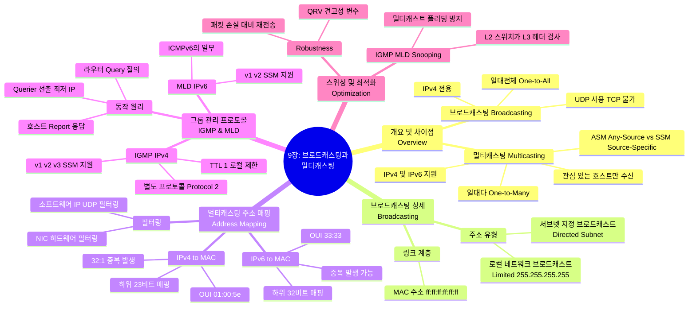

[[01_inbox/books/tcp_ip_illustrated_1/roadmap|📖 Return to Roadmap]]

### 1. Mermaid Mindmap

---

### 2. 중요 정보 및 맥락 요약

**9장: 브로드캐스팅과 로컬 멀티캐스팅 (IGMP 및 MLD)**

이 장에서는 단일 패킷을 여러 수신자에게 효율적으로 전송하기 위한 브로드캐스팅과 멀티캐스팅의 원리, 주소 변환 방식, 그리고 이를 관리하는 프로토콜인 IGMP와 MLD에 대해 다룹니다.

#### 1. 브로드캐스팅 (Broadcasting)

*   **개념:** 네트워크의 모든 호스트에게 메시지를 전송하는 방식입니다. IPv4에서는 지원하지만 IPv6에서는 지원하지 않으며(멀티캐스팅으로 대체), TCP와 같은 연결 지향 프로토콜이 아닌 UDP와 같은 프로토콜에서 주로 사용됩니다,.
*   **주소 유형:**
    *   **로컬 네트워크 브로드캐스트 (Limited Broadcast):** `255.255.255.255` 주소를 사용하며, 라우터를 넘어가지 않고 로컬 네트워크 내의 모든 호스트에게 전달됩니다.
    *   **서브넷 지정 브로드캐스트 (Directed Broadcast):** 특정 서브넷의 모든 호스트를 대상으로 합니다. 호스트 ID 부분이 모두 1인 주소(예: `10.0.0.127/25`)를 사용합니다,.
*   **링크 계층:** 이더넷과 같은 링크 계층에서는 `ff:ff:ff:ff:ff:ff`라는 특수 MAC 주소를 사용하여 브로드캐스트 프레임을 전송합니다.

#### 2. 멀티캐스팅 (Multicasting)

*   **개념:** 네트워크의 특정 그룹(관심 있는 수신자들)에게만 메시지를 전송하는 방식입니다. 브로드캐스팅보다 효율적이며, IPv4와 IPv6 모두 지원합니다.
*   **서비스 모델:**
    *   **ASM (Any-Source Multicast):** 송신자에 상관없이 특정 그룹 주소로 전송된 트래픽을 수신합니다.
    *   **SSM (Source-Specific Multicast):** 특정 송신자가 보내는 그룹 트래픽만 수신하거나 거부할 수 있어 효율성과 보안이 높습니다. IGMPv3와 MLDv2가 이를 지원합니다,.
*   **주소 매핑 (IP to MAC):** 효율적인 전달을 위해 IP 멀티캐스트 주소를 링크 계층(MAC) 주소로 변환해야 합니다. 하지만 IP 주소 공간보다 MAC 주소 공간이 작아 **중복(Overlap)**이 발생합니다.
    *   **IPv4:** IANA OUI `01:00:5e`와 IP 주소의 **하위 23비트**를 결합합니다. 상위 비트의 차이로 인해 32개의 서로 다른 IP 그룹이 동일한 MAC 주소로 매핑될 수 있습니다,.
    *   **IPv6:** OUI `33:33`과 IP 주소의 **하위 32비트**를 결합합니다. 역시 다대일 매핑이 발생할 수 있습니다,.
*   **필터링:** MAC 주소 중복으로 인해 원치 않는 패킷이 NIC(네트워크 인터페이스 카드)를 통과할 수 있으므로, IP 및 UDP 계층(소프트웨어)에서 추가적인 필터링이 수행되어야 합니다,.

#### 3. IGMP와 MLD: 그룹 관리 프로토콜

멀티캐스트 라우터가 연결된 서브넷에 어떤 멀티캐스트 그룹의 수신자가 있는지 파악하기 위해 사용하는 프로토콜입니다.
*   **프로토콜 비교:**
    *   **IGMP (Internet Group Management Protocol):** IPv4용이며, 별도의 IP 프로토콜(번호 2)로 캡슐화됩니다. TTL은 1로 설정되어 로컬 서브넷을 벗어나지 않습니다,.
    *   **MLD (Multicast Listener Discovery):** IPv6용이며, ICMPv6 메시지(type 130 등)로 구현됩니다,.
*   **동작 방식:**
    *   **Query (질의):** 멀티캐스트 라우터가 주기적으로(기본 125초) 호스트들에게 수신하고 있는 그룹 정보를 요청합니다.
    *   **Report (보고):** 호스트는 Query에 대한 응답으로, 또는 그룹에 가입/탈퇴할 때 Report 메시지를 보냅니다. IGMPv3/MLDv2에서는 특정 소스 목록을 포함(Include/Exclude)하여 보고할 수 있습니다,.
*   **Querier 선출:** 한 서브넷에 여러 멀티캐스트 라우터가 있을 경우, **가장 낮은 IP 주소**를 가진 라우터가 Querier로 선출되어 질의를 담당합니다,.

#### 4. 스위칭 최적화 및 보안

*   **IGMP/MLD Snooping:** 기본적으로 레이어 2 스위치는 멀티캐스트 프레임을 브로드캐스트(플러딩)합니다. 이를 방지하기 위해 스위치가 레이어 3 정보인 IGMP/MLD 메시지를 엿보아(snooping) 해당 그룹에 관심 있는 포트로만 트래픽을 전달하는 기능입니다.
*   **Robustness (견고성):** 패킷 손실에 대비하기 위해 QRV(Querier Robustness Variable) 값을 사용하여 상태 변경 보고를 여러 번 재전송하도록 조정할 수 있습니다.
*   **보안 이슈:** IGMP/MLD는 DoS 공격(대량의 그룹 가입 요청으로 대역폭 고갈)이나 구현 버그를 악용한 공격에 취약할 수 있습니다.