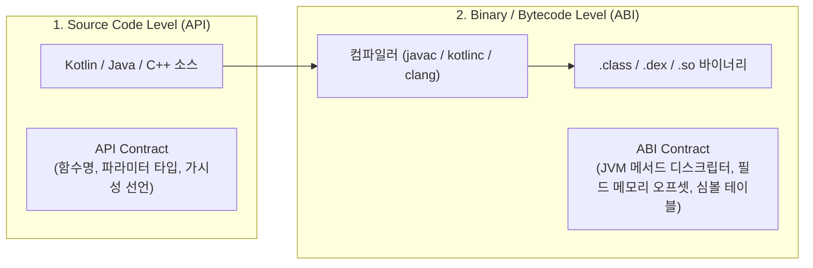
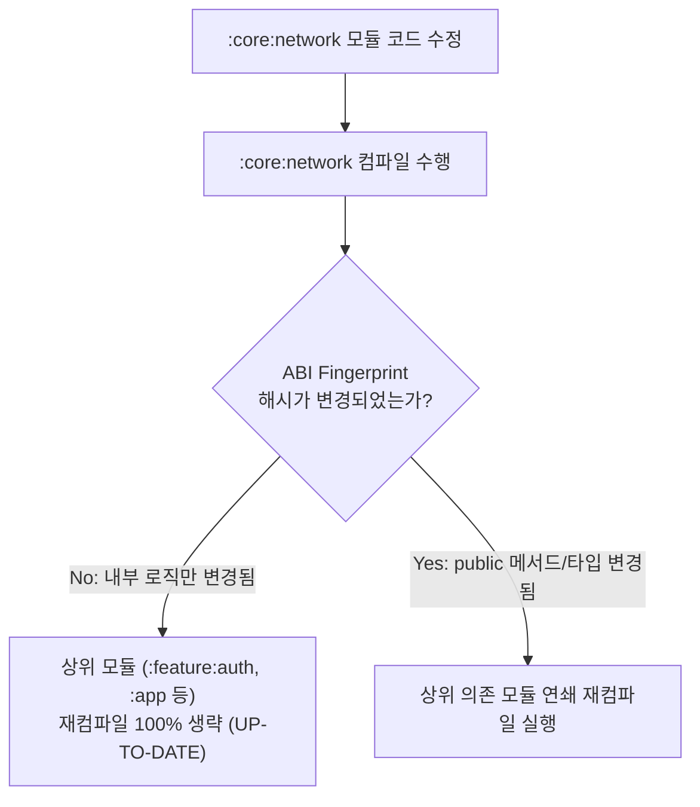

## API vs ABI (Application Programming Interface vs Application Binary Interface)

### 개요

소프트웨어 아키텍처와 빌드 시스템에서 모듈 간의 결합과 변경 전파를 이해하는 데 있어 **API(소스 코드 수준의 계약)** 와 **ABI(바이너리 수준의 계약)** 의 구분은 매우 중요하다.

현대 빌드 시스템(Gradle, Bazel 등)은 소스 코드의 단순 변경 여부가 아니라, **컴파일된 산출물의 ABI 가 변경되었는가(ABI Fingerprinting)**를 기준으로 하위 의존 모듈의 재컴파일 여부를 결정한다.



---

### 1. API 와 ABI 핵심 비교

| 비교 항목 | API (Application Programming Interface) | ABI (Application Binary Interface) |
|---|---|---|
| **정의** | **소스 코드 레벨**에서 프로그래머가 호출하고 구현할 수 있는 인터페이스 명세 | **컴파일된 바이너리 레벨**에서 프로그램 컴포넌트 간에 상호작용하는 물리적 규약 |
| **표현 형식** | 텍스트 기반 소스 코드 (`.kt`, `.java`, `.h`, `.h.in`) | 바이트코드/기계어 심볼 (`.class`, `.dex`, `.so`, JVM Method Descriptor) |
| **호환성 기준** | 소스 코드를 다시 컴파일했을 때 컴파일 에러 없이 빌드되는가? (**소스 호환성**) | 이미 컴파일된 다른 모듈을 재컴파일하지 않고도 런타임에 정상 링크/실행되는가? (**바이너리 호환성**) |
| **주요 변경 요인** | 함수명 변경, 파라미터 개수/타입 변경, 인터페이스 메서드 추가 | 메서드 바이트코드 시그니처 변경, 클래스 필드 레이아웃 오프셋 변경, 가상 메서드 테이블(vtable) 순서 변경 |

---

### 2. 소스 호환성(Source) vs 바이너리 호환성(Binary) 시나리오

```kotlin
// Version 1.0
class UserProfile(val id: String) {
    fun fetchDetails(): String = "User $id"
}

// Version 2.0 (내부 로직만 수정)
class UserProfile(val id: String) {
    fun fetchDetails(): String {
        // 내부 캐싱 및 로깅 추가 (Public 시그니처 불변)
        println("Fetching for $id")
        return "User $id (Cached)"
    }
}
```

- **위 시나리오의 결과**:
  - `fetchDetails()` 의 시그니처(이름, 파라미터 없음, 반환타입 String)가 동일하므로 **API 도 호환되고 ABI 도 100% 동일**하다.
  - 따라서 `UserProfile` 을 사용하는 다른 수십 개의 모듈들은 **재컴파일할 필요가 전혀 없다**.

```kotlin
// Version 3.0 (기본값 인자 추가)
class UserProfile(val id: String) {
    fun fetchDetails(useCache: Boolean = true): String = "User $id"
}
```

- **위 시나리오의 결과**:
  - 소스 레벨에서는 기존 코드 `userProfile.fetchDetails()` 가 그대로 컴파일되므로 **소스 호환성(API)은 유지**된다.
  - 하지만 컴파일된 바이트코드(ABI) 관점에서는 파라미터가 1 개 추가된 신규 메서드 `fetchDetails(Z)Ljava/lang/String;` 가 생성되고 기존 매개변수 없는 메서드는 사라지거나 합성(synthetic) 메서드로 대체된다.
  - 따라서 이전 1.0 버전에 바인딩되어 있던 다른 모듈들은 재컴파일하지 않고 런타임에 실행하면 `NoSuchMethodError` 가 발생한다 (**바이너리 호환성(ABI) 파괴**).

---

### 3. Gradle 빌드 최적화에서의 ABI 지문 (ABI Fingerprinting)

Gradle 은 멀티모듈 증분 빌드 시 **ABI Fingerprint(공개 바이너리 시그니처 해시)**를 계산한다.



- **`implementation` vs `api` 의 결정적 차이**:
  - `implementation` 으로 선언된 의존성의 ABI 가 바뀌더라도, 현재 모듈의 공개 ABI 에 누출되지 않았다면 상위 모듈로의 재컴파일 전파를 차단할 수 있다.

---

### 상위 및 연관 문서

- [JVM 클래스패스와 클래스 로딩 메커니즘](jvm-classpath.md)
- [링커와 로더 (Linker & Loader)](linker-and-loader.md)
- [Gradle 의존성 구성 및 클래스패스 격리](../mobile/android/03_packaging_deployment/build/gradle/gradle-build/gradle-dependency-configurations.md)
- [Gradle 태스크 모델과 지연 평가](../mobile/android/03_packaging_deployment/build/gradle/gradle-build/gradle-task-api.md)
