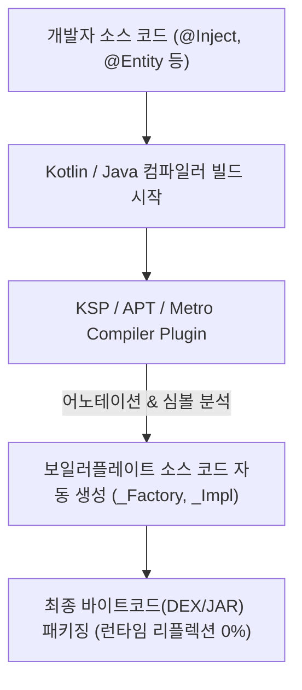

# Compile-time Code Generation (컴파일 타임 코드 생성 & KSP / APT)

## 1. 개요 (Overview)

**Compile-time Code Generation (컴파일 타임 코드 생성)** 은 애플리케이션을 빌드(컴파일)하는 시점에 어노테이션(Annotation)이나 코틀린 심볼(Symbol)을 분석하여, **런타임에 필요한 소스 코드를 자동으로 미리 생성(Generate)해 두는 메타프로그래밍 기술**이다.

컴파일러 플러그인이 빌드 타임에 작동하므로, 런타임에 클래스 구조를 동적으로 스캔하는 **[Reflection (런타임 리플렉션)](reflection.md)** 의 오버헤드를 100% 제거할 수 있다.

---

### 초보자를 위한 쉽게 이해하는 비유

* **런타임 리플렉션 (Reflection)**:
  - 주문이 들어올 때마다 매번 주방장이 손님의 의도를 파악하려고 손님 가방을 엑스레이로 스캔하고 레시피를 런타임에 즉석 추정하는 방식 (느리고 에러 위험).
* **컴파일 타임 코드 생성 (KSP / APT / Metro DI)**:
  - 공장 출하(컴파일) 전에 모든 주문 조합에 맞는 **정밀 밀키트 레시피 조립 코드를 미리 프린트해서 박스에 넣어두는 방식** (런타임에는 꺼내서 쓰기만 하므로 초고속!).

---

## 2. 코드 생성 도구 비교 (APT vs KSP)

Java 의 대표적 어노테이션 프로세서인 **APT (`kapt`)** 와 Kotlin 전용으로 발전한 **KSP (Kotlin Symbol Processing)** 의 성능 및 작동 원리 비교는 독립된 [APT vs KSP 비교 문서](apt-vs-ksp.md)를 참고한다.

---

## 3. 현대 DI (Dependency Injection) 패러다임의 변화: Metro / Dagger / Hilt

의존성 주입(DI) 프레임워크는 리플렉션 사용 여부에 따라 세대가 나뉜다.

| 구분 | 1세대 런타임 DI (Spring / Guice) | 2/3세대 컴파일 타임 DI (Dagger2 / Hilt / Metro) |
| :--- | :--- | :--- |
| **의존성 탐색 시점** | **런타임 (Runtime)** | **컴파일 타임 (Compile Time)** |
| **작동 원리** | [Reflection](reflection.md)으로 생성자/필드 동적 주입 | KSP / APT 로 **`_Factory` 및 `_MembersInjector` 소스 코드를 사전 생성** |
| **성능 및 속도** | 느림 (앱 구동 시 런타임 객체 탐색 병목) | **초고속 (일반 자바/코틀린 객체 생상 속도와 동일)** |
| **안정성** | 누락된 의존성이 앱 실행 중 런타임 크래시 유발 | **컴파일 시점에 의존성 그래프 검증 (빌드 실패로 예방)** |

- **Metro DI / Dagger / Hilt**:
  - 개발자가 `@Inject` 어노테이션을 붙이면, 컴파일 타임에 [APT vs KSP](apt-vs-ksp.md)가 팩토리 소스 코드를 생성한다.
  - 앱이 실행될 때는 수식이나 리플렉션 없이 미리 생성된 팩토리 코드를 호출하여 객체를 즉시 주입한다.

---

## 4. 연결 문서 (Related Links)

- [APT vs KSP 비교](apt-vs-ksp.md) - APT (`kapt`) 와 KSP 의 세부 원리 및 빌드 속도 비교
- [Reflection (런타임 리플렉션)](reflection.md) - 컴파일 타임 코드 생성 기술이 대체하는 런타임 리플렉션의 한계
- [Serializable](../mobile/android/01_system_internals/binder-ipc.md) - KSP 기반 kotlinx.serialization 이 런타임 직렬화를 대체하는 원리
- [Parcelable](../mobile/android/01_system_internals/binder-ipc.md) - `@Parcelize` 컴파일러 플러그인이 코드를 자동 생성하는 사례
