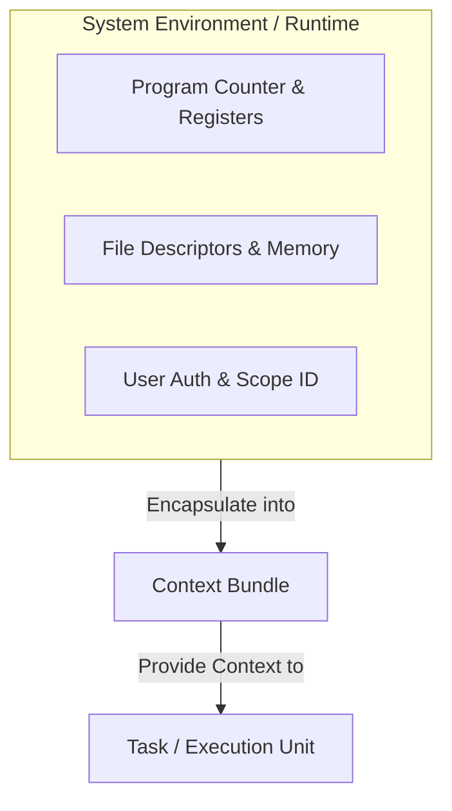
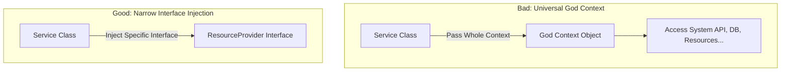

## Context (컨텍스트) 란 무엇인가

컴퓨터 과학과 소프트웨어 아키텍처에서 **Context (컨텍스트 / 맥락)** 란 **"특정 작업, 프로세스 또는 코드가 올바르게 실행되는 데 필요한 배경 정보 및 실행 상태의 묶음(Environment Bundle)"**을 의미합니다.

단독으로는 의미를 알기 어려운 연산이나 데이터에 "현재 어디서 실행 중이며, 누구의 권한과 생명주기를 따르고 있는가?"라는 실행 맥락을 제공하는 역할을 합니다.

---

### 초보자를 위한 쉽게 이해하는 비유

Context는 **"신분증과 직인 묶음이 들어있는 사원증 지갑"**과 같습니다.
사원증 지갑이 있어야 회사 문을 열고 들어가고, 프린터를 사용하고, 승인 결재를 올릴 수 있는 것처럼, 프로그램 내부의 코드도 자신에게 할당된 Context가 있어야 메모리 접근, 파일 조작, 시스템 API 호출을 수행할 수 있습니다.

---

### 컴퓨터 과학 분야별 Context의 구체적 개념

#### 1. 운영체제 (OS): Process & Thread Context
운영체제에서 스레드나 프로세스가 실행되다가 다른 작업으로 교체될 때(인터럽트), **"나중에 원래 위치에서 그대로 재개(Resume)하기 위해 저장해두는 CPU 레지스터 및 상태 정보"**를 말합니다.
* **Context Switch (문맥 교환)**: CPU가 실행 중인 작업 A의 Context를 저장하고 작업 B의 Context를 불러와 교체하는 작업입니다.

#### 2. 코루틴/동시성 프로그래밍: `CoroutineContext`
Kotlin 코루틴 등 현대 비동기 프레임워크에서 `CoroutineContext`는 비동기 작업이 실행될 환경 요소들의 집합(Indexed Set)입니다.
* **구성 요소**:
  * `Job`: 작업의 생명주기와 부모-자식 계층 구조 제어. ([Structured Concurrency](structured-concurrency.md))
  * `CoroutineDispatcher`: 작업이 실행될 스레드 풀 지정 (예: `Dispatchers.IO`, `Dispatchers.Main`)
  * `CoroutineExceptionHandler`: 예기치 못한 예외 처리기

#### 3. 모바일/앱 프레임워크: Android Context
안드로이드 앱 개발에서 `Context`는 애플리케이션의 현재 상태와 리소스 접근 통로 역할을 하는 인터페이스입니다.
* **기능**: 리소스 읽기(`getString()`), 데이터베이스/파일 접근, 시스템 서비스 획득(`getSystemService()`), 화면 전환 등

---

### Context 남용 시 문제점 (Anti-Patterns)

Context는 편리한 통로이지만, 무분별하게 전달하면 다음과 같은 부작용이 발생합니다.

1. **God Object (만능 신 객체) 화**
   * 필요한 구체적 데이터만 전달하는 대신 Context 전체를 클래스에 통째로 넘겨버리면 architectural 결합도가 지나치게 높아집니다.
2. **테스트 격리 저해**
   * 단위 테스트 시 Context 전체를 가짜 객체(Mock)로 만들어야 하므로 테스트 작성이 극도로 어려워집니다. ([Pure Function](pure-function.md) 원칙 위반)
3. **생명주기 불일치로 인한 메모리 누수 (Memory Leak)**
   * 수명이 짧은 `Activity Context`를 수명이 긴 싱글톤 객체나 백그라운드 작업이 계속 참조하면, 화면이 파괴되어도 메모리에서 해제되지 않는 누수가 일어납니다.

---

### Context를 올바르게 다루는 설계 원칙

1. **명시적 의존성 주입 (Explicit Dependency Injection)**
   * Context 전체를 클래스 인자로 넘기지 말고, 객체가 실제로 필요한 구체적 의존성만 인수로 전달합니다.
2. **인터페이스 분리 원칙 (ISP)**
   * Context가 가진 수많은 기능 중 특정 레이어에 필요한 최소한의 인터페이스만 추상화하여 제공합니다.
3. **Scope와 생명주기의 일치**
   * 부모 작업과 자식 작업의 생명주기를 부모 Scope에 안전하게 바인딩합니다. ([Structured Concurrency](structured-concurrency.md))

---

### 연관 노트

- [Structured Concurrency](structured-concurrency.md) - 코루틴 컨텍스트를 활용한 안전한 비동기 작업 생명주기 관리
- [Pure Function](pure-function.md) - 외부 컨텍스트에 의존하지 않는 순수 함수
- [Immutability](immutability.md) - 안전한 컨텍스트 전달을 위한 불변성

