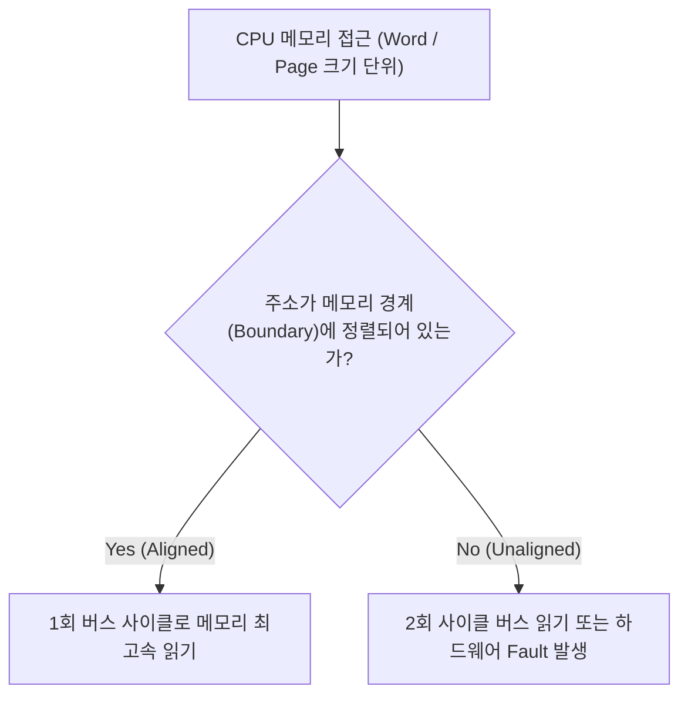

## Data Structure Alignment (메모리 정렬 및 얼라인먼트)

### 1. 개요 (Overview)

**Data Structure Alignment (메모리 정렬)** 은 CPU 가 메모리를 읽고 쓸 때 효율성을 극대화하기 위해, **데이터 및 메모리 세그먼트의 시작 주소를 특정 배수(4 Byte, 8 Byte, 16KB 등)의 메모리 경계(Boundary)에 일치시키는 컴퓨터 아키텍처 원칙**이다.

CPU 는 메모리를 1 바이트 단위가 아닌 워드(Word) 단위나 페이지 단위로 엑세스한다. 주소가 메모리 경계에 맞게 정렬(Aligned)되어 있지 않으면 **추가적인 메모리 접근 버스 사이클(Extra Bus Cycle)** 이 발생하거나, 최신 하드웨어 환경에서는 하드웨어 예외 및 세그멘테이션 오류(`SIGSEGV`)를 유발한다.

---

#### 초보자를 위한 쉽게 이해하는 비유

- **메모리 정렬 (모눈종이 격자 칸에 글자 맞춰 쓰기)**:
  - CPU 는 모눈종이 1 칸(메모리 엑세스 단위)에 딱 맞춰 들어가는 도장을 찍듯이 메모리를 읽음. 글자가 격자 경계선에 걸쳐서 삐져나가 있으면 도장을 2 번 찍어야 하는(성능 저하 및 비정렬 크래시) 문제 발생.

---

### 2. Memory Alignment 의 종류 및 주요 이유

1. **데이터 구조체 정렬 (Data Alignment & Padding)**:
   - C/C++ 구조체 내 멤버 변수를 4byte, 8byte 경계로 맞추기 위해 사이에 패딩(Padding) 바이트를 삽입하는 원리.
2. **ELF 세그먼트 / 페이지 정렬 (ELF Page Alignment)**:
   - [Linker 와 Loader](linker-and-loader.md) 가 실행 가능한 바이너리 파일([elf-executable-and-linkable-format](elf-executable-and-linkable-format.md) 공유 라이브러리 `.so`)의 `LOAD` 세그먼트 시작 주소를 OS [Virtual Memory](virtual-memory.md) 페이지 크기(4KB 또는 16KB)의 배수로 맞추는 링커 규약.

---

### 3. 연결 문서 (Related Links)

- [virtual-memory](virtual-memory.md) - 가상 메모리 시스템
- [virtual-memory-paging](virtual-memory-paging.md) - 가상 메모리 페이징 기법
- [linker-and-loader](linker-and-loader.md) - 링커와 로더
- [elf-executable-and-linkable-format](elf-executable-and-linkable-format.md) - ELF 바이너리 포맷
- [android-16kb-page-alignment](../mobile/android/01_system_internals/kernel-and-hal/android-16kb-page-alignment.md) - 안드로이드 16KB ELF 페이지 정렬
