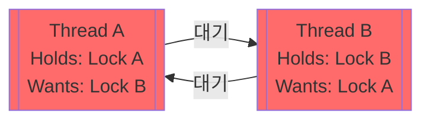

## Deadlock (교착 상태)

**Deadlock (교착 상태)**은 둘 이상의 작업이 서로 상대방이 가진 자원(락)을 얻기 위해 대기하면서 **모든 작업의 진행이 영구적으로 중단되는 멈춤 현상**입니다.

---

### 초보자를 위한 쉽게 이해하는 비유

**Deadlock (교착 상태)**: **"좁은 외나무다리에서 만난 두 자동차"**

양쪽 자동차가 서로 상대방이 양보하기만을 기다리며 멈춰 서서 아무도 앞으로 나아가지 못하는 영구 대기 상태입니다.

---

## Deadlock의 정의 및 특징

### 기본 개념

```
스레드 A: Lock A 보유 → Lock B 대기
스레드 B: Lock B 보유 → Lock A 대기
→ 서로를 기다리며 영구 정지
```



### Deadlock의 특성

1. **영구성**: 한 번 발생하면 외부 개입 없이 자동 복구 불가능
2. **상호 차단**: 모든 관련 스레드가 대기 상태
3. **진행 불가**: 시스템 응답 불가 (Hang 상태)

---

## Deadlock 발생의 필요충분 조건: Coffman Conditions

**Deadlock은 다음 4가지 조건이 동시에 모두 성립할 때만 발생합니다.**

### 1. 상호 배제 (Mutual Exclusion)

```
한 번에 한 스레드만 자원을 사용할 수 있음
```

- Lock의 기본 특징
- 여러 스레드의 동시 접근 불가

### 2. 점유와 대기 (Hold and Wait)

```
자원을 점유한 채로 다른 자원을 추가 대기함
```

```kotlin
// ❌ Hold and Wait 발생
lock1.lock()           // Lock A 획득 (점유)
lock2.lock()           // Lock B 대기 (다른 자원 요청)
```

### 3. 비선점 (No Preemption)

```
다른 스레드가 가진 자원을 강제로 빼앗을 수 없음
```

- Lock은 강제 해제 불가능
- 락을 보유한 스레드가 자발적으로 해제할 때까지 대기
- 타임아웃/강제 종료 필요

### 4. 순환 대기 (Circular Wait)

```
자원 대기 관계가 순환 고리를 형성
A → B → C → A
```

```kotlin
// ❌ Circular Wait
스레드 A: lock1 획득 → lock2 대기
스레드 B: lock2 획득 → lock1 대기
→ 원형 대기 고리 형성
```

---

## Deadlock 예방 전략

### 전략 1: 상호 배제 제거 (거의 불가능)

```
공유 자원 자체를 없애기
→ 실무에서는 거의 불가능
```

대체: [Immutability](immutability.md) 사용

### 전략 2: Hold and Wait 제거

**방법 A: 모든 자원을 한 번에 획득**

```kotlin
// ❌ Hold and Wait: 순차 획득
lock1.lock()
try {
    lock2.lock()
    try {
        // 작업
    } finally { lock2.unlock() }
} finally { lock1.unlock() }

// ✅ 개선: 모든 자원을 한 번에 획득
lockManager.acquireAll(lock1, lock2)
try {
    // 작업
} finally {
    lockManager.releaseAll(lock1, lock2)
}
```

**방법 B: 대기하지 않고 즉시 실패**

```kotlin
if (lock1.tryLock() && lock2.tryLock()) {
    try {
        // 작업
    } finally {
        lock2.unlock()
        lock1.unlock()
    }
} else {
    // 일부 Lock만 획득 → 모두 해제하고 재시도
    lock1.unlock()
    retry()
}
```

### 전략 3: 비선점 제거

**Timeout 사용**:

```kotlin
if (lock.tryLock(1, TimeUnit.SECONDS)) {
    try {
        // 작업
    } finally {
        lock.unlock()
    }
} else {
    // Timeout: Lock 획득 실패
    println("Deadlock 감지 및 복구")
    recovery()
}
```

### 전략 4: 순환 대기 제거 ⭐ (가장 실용적)

**Lock Ordering (락 획득 순서 정렬)**:

모든 스레드에서 **동일한 순서**로 Lock을 획득하면 순환 대기는 절대 발생할 수 없습니다.

```kotlin
// ❌ Deadlock 발생 가능: 순서 불일치
fun transaction1() {
    lock1.lock()
    try {
        lock2.lock()
        try { /* 작업 */ }
        finally { lock2.unlock() }
    } finally { lock1.unlock() }
}

fun transaction2() {
    lock2.lock()  // 반대 순서!
    try {
        lock1.lock()
        try { /* 작업 */ }
        finally { lock1.unlock() }
    } finally { lock2.unlock() }
}

// ✅ Deadlock 방지: 순서 일관성 (Lock ID로 정렬)
fun transaction1() {
    lock1.lock()  // 작은 ID부터
    try {
        lock2.lock()
        try { /* 작업 */ }
        finally { lock2.unlock() }
    } finally { lock1.unlock() }
}

fun transaction2() {
    lock1.lock()  // 항상 lock1부터
    try {
        lock2.lock()
        try { /* 작업 */ }
        finally { lock2.unlock() }
    } finally { lock1.unlock() }
}
```

---

## Deadlock 해결 전략

### 1. Deadlock 감지 (Detection)

시스템이 현재 Deadlock 상태인지 주기적으로 확인:

```
자원 할당 그래프 분석
→ 순환 의존성 감지
→ Deadlock 상태 판단
```

### 2. Deadlock 회복 (Recovery)

감지된 Deadlock을 복구:

```
- 프로세스/스레드 종료
- 자원 선점 (강제 회수)
- 트랜잭션 롤백
```

### 3. Deadlock 회피 (Avoidance)

Deadlock 발생 가능성이 있으면 사전 차단:

```
Banker's Algorithm
→ 안전 상태 확인 후 자원 할당
→ 위험한 할당은 거부
```

### 4. Deadlock 방지 (Prevention)

Coffman Conditions 중 1개 이상 제거:

```
Lock Ordering, Timeout, Immutability 등
→ 가장 실용적인 방식
```

---

## Race Condition vs Deadlock

| 비교 항목 | Race Condition | Deadlock |
|---------|----------------|----------|
| **발생 원인** | 동기화 부족으로 무작위 덮어쓰기 | 락 획득 순서 꼬임으로 인한 순환 대기 |
| **프로그램 상태** | 스레드가 계속 실행되며 **잘못된 데이터 생성** | 스레드가 멈춰서(Blocked) **작업 진행 안 됨** |
| **증상** | 간헐적 데이터 오류, 계산 결과 변동 | 시스템 Hang, 응답 없음 |
| **감지** | 어려움 (타이밍 의존) | 쉬움 (명확한 정지) |
| **예방 방법** | Mutex/Lock, 불변성, 원자적 연산 | Lock Ordering, Timeout, Lock 범위 최소화 |
| **해결책** | 동기화 메커니즘 추가 | Lock 획득 순서 일관성 유지 |

---

## Deadlock 감지 및 디버깅

### Java Thread Dump 사용

```bash
# JVM PID 확인
jps

# Thread Dump 생성
jstack <pid> > dump.txt

# Deadlock 자동 감지
grep -A 20 "Found one Java-level deadlock" dump.txt
```

### 출력 예시

```
Found one Java-level deadlock:
=============================
"Thread-2":
  waiting to lock monitor 0x00007fb51d7d0c40 (object at 0x00007fb51c5f3388),
  which is held by "Thread-1"
"Thread-1":
  waiting to lock monitor 0x00007fb51d7d0d40 (object at 0x00007fb51c5f3398),
  which is held by "Thread-2"
```

### Linux Mutex 모니터링

```bash
# mutex_stats 확인
cat /proc/lock_stat

# 대기 시간이 긴 lock 확인
sort -k4 -rn /proc/lock_stat | head -20
```

---

## Deadlock 방지 Best Practice

| 원칙 | 설명 | 예시 |
|------|------|------|
| **Lock Ordering** | 모든 스레드가 동일 순서로 획득 | Lock ID 정렬 후 획득 |
| **Timeout** | 일정 시간 내 획득 실패 시 포기 | `tryLock(1, TimeUnit.SECONDS)` |
| **Lock 범위 최소화** | 꼭 필요한 부분만 Lock | I/O는 Lock 밖에서 |
| **Exception Safety** | 예외 발생 시에도 Lock 해제 | try-finally, withLock |
| **Stress Test** | 많은 스레드로 부하 테스트 | 1000+ 스레드 동시 실행 |
| **모니터링** | 락 경합 및 대기 시간 감시 | JFR, Java Flight Recorder |

---

## 실제 예시: 모범 사례

```kotlin
class TransactionManager {
    private val locks = sortedMapOf<String, ReentrantLock>()
    
    // 모든 계좌의 Lock을 ID 순서대로 획득
    fun transferMoney(fromAccountId: String, toAccountId: String, amount: BigDecimal) {
        val lock1 = locks.getOrPut(fromAccountId) { ReentrantLock() }
        val lock2 = locks.getOrPut(toAccountId) { ReentrantLock() }
        
        // Lock ID로 정렬하여 항상 같은 순서 보장
        val (firstLock, secondLock) = if (fromAccountId < toAccountId) {
            lock1 to lock2
        } else {
            lock2 to lock1
        }
        
        firstLock.withLock {
            secondLock.withLock {
                // 안전한 거래 처리
                val fromAccount = getAccount(fromAccountId)
                val toAccount = getAccount(toAccountId)
                
                if (fromAccount.balance >= amount) {
                    fromAccount.balance -= amount
                    toAccount.balance += amount
                    saveAccounts(fromAccount, toAccount)
                }
            }
        }
    }
}
```

---

## 연결 문서 (Related Documents)

- [Race Condition](race-condition.md) - Deadlock 방지를 위해 Lock 사용 시 발생 가능한 다른 문제
- [Mutex/Lock](mutex-lock.md) - Lock의 올바른 사용 방법
- [Immutability](immutability.md) - Lock 없이 동시성을 해결하는 방법
- [Structured Concurrency](structured-concurrency.md) - 안전한 동시성 제어 패턴
