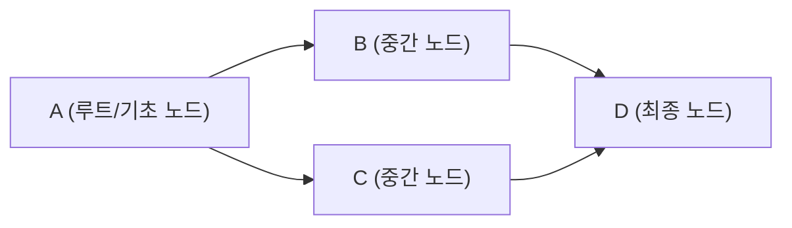
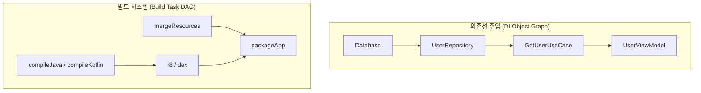

## 유향 비순환 그래프 (DAG: Directed Acyclic Graph)

### 개념 및 정의

**유향 비순환 그래프(DAG: Directed Acyclic Graph)** 는 방향성을 가진 간선(Directed Edge)들로 구성되며, **어떠한 정점(Vertex)에서 출발하더라도 자기 자신으로 되돌아오는 순환 경로(Cycle)가 존재하지 않는 그래프**이다.

수학적으로 정점 집합 $V$와 유향 간선 집합 $E$에 대해, $v_0 \to v_1 \to \dots \to v_k$ ($k \ge 1$) 경로가 존재할 때 $v_0 \neq v_k$ 를 만족하는 구조를 말한다.

---

### 소프트웨어 엔지니어링에서 DAG 가 필수적인 이유

DAG 는 단순한 자료구조를 넘어, **의존성 관리(Dependency Management), 동시성 스케줄링(Concurrency Scheduling), 상태 전파(State Propagation)** 의 수학적 기반이다.

#### 1. 결정론적 선후 관계 결정 (위상 정렬 - Topological Sort)

- DAG 의 모든 정점은 **선행 조건(Prerequisite)** 을 만족하는 선형 순서로 나열될 수 있다.
- **Kahn 알고리즘(진입 차수 기반)** 또는 **DFS 사후 탐색(Post-order)** 을 통해 위상 정렬을 수행하며, 이는 "작업 B 를 실행하기 전에 반드시 작업 A 가 완료되어야 한다"는 실행 보장을 제공한다.

#### 2. 순환 참조(Circular Dependency) 방지 및 교착 상태 예방

- $A \to B \to C \to A$ 형태의 순환이 발생하면 위상 정렬이 불가능해지며, 무한 재귀 호출이나 리소스 교착 상태(Deadlock)가 발생한다.
- 시스템은 그래프 구축 시점에 **Tarjan 알고리즘** 또는 사이클 감지(Cycle Detection)를 수행하여 아키텍처 결함을 컴파일/초기화 시점에 차단한다.

#### 3. 병렬 처리(Parallelism) 및 동시성 최적화

- DAG 상에서 진입 차수(In-degree)가 0 인 노드들은 서로 독립적이므로 **동시에 병렬(Parallel) 실행**이 가능하다.
- 작업 완료 시 해당 노드의 진출 간선을 제거하여 후속 노드의 진입 차수를 낮춤으로써 동적으로 병렬 워커 풀(Worker Pool)에 작업을 분배한다.

#### 4. 증분 계산(Incremental Evaluation) 및 캐시 무효화 전파

- 특정 노드의 데이터가 변경되면, DAG 의 방향성을 따라 **해당 노드의 하류(Downstream/Dependent) 노드들만 선택적으로 무효화(Invalidation)** 하고 재계산한다.
- 변경되지 않은 상류(Upstream) 또는 독립된 형제 서브트리는 캐시된 결과를 그대로 재사용(`FROM-CACHE`)할 수 있다.

---

### 핵심 응용 도메인 비교

| 도메인                                     | 노드 (Vertex)              | 간선 (Edge, $A \to B$)           | DAG 활용 목적                          |
| --------------------------------------- | ------------------------ | ------------------------------ | ---------------------------------- |
| **빌드 시스템** (Gradle, Bazel)              | Task / Target            | Task $B$는 Task $A$ 의 출력을 필요로 함 | 빌드 태스크 병렬 실행, 증분 빌드, 캐시 판별         |
| **의존성 주입 (DI)** (Spring, Dagger, Metro) | Bean / Service / Binding | 객체 $B$ 생성 시 객체 $A$ 를 주입받음      | 객체 생성 순서 결정, 싱글톤 수명주기 관리, 순환 주입 감지 |
| **데이터 파이프라인** (Airflow, Spark)          | ETL Job / Operator       | Job $B$는 Job $A$ 의 가공 데이터를 소비  | 분산 데이터 처리 스케줄링, 실패 시 재시도 파이프라인     |
| **버전 관리** (Git)                         | Commit                   | 커밋 $B$는 부모 커밋 $A$ 를 가리킴        | 브랜치 분기/병합 이력 추적, 3-way merge       |
| **반응형 프로그래밍** (Rx, Flow, Compose)       | State / Signal           | 파생 상태 $B$는 원본 상태 $A$ 를 구독      | 최소 단위 리컴포지션, UI 렌더링 그래프 최적화        |

---

### 의존성 주입(DI)과 빌드 시스템에서의 DAG 비교

- **의존성 주입(DI)**: 런타임/컴파일 타임에 컴포넌트 간의 결합도를 낮추고 수명주기를 격리하기 위해 객체 인스턴스화 그래프를 DAG 로 구성한다.
- **빌드 시스템**: 입력 파일에서 최종 실행 아티팩트에 이르는 파일 변환 및 가공 단계를 DAG 로 모델링하여 최소 작업(Minimal Work)만을 수행한다.

---

### 상위 및 연관 문서

- [순수 함수와 불변성](pure-function.md)
- [AOT 컴파일](aot-compilation.md)
