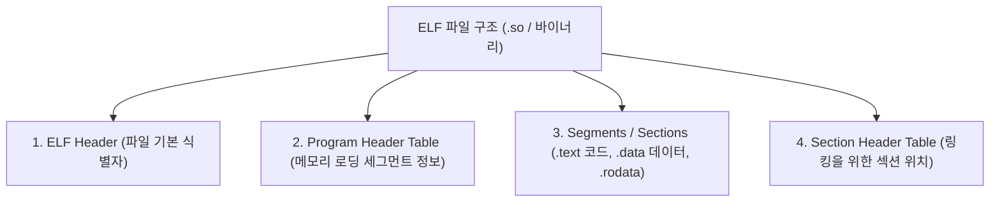

# ELF (Executable and Linkable Format 표준 바이너리 포맷)

## 1. 개요 (Overview)

**ELF (Executable and Linkable Format)** 는 Linux 및 Android 운영체제에서 사용하는 **표준 실행 파일, 공유 라이브러리(`.so`), 오브젝트 파일(`.o`), 코어 덤프(Core Dump)의 바이너리 구조 규격**이다.

[linker-and-loader](linker-and-loader.md) 가 바이너리를 조립하고, OS Loader 가 이를 [virtual-memory](virtual-memory.md) 에 올리기 위한 메타데이터 헤더와 코드/데이터 세그먼트(Segment) 구조를 정의한다.

---

### 초보자를 위한 쉽게 이해하는 비유

* **ELF 포맷 (목차와 세분화된 단락이 명시된 표준 서적)**:
  - 파일 제일 앞부분에 "이 서적은 몇 페이지로 구성되어 있고, 어디서부터 읽어야 하는가" 를 명시한 표지(ELF Header)와 목차(Program Header Table)가 있고, 본문 내용이 코드(`.text`)와 데이터(`.data`) 단락으로 나누어져 있는 표준 규격 책.

---

## 2. ELF 의 3대 주요 구조 및 Alignment 규약

1. **ELF Header**: 아키텍처(ARM64, x86_64), 엔디안, 시작 실행 주소(Entry Point) 포함.
2. **Program Header Table (LOAD Segment)**: OS 로더가 메모리에 맵핑해야 할 `LOAD` 세그먼트의 가상 주소, 크기, 정렬 기준(Align)을 포함한다.
3. **ELF Page Size Alignment (페이지 정렬 규약)**:
   - `LOAD` 세그먼트의 가상 메모리 주소 시작점은 반드시 OS 가상 메모리 [virtual-memory-paging](virtual-memory-paging.md) 크기(4KB 또는 16KB)의 배수로 정렬되어 있어야 함([data-structure-alignment](data-structure-alignment.md)).

---

## 3. 연결 문서 (Related Links)

- [linker-and-loader](linker-and-loader.md) - 링커와 로더 시스템
- [data-structure-alignment](data-structure-alignment.md) - 메모리 정렬 원리
- [virtual-memory](virtual-memory.md) - 가상 메모리 시스템
- [android-16kb-page-alignment](../mobile/android/01_system_internals/kernel-and-hal/android-16kb-page-alignment.md) - 안드로이드 16KB ELF 페이지 정렬
