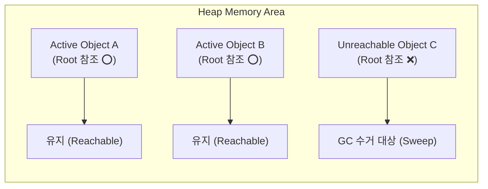

## Garbage Collection (가비지 컬렉션 / GC) 이란 무엇인가

소프트웨어 공학 및 런타임 환경에서 **Garbage Collection (가비지 컬렉션, GC)** 은 **"프로그램이 동적으로 할당했던 힙(Heap) 메모리 영역 중 더 이상 사용되지 않는 객체(Garbage)를 런타임이 자동으로 추적하여 해제하는 자동 메모리 관리 메커니즘"** 을 의미한다.

C/C++ 처럼 개발자가 `free()`나 `delete` 를 통해 수동으로 메모리를 해제해야 하는 언어와 달리, Java, Kotlin, Go, Python 등 런타임 언어는 GC 가 메모리 누수(Memory Leak)와 이중 해제(Double Free) 위험을 예방해 준다.

---

## GC 의 핵심 동작 원리 (Mark-and-Sweep)

1. **GC Root 추적 (Mark Phase)**:
   - 런타임은 스택 변수, 전역 변수, JNI 참조 등 기준점(GC Root)으로부터 연결된 모든 객체를 추적(Tracing)하여 **살아있는 객체(Reachable Object)** 로 표기(Mark)한다.
2. **미사용 메모리 해제 (Sweep Phase)**:
   - GC Root 로부터 도달할 수 없는 **고아 객체(Unreachable Object)** 를 도려내고 해당 메모리를 힙으로 반환한다.
3. **메모리 단편화 정리 (Compaction Phase)**:
   - 해제된 힙 메모리 구멍(Fragmentation)을 메우기 위해 살아있는 객체들을 한쪽으로 모아 붙인다.

---

## Android (ART Runtime) 에서의 GC 발전과 특성

Android 런타임 환경([ART](../mobile/android/01_system_internals/art.md))에서 GC 는 앱 성능과 직결되는 매우 중요한 요소다.

- **Dalvik VM 시절 (Stop-the-world GC)**:
  - 메모리를 수거하는 동안 전체 앱 스레드를 완전히 멈추어 UI 화면이 버벅이는 프레임 드롭(Jank)의 주원인이었다.
- **현대 ART 런타임 (Concurrent GC)**:
  - 앱 스레드 정지 없이 백그라운드에서 메모리를 수거하는 **Concurrent Mark-Sweep GC** 및 메모리 컴팩션 최적화를 채택하여 GC 로 인한 멈춤 시간을 불과 수 ms 이하로 획기적으로 줄였다.

---

## 연결 문서

- [ART (Android Runtime)](../mobile/android/01_system_internals/art.md) - Android 가비지 컬렉션 엔진을 탑재한 런타임
- [Thread](thread.md) - Concurrent GC 와 연동되는 앱 실행 스레드
- [Immutability](immutability.md) - 단기 객체 생성 감소 및 GC 부담 완화 패턴
