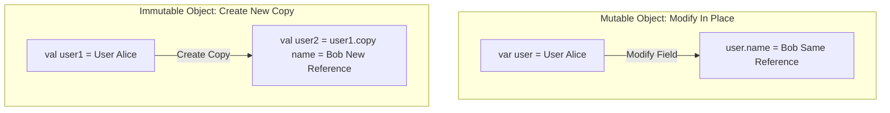

## Immutability (불변성) 이란 무엇인가

소프트웨어 공학에서 **Immutability (불변성)**란 **"객체 또는 데이터 구조가 생성(Initialization)된 이후에는 그 내부의 상태(State)를 변경할 수 없는 성질"**을 의미합니다.

반대로 생성된 이후에도 언제든 내부 필드나 상태를 수정할 수 있는 성질은 **Mutability (가변성)**라고 합니다.

---

### 초보자를 위한 쉽게 이해하는 비유

* **가변 객체 (Mutable)**: **"칠판"**과 같습니다. 누구든 칠판의 글씨를 지우고 새로 쓸 수 있어, 내가 작성한 내용을 다른 사람이 몰래 수정할 위험이 있습니다.
* **불변 객체 (Immutable)**: **"인쇄된 책"**과 같습니다. 한 번 인쇄되면 내용을 수정할 수 없으며, 내용 일부를 수정하고 싶다면 **새로운 책을 한 권 더 인쇄(Copy)**해야 합니다.

---

### 불변성(Immutability)이 제공하는 핵심 이점

1. **스레드 안전성 (Thread Safety) 100% 보장**
   * 수많은 스레드가 동시에 읽더라도 데이터가 도중에 바뀌지 않으므로, 복잡한 Lock/Mutex 동기화 없이도 동시성 환경에서 안전하게 공유할 수 있습니다.
2. **예측 가능성과 부작용([Side Effect](side-effect.md)) 방지**
   * 함수나 외부 라이브러리에 불변 객체를 넘겨주더라도, 외부에서 이 객체의 상태를 몰래 변경(Mutation)할 위험이 전혀 없습니다.
3. **고성능 변경 감지 (Reference Equality Optimization)**
   * 데이터가 변경되었는지 확인하기 위해 모든 필드를 일일이 비교(Structural Equality)할 필요 없이, 메모리 주소(Reference, `===`)만 비교해서 바뀐 새로운 객체인지를 즉시 파악할 수 있습니다.

---

### Jetpack Compose 및 현대 선언적 UI에서의 불변성

Jetpack Compose 런타임은 상태(State) 변경을 감지하고 UI를 다시 그릴 때(Recomposition) **불변 객체(Immutable Objects)**에 크게 의존합니다.

* **Recomposition Skip (스킵 최적화)**
  * Composable 함수의 파라미터가 불변 상태이고 이전 렌더링 때와 메모리 주소/값이 동일하다면, Compose 런타임은 해당 UI 재구성을 건너뛰어(Skip) 최적화합니다.
* **가변 리스트 사용 시 주의사항**
  * 일반 `ArrayList` 내부 요소를 `list.add()`로 변경하면 객체 주소 자체가 바뀌지 않아 Compose가 상태 변경을 감지하지 못합니다. 반드시 `toPersistentList()`나 `copy()`를 사용하여 새로운 불변 객체를 생성해야 UI가 업데이트됩니다.

---

### 연관 노트

- [Pure Function](pure-function.md) - 불변 데이터를 기반으로 동작하는 순수 함수 레퍼런스
- [Side Effect](side-effect.md) - 불변성이 차단하는 상태 변이와 부작용
- [Composable Body Must Be Fast, Idempotent and Side-Effect Free](../mobile/android/02_app_framework/jetpack-compose/runtime/composable-body-purity.md) - Compose 본문 규약

