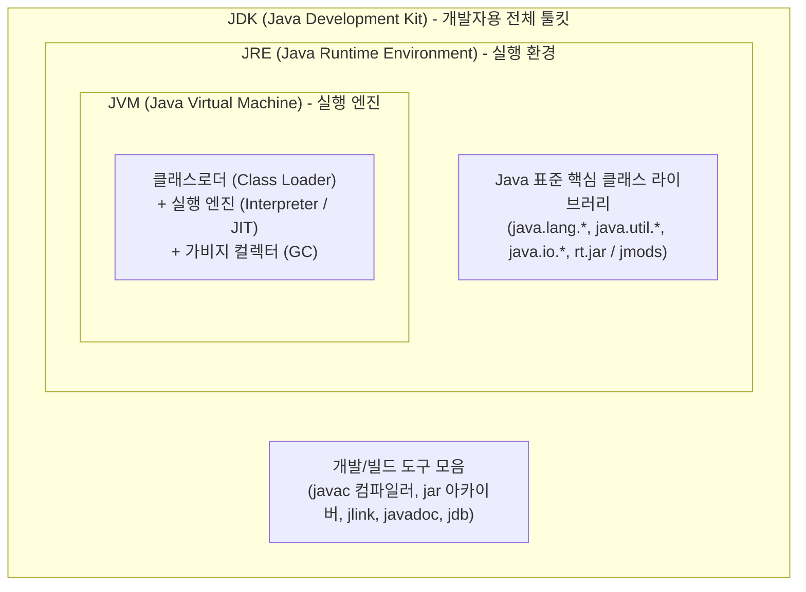

## JDK vs JRE vs JVM 의 차이와 런타임(Runtime)

### 개요

Java 생태계의 소프트웨어 아키텍처는 **JVM(가상 머신 엔진)**, **JRE(실행 런타임 환경)**, **JDK(소프트웨어 개발 키트)** 의 3 단계 계층적 포함 관계(Inclusion Hierarchy)로 정의된다.

$$\text{JDK (개발 키트)} \supset \text{JRE (실행 환경)} \supset \text{JVM (가상 머신 엔진)}$$

---

### 1. 3 대 핵심 요소의 정의와 역할 비교

| 구분 | **JVM (Java Virtual Machine)** | **JRE (Java Runtime Environment)** | **JDK (Java Development Kit)** |
|---|---|---|---|
| **본질 및 성격** | **가상 머신 실행 엔진 (Core Engine)** | **소프트웨어 실행 환경 (Runtime Package)** | **전체 소프트웨어 개발 키트 (SDK)** |
| **주요 대상** | 바이트코드(`.class`)를 기계어로 실행 | 일반 사용자 / 서버 배포 환경 | **개발자 (Developer)** / CI 빌드 머신 |
| **포함 요소** | 클래스로더, 런타임 메모리(Heap/Stack), JIT, GC | **JVM + Java 표준 핵심 라이브러리 API** | **JRE + 컴파일러(`javac`) + 개발 도구** |
| **비유** | 자동차의 **'엔진(Engine)'** | 엔진 + 바퀴 + 연료가 갖춰진 **'완성된 자동차'** | 자동차 + 정비소의 **'수리 및 튜닝 도구 세트'** |

---

### 2. '런타임(Runtime)'이라는 말은 왜 붙는가?

>**"런타임(Runtime / Runtime Environment)이란 프로그램이 실행(Run)되는 동안, 그 생명주기와 동작을 뒷받침하는 모든 소프트웨어 실행 기반을 의미한다."**

- 프로그래밍 언어로 작성된 코드가 실행되려면 단순 바이너리만으로는 부족하며, **메모리 할당 및 해제(GC), 스레드 동기화, 표준 입출력, 시스템 콜 중재** 등의 서비스를 제공하는 소프트웨어 계층이 필요하다.
- C 언어에는 `C Runtime (CRT / glibc)`이 있고, JavaScript 에는 `V8 / Node.js Runtime` 이 있듯이, Java 에는 **JVM 과 표준 라이브러리가 결합된 `JRE(Java Runtime Environment)`** 가 바로 런타임이다.

---

### 3. Java 생태계 vs Android 생태계의 1:1 대응 비교

Android 는 데스크톱/서버용 표준 JVM/JRE 를 기기에 탑재하지 않고, 모바일 하드웨어에 특화된 독자적인 런타임 아키텍처를 사용한다:

| 개념 계층 | 표준 Java 생태계 | Android 모바일 생태계 |
|---|---|---|
| **개발 도구 (SDK)** | **JDK** (`javac`, `jar`, `javadoc`) | **Android SDK + AGP** (`kotlinc`, `AAPT2`, `D8/R8`, `apksigner`) |
| **실행 런타임 (Runtime)** | **JRE** (JVM + Java 표준 라이브러리) | **[ART (Android Runtime)](../mobile/android/01_system_internals/boot-and-runtime/zygote-runtime/art.md)** / [Dalvik VM](../mobile/android/01_system_internals/boot-and-runtime/zygote-runtime/dalvik-vm.md) + Android Framework (`android.*`) |
| **실행 가상 머신 (VM)** | **JVM (HotSpot 등)** (스택 기반) | **[ART / Dalvik](../mobile/android/01_system_internals/boot-and-runtime/zygote-runtime/dalvik-vs-art.md)** (레지스터 기반) |
| **실행 바이너리 포맷** | **`.class` / `.jar`** (분산 바이트코드) | **[`.dex`](jvm-bytecode-and-jar-archive.md)** (단일 상수 풀 통합 압축) |

---

### 4. Java 11+ 이후 JRE 배포의 변화

- Java 8 이전에는 일반 사용자를 위한 독립 실행형 `JRE 설치 파일` 이 따로 제공되었다.
- **Java 9(JPMS 모듈 시스템) 및 Java 11 이후부터는 별도의 JRE 배포가 폐지**되었으며, 개발자가 `jlink` 도구를 사용하여 애플리케이션에 필요한 최소한의 모듈만 포함하는 초경량 커스텀 런타임 이미지를 직접 패키징하는 방식으로 현대화되었다.

---

### 상위 및 연관 문서

- [JVM 아키텍처와 런타임 실행 엔진](jvm-architecture.md)
- [JVM 클래스로더 메커니즘](jvm-classloader.md)
- [JVM 클래스패스 (Classpath)](jvm-classpath.md)
- [바이트코드 파일(.class)과 아카이브 파일(.jar)의 본질](jvm-bytecode-and-jar-archive.md)
- [Dalvik VM (Dalvik 가상 머신)](../mobile/android/01_system_internals/boot-and-runtime/zygote-runtime/dalvik-vm.md)
- [ART (Android Runtime)](../mobile/android/01_system_internals/boot-and-runtime/zygote-runtime/art.md)
- [Dalvik vs ART 비교](../mobile/android/01_system_internals/boot-and-runtime/zygote-runtime/dalvik-vs-art.md)
