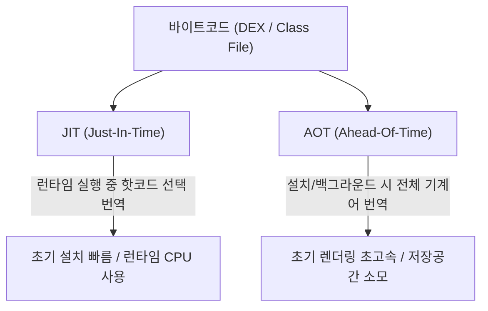

# JIT & AOT 컴파일 (Just-In-Time vs Ahead-Of-Time)

## 1. 개요 (Overview)

프로그래밍 언어의 바이트코드(Bytecode)를 CPU 가 이해할 수 있는 **네이티브 기계어(Native Machine Code)**로 번역하는 방식은 크게 **JIT (Just-In-Time)** 와 **AOT (Ahead-Of-Time)** 방식으로 나뉜다.

---

### 초보자를 위한 쉽게 이해하는 비유

* **JIT (Just-In-Time) 컴파일 - "동통역사"**:
  - 앱이 실행되는 중에 실시간으로 자주 쓰이는 문장(Hot Code)만 그때그때 기계어로 번역하는 방식.
  - 앱 설치나 실행 시작은 빠르지만, 번역하는 동안 CPU 를 소모하여 순간적인 끊김(Jank)이 발생할 수 있다.
* **AOT (Ahead-Of-Time) 컴파일 - "사전 완역본"**:
  - 앱이 실행되기 전에 미리 책(바이트코드) 전체를 기계어로 번역해 저장해 두는 방식.
  - 실행 즉시 완역본 기계어를 읽으므로 초고속으로 작동하지만, 사전에 번역본 파일(oat)을 보관해야 하므로 저장공간을 더 차지한다.

---

## 2. JIT vs AOT 특성 비교

| 비교 항목 | JIT (Just-In-Time) | AOT (Ahead-Of-Time) |
| :--- | :--- | :--- |
| **번역 시점** | 앱 **실행 중 (Runtime)** | 앱 **설치 시점 / 기기 유휴 백그라운드** |
| **실행 속도** | 인터프리터 ➔ JIT 핫코드 부분 컴파일 | **즉시 네이티브 기계어 전면 실행 (최고 속도)** |
| **CPU / RAM 영향** | 런타임 컴파일로 인해 CPU 소모 및 배터리 소모 | 런타임 컴파일 CPU 소모 0 (배터리 절약) |
| **저장공간 영향** | 원본 바이트코드 위주 (공간 적게 듦) | 번역본 파일(oat/elf) 보관으로 저장공간 필요 |

---

## 3. Android ART 런타임에서의 혼합 컴파일 파이프라인

Android 현대 [ART (Android Runtime)](../mobile/android/01_system_internals/art.md) 는 JIT 와 AOT 의 단점을 메우기 위해 **Profile-Guided Hybrid Compilation (프로필 기반 혼합 컴파일)** 파이프라인을 채택한다.

1. **설치 직후 (Interpreting)**: 앱을 처음 설치하면 인터프리터로 바로 빠르게 실행한다.
2. **앱 사용 중 (JIT + Profiling)**: 실행하는 동안 JIT 가 작동하며 자주 실행되는 코드 프로필(`prof` 파일)을 수집한다.
3. **충전 중 백그라운드 (Profile-Guided AOT)**: 기기를 충전하고 유휴 상태일 때 수집된 프로필 코드를 AOT 컴파일하여 다음 실행 시 초고속 네이티브로 구동한다.

---

## 4. 연결 문서 (Related Links)

- [ART (Android Runtime)](../mobile/android/01_system_internals/art.md) - Profile-Guided JIT + AOT 혼합 컴파일을 사용하는 안드로이드 런타임
- [Dalvik VM](../mobile/android/01_system_internals/dalvik-vm.md) - JIT 컴파일 위주로 구동되었던 레거시 가상 머신
- [DEX (Dalvik Executable)](../mobile/android/00_foundations/glossary/android-glossary/11-dex-dalvik-executable.md) - JIT/AOT 컴파일 대상이 되는 바이트코드 포맷
