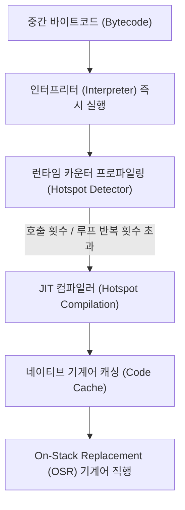

## JIT Compilation (Just-In-Time 동적 컴파일)

### 1. 개요 (Overview)

**JIT (Just-In-Time / 동적) 컴파일**은 프로그래밍 언어의 인터프리팅 방식과 정적 컴파일 방식의 단점을 보완하기 위해 개발된 런타임 컴파일 메커니즘이다.

소프트웨어가 **실행 중(Runtime)인 시점**에 인터프리터가 읽고 있는 중간 표현식(Bytecode / IR)을 CPU 가 즉시 실행 가능한 **네이티브 기계어(Native Machine Code)** 로 실시간 번역하여 실행한다.

---

### 2. JIT 컴파일의 동작 원리 (HotSpot & OSR)

JIT 컴파일러는 프로그램의 모든 코드를 무조건 번역하지 않고, **"자주 실행되는 무거운 부분(Hot Code)"** 을 선별하여 컴파일한다.

1. **인터프리팅 초기 구동**: 프로그램 시작 시 인터프리터가 한 줄씩 읽어 빠르게 초기 렌더링을 마친다.
2. **핫스팟 감지 (Hotspot Detection)**: 런타임 프로파일러가 메서드 호출 횟수와 루프(Loop) 반복 횟수를 카운팅하여 빈번히 실행되는 핫스팟(Hotspot) 코드를 감지한다.
3. **네이티브 기계어 번역 및 코드 캐싱**: 핫스팟으로 판단된 블록을 네이티브 기계어로 즉석 번역하여 메모리(Code Cache)에 캐싱한다.
4. **OSR (On-Stack Replacement)**: 이미 실행 중인 오랫동안 도는 루프 문장을 런타임에 즉시 기계어 스택으로 교체하여 최적화한다.

---

### 3. JIT 컴파일의 주요 언어 및 런타임 사례

- **Dart (Flutter Debug Mode)**: Flutter 개발 중 디버그 모드에서는 Dart VM 이 JIT 방식을 사용하여 코드 수정 시 1 초 만에 렌더링을 갱신하는 **Hot Reload (핫 리로드)** 기능을 제공한다.
- **Java (JVM HotSpot)**: Java 가상 머신의 C1(Client), C2(Server) 컴파일러가 JIT 방식으로 작동한다.
- **JavaScript (V8 Engine)**: Chrome 및 Node.js 의 V8 엔진(Ignition Interpreter + TurboFan JIT)이 JS 동적 코드를 고속 컴파일한다.
- **.NET (CLR)**: C# / F# 코드를 런타임에 RyuJIT 컴파일러로 기계어로 변환한다.
- **PyPy**: CPython 인터프리터 대비 Python 속도를 수 배 끌어올린 JIT 기반 파이썬 런타임이다.

---

### 4. JIT 컴파일의 장단점

#### 장점
- **빠른 애플리케이션 시작**: 프로그램 시작 시 전체 코드를 컴파일하지 않고 즉시 인터프리팅을 시작하므로 반응 속도가 빠르다.
- **런타임 프로파일 기반 최적화 (PGO)**: 실제로 자주 실행되는 분기(Branch)와 타입을 런타임에 관찰하여 최적 기계어를 생성한다.

#### 단점
- **런타임 CPU 및 메모리 오버헤드**: 프로그램이 구동되는 동안 컴파일러가 함께 돌아가므로 CPU 자원과 배터리를 소비하고 코드 캐시 메모리를 차지한다.
- **초기 실행 가열 타임 (Warm-up Time)**: JIT 컴파일이 무르익기 전까지는 인터프리팅 속도로 작동하므로 순간적인 프레임 드롭(Jank)이 발생할 수 있다.

---

### 5. 연결 문서 (Related Links)

- [AOT Compilation](aot-compilation.md) - 컴파일 타임에 사전 기계어로 번역하는 AOT 방식
- [JIT vs AOT 비교](jit-vs-aot-compilation.md) - JIT 과 AOT 컴파일 이론 종합 비교
- [Android Compilation Pipeline](../mobile/android/01_system_internals/android-compilation-pipeline.md) - Android ART 런타임에서의 JIT 활용 파이프라인
