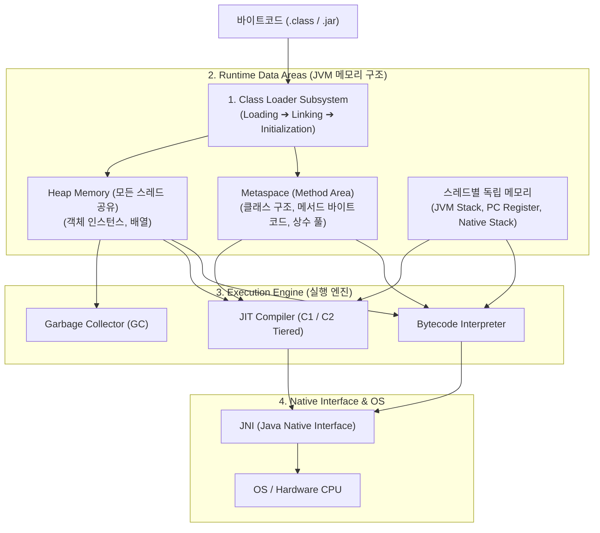

## JVM 아키텍처와 런타임 실행 엔진 (JVM Architecture)

### 개요

**JVM(Java Virtual Machine)** 은 Java 및 Kotlin 바이트코드(`.class`)를 플랫폼 독립적으로 실행하기 위한 가상 컴퓨터 시스템이다.

C/C++ 과 같은 네이티브 컴파일 언어가 운영체제(OS)와 CPU 아키텍처에 직접 종속되는 기계어 바이너리를 생성하는 반면, JVM 은 **클래스로더 서브시스템(Class Loader Subsystem)** 을 통해 바이트코드를 동적으로 메모리에 적재하고, **런타임 데이터 영역(Runtime Data Areas)** 에서 메모리를 관리하며, **실행 엔진(Execution Engine)** 을 통해 인터프리터 및 JIT 컴파일러로 고속 실행한다.

---

### 1. JVM 4 대 핵심 서브시스템

#### 1) 클래스로더 서브시스템 (Class Loader Subsystem)

컴파일된 `.class` 바이트코드와 `.jar` 아카이브를 [클래스패스(Classpath)](jvm-classpath.md)에서 탐색하여 [클래스로더(ClassLoader)](jvm-classloader.md) 를 통해 동적으로 메모리에 로딩, 검증, 링크, 초기화한다.

#### 2) 런타임 데이터 영역 (Runtime Data Areas - JVM 메모리)

JVM 이 프로그램을 실행하기 위해 OS 로부터 할당받은 메모리 공간이다.

| 메모리 영역 | 스레드 공유 여부 | 저장 대상 및 역할 | 관리 주체 |
|---|---|---|---|
| **Metaspace (Method Area)** | **모든 스레드 공유** | 클래스 메타데이터, 메서드 바이트코드, 런타임 상수 풀(Constant Pool), 정적(`static`) 변수 | JVM (Native Memory) |
| **Heap Memory** | **모든 스레드 공유** | `new` 키워드로 생성된 모든 객체 인스턴스와 배열 | [Garbage Collector (GC)](garbage-collection.md) |
| **JVM Stack** | 스레드별 독립 생성 | 메서드 호출 시마다 생성되는 **스택 프레임(Stack Frame)**: 지역 변수(Local Variables), 연산자 스택(Operand Stack), 프레임 데이터 | 메서드 종료 시 자동 반환 |
| **PC Register** | 스레드별 독립 생성 | 현재 스레드가 실행 중인 JVM 바이트코드 명령의 메모리 주소 | CPU/JVM 스케줄러 |
| **Native Method Stack** | 스레드별 독립 생성 | C/C++ 네이티브 메서드 호출 시 사용되는 C 스택 | C 런타임 |

#### 3) 실행 엔진 (Execution Engine)

메모리에 적재된 바이트코드를 실제 하드웨어 CPU 명령어로 변환하여 실행한다.

- **인터프리터(Interpreter)**: 바이트코드 명령어를 한 줄씩 읽고 해석하여 실행한다. 초기 기동은 빠르나 반복 실행 속도가 느리다.
- **[JIT 컴파일러 (Just-In-Time Compiler)](jit-compilation.md)**: 자주 실행되는 핫스팟(Hotspot) 바이트코드를 감지하여 네이티브 기계어로 직접 컴파일하고 캐싱(Code Cache)하여 실행 속도를 비약적으로 높인다 (C1 Client + C2 Server 계층 컴파일).
- **[가비지 컬렉터 (Garbage Collector)](garbage-collection.md)**: Heap 메모리에서 더 이상 참조되지 않는 무효 객체를 백그라운드에서 주기적으로 탐색하여 메모리를 자동 회수한다.

#### 4) JNI (Java Native Interface) 및 네이티브 라이브러리
- C, C++, Rust 등으로 작성된 OS 네이티브 라이브러리(`.so`, `.dylib`, `.dll`)를 Java/Kotlin 코드에서 호출할 수 있도록 브릿지 역할을 수행한다.

---

### 2. 소스 코드에서 실행까지의 전체 생명주기

1. **컴파일 단계**: 소스 코드가 JVM 명령어 세트인 바이트코드(`.class`)로 정적 변환된다.
2. **동적 로딩 단계**: 애플리케이션 시작 시 모든 코드를 한 번에 올리지 않고, 특정 클래스가 코드에서 처음 참조되는 시점에 클래스로더가 클래스패스를 탐색하여 로드한다.
3. **인터프리트 및 JIT 최적화 단계**: 초기에는 인터프리터가 바이트코드를 실행하다가 호출 횟수 임계치를 넘으면 JIT 컴파일러가 기계어로 최적화 컴파일하여 네이티브 성능으로 직행한다.

---

### 상위 및 연관 문서

- [JVM 클래스로더 메커니즘 (ClassLoader)](jvm-classloader.md)
- [JVM 클래스패스 (Classpath)](jvm-classpath.md)
- [바이트코드 파일(.class)과 아카이브 파일(.jar)의 본질](jvm-bytecode-and-jar-archive.md)
- [JIT 컴파일레이션](jit-compilation.md)
- [가비지 컬렉션 (Garbage Collection)](garbage-collection.md)
