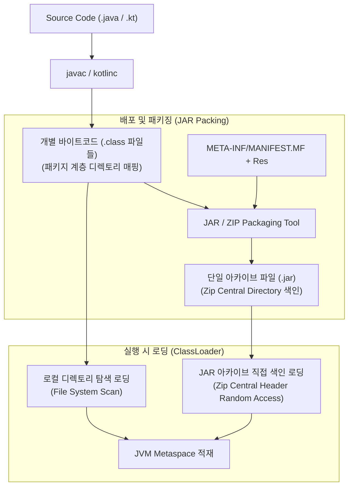

## 바이트코드 파일(.class)과 아카이브 파일(.jar)의 본질

### 개요

Java 및 Kotlin 빌드 생태계에서 컴파일 결과물은 개별 **바이트코드 파일(`.class`)**과 이를 묶은 **아카이브 파일(`.jar`, Java Archive)**이라는 두 가지 형태로 존재한다.

단순해 보이는 이 이원화 구조는 **컴파일러의 컴파일 단위(Compilation Unit)**, **파일 시스템 I/O 오버헤드 최적화**, **네트워크 배포 및 서명(Signing)의 효율성**을 달성하기 위해 필연적으로 고안된 아키텍처적 결정이다.



---

### 1. 개별 바이트코드 파일 (`.class`)의 역할과 한계

- **역할 (컴파일 단위)**:
  - Java/Kotlin 컴파일러는 하나의 소스 파일 내에 존재하는 클래스, 인터페이스, 열거형(Enum), 익명 내부 클래스(Anonymous Class)마다 정확히 1개의 독립된 `.class` 바이너리 파일을 생성한다.
  - 패키지 네임스페이스(`com.example.util.MathUtils`)가 디스크의 물리적 디렉터리 경로(`com/example/util/MathUtils.class`)와 1:1로 정확하게 일치한다.
- **한계 (파일 파편화와 I/O 병목)**:
  - 대규모 애플리케이션이나 라이브러리는 수천~수십만 개의 클래스를 가진다.
  - 이를 개별 `.class` 파일 디렉터리 구조 그대로 배포하면:
    1. **수많은 작은 파일로 인한 파일 시스템 I/O 및 inode 낭비**
    2. **네트워크 다운로드 시 수천 번의 HTTP 요청 오버헤드**
    3. **단일 파일 누락 시 런타임 `NoClassDefFoundError` 유발**

---

### 2. 아카이브 파일 (`.jar`: Java Archive)의 필요성과 내부 구조

**JAR(Java Archive)**는 수천 개의 디렉터리와 `.class` 파일, 메타데이터, 리소스 파일을 **표준 ZIP 압축 알고리즘을 사용해 단 하나의 파일로 묶은 아카이브 컨테이너**이다.

#### JAR 내부 디렉터리 구조

```text
my-library.jar (ZIP 포맷)
├── META-INF/
│   ├── MANIFEST.MF           # 메타데이터 (Main-Class, 버전, 서명 해시)
│   └── services/             # ServiceLoader SPI 등록 명세
├── com/
│   └── example/
│       ├── core/
│       │   ├── Engine.class  # 컴파일된 바이트코드
│       │   └── Config.class
│       └── util/
│           └── Helper.class
└── assets/
    └── config.properties     # 리소스 파일
```

#### JAR의 핵심 기술적 이점
1. **압축 해제 없는 고속 무작위 접근 (Random Access via Zip Central Directory)**:
   - JVM 클래스로더는 JAR 파일을 실행하기 위해 디스크에 압축을 풀지 않는다.
   - JAR 파일의 꼬리 부분에 있는 **중앙 디렉터리 헤더(Central Directory Header)**만 메모리에 읽어 클래스 위치 오프셋을 색인(Index)한 뒤, 필요한 `.class` 파일만 즉시 O(1) 스트림으로 압축 해제하여 Metaspace 에 적재한다.
2. **배포 및 버전 관리의 원자성(Atomicity)**:
   - 라이브러리 전체를 하나의 파일(Artifact)로 다루므로 네트워크 전송 및 Maven/Gradle 좌표(`groupId:artifactId:version`) 배포가 단일 파일 단위로 완결된다.
3. **암호학적 무결성 서명 (JAR Signing)**:
   - `META-INF/MANIFEST.MF` 및 `.SF`, `.RSA` 서명 블록을 통해 JAR 내부의 클래스가 변조되지 않았음을 검증할 수 있다.

---

### 3. Java/Android 아티팩트 포맷 비교표

| 포맷 | 기반 압축 포맷 | 주요 포함 내용 | 실행 런타임 |
|---|---|---|---|
| **`.class`** | 바이너리 파일 | 단일 클래스의 JVM 바이트코드, 상수 풀, 필드/메서드 구조 | JVM / D8 컴파일러 |
| **`.jar`** | ZIP 아카이브 | 수천 개의 `.class` 파일 + `META-INF/MANIFEST.MF` + 리소스 | 표준 JVM 런타임 |
| **`.aar`** | ZIP 아카이브 (Android 전용) | `classes.jar` + `AndroidManifest.xml` + `res/` 리소스 + JNI `.so` 네이티브 라이브러리 + ProGuard 룰 | Android Gradle Plugin 빌드 타임 |
| **`.dex`** | 바이너리 파일 (Android 전용) | 여러 `.class` 파일의 바이트코드를 하나로 통합 최적화한 Dalvik Executable 바이너리 | Android ART / Dalvik 가상 머신 |
| **`.apk` / `.aab`** | ZIP 아카이브 (Android 전용) | `.dex` 바이트코드 + `resources.arsc` + `res/` + `AndroidManifest.xml` + 서명 블록 | Android OS 설치/실행 |

---

### 상위 및 연관 문서

- [JVM 아키텍처와 런타임 실행 엔진](jvm-architecture.md)
- [JVM 클래스로더 메커니즘 (ClassLoader)](jvm-classloader.md)
- [JVM 클래스패스 (Classpath)](jvm-classpath.md)
- [Android 빌드 파이프라인과 핵심 빌드 용어 해설](../mobile/android/03_packaging_deployment/build/gradle/gradle-build/android-build-pipeline.md)
