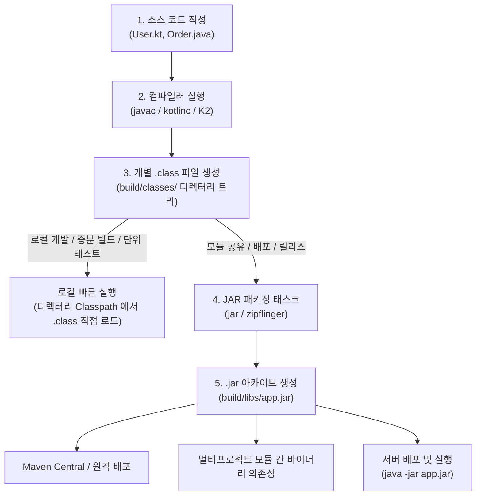
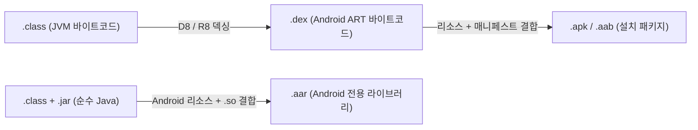

## 바이트코드 파일(.class)과 아카이브 파일(.jar)의 본질

### 개요

Java 및 Kotlin 빌드 생태계에서 코드는 **"소스 코드(.java/.kt) ➔ 개별 바이트코드 파일(.class) ➔ 묶음 아카이브 파일(.jar)"** 의 명확한 단계별 변환 과정을 거친다.

컴파일러가 처음 출력하는 결과물은 항상 개별 **`.class` 파일**이며, 이를 모듈 간 공유나 외부 배포, 프로덕션 실행을 위해 하나의 컨테이너로 묶은 결과물이 **`.jar` 파일**이다.



---

### 1. 어떤 경우에 `.class` 가 생성되고 사용되는가?

#### 1) 생성 시점: 컴파일 단계 (Compilation Phase)

- Java 컴파일러(`javac`)나 Kotlin 컴파일러(`kotlinc`)가 소스 코드를 읽어 문법 검증을 마치고 **JVM 바이트코드 명령어로 번역하는 즉시** 생성된다.
- **1 개 소스 파일 ≠ 1 개 `.class` 파일**:
  - 소스 파일 하나 안에 내부 클래스(Inner Class), 익명 클래스(Anonymous Class), 람다식, 인터페이스가 포함되어 있으면 컴파일러는 `User.class`, `User$1.class`, `User$Companion.class`처럼 여러 개의 `.class` 파일을 쪼개어 생성한다.
  - 패키지 경로(`com.example.util`)는 디스크의 실제 폴더 구조(`build/classes/kotlin/main/com/example/util/`)로 그대로 투영된다.

#### 2) 사용 시점: 로컬 개발 및 초고속 증분 빌드 (Incremental Feedback)

- **증분 컴파일(Incremental Compilation)**:
  - 개발자가 `User.kt` 1 개 파일만 수정했을 때, 빌드 도구는 전체 프로젝트를 다시 묶지 않고 오직 `User.class` 1 개 파일만 디스크에 덮어쓴다.
- **로컬 단위 테스트 실행**:
  - IDE(IntelliJ)나 Gradle 이 로컬에서 JUnit 테스트를 실행할 때는, 굳이 무거운 JAR 압축 과정을 거치지 않고 `build/classes/` 디렉터리 자체를 [클래스패스(Classpath)](jvm-classpath.md) 에 바로 등록하여 `.class` 파일을 즉시 로드한다 (패키징 오버헤드 0 초).

---

### 2. 어떤 경우에 `.jar` 로 패키징되고 사용되는가?

#### 1) 생성 시점: 패키징 및 아티팩트 조립 단계 (Packaging Phase)

- 컴파일이 완료된 후, Gradle 의 `jar` 태스크나 Maven 의 `package` 골(Goal)이 실행될 때 생성된다.
- `build/classes/`에 흩어져 있는 수천 개의 `.class` 파일과 메타데이터(`META-INF/MANIFEST.MF`), 설정 리소스 파일들을 ZIP 알고리즘으로 단 하나의 압축 파일(`build/libs/my-module.jar`)로 결합한다.

#### 2) 사용 시점: 공유, 배포, 프로덕션 런타임 (Distribution & Deployment)

```text
1. 멀티모듈 간 바이너리 의존성 제공:
   :core:network 모듈이 빌드한 core-network.jar 를 :feature:auth 모듈이 클래스패스로 참조.

2. 외부 라이브러리 배포 (Maven Central):
   수천 개의 클래스 파일을 개별 다운로드할 수 없으므로, ktor-client-core-3.5.2.jar 단일 파일로 배포.

3. 독립 실행형 프로덕션 배포 (Fat JAR / Spring Boot JAR):
   Main-Class 정보와 의존 라이브러리를 모두 내장하여 `java -jar application.jar` 단 한 줄로 서버 구동.
```

#### 3) 기술적 핵심: 압축 해제 없는 O(1) 무작위 접근 (Central Directory)

- JVM [클래스로더(ClassLoader)](jvm-classloader.md)는 `.jar` 파일을 실행할 때 디스크에 압축을 풀지 않는다.
- ZIP 파일의 끝에 위치한 **중앙 디렉터리 색인(Central Directory Index)** 만 메모리에 로드한 뒤, 특정 클래스(예: `com/example/User.class`)가 필요할 때 해당 파일의 오프셋 위치로 즉시 점프하여 O(1) 스트림으로 압축을 풀어 메모리(Metaspace)에 적재한다.

---

### 3. `.class` vs `.jar` 선택 및 변환 기준 정리

| 구분            | 개별 바이트코드 파일 (`.class`)          | 아카이브 파일 (`.jar`)                               |
| ------------- | ------------------------------- | ---------------------------------------------- |
| **역할 및 성격**   | **컴파일러의 기본 출력 단위** (중간 산출물)     | **배포 및 공유의 기본 단위** (최종 아티팩트)                   |
| **생성 주체**     | `javac`, `kotlinc`, K2 컴파일러     | `jar` 도구, Gradle/Maven 패키징 태스크                 |
| **저장 위치**     | 로컬 `build/classes/` 디렉터리 트리     | `build/libs/`, 로컬 캐시(`.m2`, `.gradle`), 원격 저장소 |
| **언제 사용하는가?** | 로컬 빠른 코드 수정, 증분 컴파일, IDE 단위 테스트 | 모듈 간 의존성 주입, Maven 배포, 서버 릴리스 실행               |
| **물리적 구조**    | 단일 클래스 바이트코드 바이너리 파일            | 수천 개의 `.class` + `MANIFEST.MF` 가 묶인 표준 ZIP 포맷  |

---

### 4. Android 생태계로의 확장 변환 (.aar, .dex, .apk)

Android 빌드 파이프라인에서는 JVM 의 `.class`와 `.jar` 개념이 모바일 런타임에 맞게 다음과 같이 추가 확장된다:



- **`.aar` (Android Archive)**: 순수 Java 라이브러리인 `.jar`와 달리, Android 레이아웃 XML, `res/` 이미지, `AndroidManifest.xml`, C/C++ JNI `.so` 라이브러리를 함께 묶은 Android 전용 라이브러리 포맷.
- **`.dex` (Dalvik Executable)**: 수많은 `.class` 파일의 중복된 문자열 상수 풀을 하나로 통합하고 레지스터 기반 명령어로 압축 최적화한 Android 실행 바이너리.

---

### 상위 및 연관 문서

- [JVM 아키텍처와 런타임 실행 엔진](jvm-architecture.md)
- [JVM 클래스로더 메커니즘 (ClassLoader)](jvm-classloader.md)
- [JVM 클래스패스 (Classpath)](jvm-classpath.md)
- [API vs ABI](api-vs-abi.md)
- [Android 빌드 파이프라인과 핵심 빌드 용어 해설](../mobile/android/03_packaging_deployment/build/gradle/gradle-build/android-build-pipeline.md)
