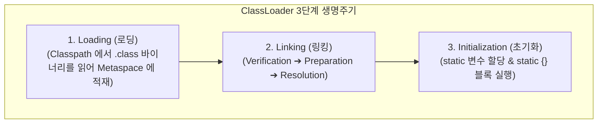
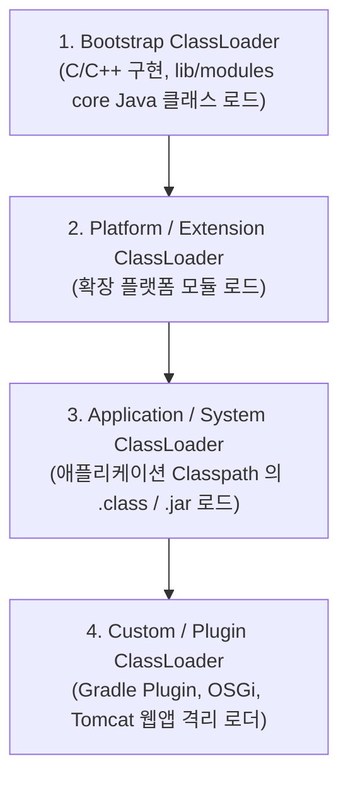

## JVM 클래스로더 메커니즘 (ClassLoader Subsystem)

### 개요

**클래스로더(ClassLoader)**는 JVM 의 핵심 서브시스템으로, 컴파일된 바이트코드(`.class` 바이너리 스트림)를 [클래스패스(Classpath)](jvm-classpath.md)에서 찾아 **동적으로 읽어 들이고, 바이트코드 무결성을 검증하며, JVM 메모리(Metaspace)에 적재하여 실행 가능한 `Class<T>` 인스턴스로 변환**하는 역할을 수행한다.

JVM 은 시작 시점에 모든 클래스를 메모리에 올리지 않으며, **특정 클래스가 코드 실행 중 처음 참조될 때 동적으로 로드(Lazy Dynamic Loading)**한다.

---

### 1. 클래스로더의 3단계 생명주기 (Loading ➔ Linking ➔ Initialization)

#### 1) Loading (로딩)
- 클래스의 완전한 패키지명(FQCN, Fully Qualified Class Name, 예: `com.example.NetworkClient`)을 기반으로 클래스패스 디렉터리나 JAR 아카이브 내부에서 바이너리 바이트 스트림을 읽어온다.
- 바이트 스트림을 파싱하여 JVM Metaspace 에 클래스 메타데이터를 생성하고, Heap 영역에 해당 클래스를 나타내는 `java.lang.Class` 객체를 생성한다.

#### 2) Linking (링킹)
적재된 클래스를 JVM 런타임 상태로 결합하는 과정으로 3개의 하위 단계로 나뉜다:
- **Verification (검증)**:
  - 바이트코드가 Java 언어 명세 및 JVM 제약조건을 만족하는지 엄격히 검사한다.
  - 파일 매직 넘버(`0xCAFEBABE`), 바이트코드 오버플로우/언더플로우, 타입 변환 유효성, `final` 클래스 상속 금지 위반 여부를 검사하여 보안 취약점과 시스템 크래시를 방지한다.
- **Preparation (준비)**:
  - 클래스의 정적 필드(`static` 변수)를 위한 메모리를 Metaspace 에 할당하고 **기본 초깃값(Default Value: 숫자 `0`, boolean `false`, 참조형 `null`)으로 초기화**한다. (사용자가 선언한 명시적 초깃값은 3단계 Initialization 에서 할당됨).
- **Resolution (해석)**:
  - 클래스의 런타임 상수 풀(Constant Pool)에 저장된 **심볼릭 참조(Symbolic Reference, 문자열 기반의 클래스/메서드/필드 이름)**를 실제 메모리 상의 물리적 주소를 가리키는 **직접 참조(Direct Reference)**로 치환한다.

#### 3) Initialization (초기화)
- 클래스의 정적 변수들에 개발자가 코드에 명시한 실제 초깃값을 할당하고, `static { ... }` 초기화 블록을 컴파일러가 생성한 `<clinit>` 메서드 바이트코드로 순차 실행한다.
- 이 단계는 멀티스레드 환경에서도 단 한 번만 안전하게 실행되도록 JVM 내부 락(Lock)에 의해 동기화된다.

---

### 2. 클래스로더 계층 구조와 위임 모델 (Delegation Model)

JVM 은 클래스 로딩을 위해 부모-자식 계층 구조로 연결된 표준 클래스로더들을 사용한다.

| 클래스로더 | 역할 및 탐색 대상 |
|---|---|
| **Bootstrap ClassLoader** | JVM 기동 시 C/C++ 네이티브 코드로 생성되며, `java.lang.*`, `java.util.*` 등 Java 핵심 런타임 클래스 로드 |
| **Platform ClassLoader** | Java 9+ 모듈 시스템(JPMS) 기반의 확장 플랫폼 모듈 로드 (과거 Extension ClassLoader) |
| **Application ClassLoader** | 애플리케이션의 [클래스패스(Classpath)](jvm-classpath.md)에 지정된 디렉터리와 라이브러리(`.jar`)를 로드 |
| **Custom ClassLoader** | 개발자가 `ClassLoader`를 상속하여 네트워크, 암호화된 파일, 또는 플러그인 격리 공간에서 클래스를 로드 |

---

### 3. 클래스로더의 3대 핵심 원칙

1. **위임 원칙 (Delegation Principle)**:
   - 클래스 로드 요청을 받은 클래스로더는 스스로 클래스를 찾기 전에 **항상 상위(Parent) 클래스로더에게 로딩을 먼저 위임**한다.
   - 최상위(Bootstrap)까지 올라가서 부모가 클래스를 찾지 못했을 때 비로소 자기 자신의 클래스패스에서 클래스를 탐색한다.
   - *이유*: 사용자가 악의적으로 `java.lang.String` 같은 핵심 클래스를 재작성하여 클래스패스에 두더라도, 항상 Bootstrap 로더가 원본 `String`을 먼저 로드하므로 핵심 시스템 클래스의 변조를 방지한다.
2. **가시성 원칙 (Visibility Principle)**:
   - 자식(Child) 클래스로더는 부모가 로드한 클래스를 참조할 수 있지만, **부모 클래스로더는 자식이 로드한 클래스를 볼 수 없다**.
3. **유일성 원칙 (Uniqueness Principle)**:
   - 부모가 이미 로드한 클래스는 자식 클래스로더가 다시 로드하지 않음으로써, JVM 내에서 FQCN 클래스의 단일성과 메모리 효율을 보장한다.

---

### 4. 클래스로더 격리와 빌드 도구 (Gradle Plugin Isolation)

빌드 도구인 Gradle 은 태스크나 플러그인을 실행할 때 프로젝트 라이브러리와 빌드 플러그인 간의 의존성 충돌을 방지하기 위해 **독립된 Custom ClassLoader 인스턴스를 생성하여 격리(ClassLoader Isolation)**한다.

- 플러그인 A가 구버전 라이브러리(`guava 28.0`)를 요구하고 모듈 B가 신버전 라이브러리(`guava 32.0`)를 사용하더라도, 서로 다른 클래스로더가 각자의 메모리 공간에 로드하므로 `Jar Hell` 충돌 없이 안전하게 공존할 수 있다.

---

### 상위 및 연관 문서

- [JVM 아키텍처와 런타임 실행 엔진](jvm-architecture.md)
- [JVM 클래스패스 (Classpath)](jvm-classpath.md)
- [바이트코드 파일(.class)과 아카이브 파일(.jar)의 본질](jvm-bytecode-and-jar-archive.md)
- [API vs ABI](api-vs-abi.md)
- [Gradle 태스크 모델과 Provider API](../mobile/android/03_packaging_deployment/build/gradle/gradle-build/gradle-task-api.md)
