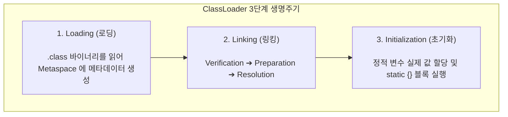
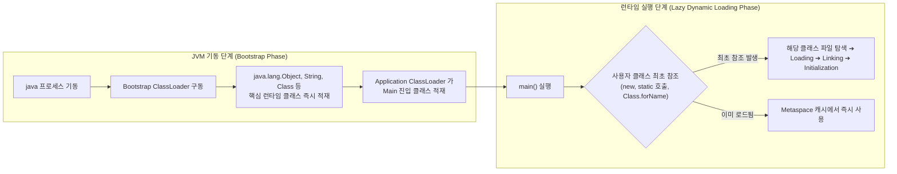
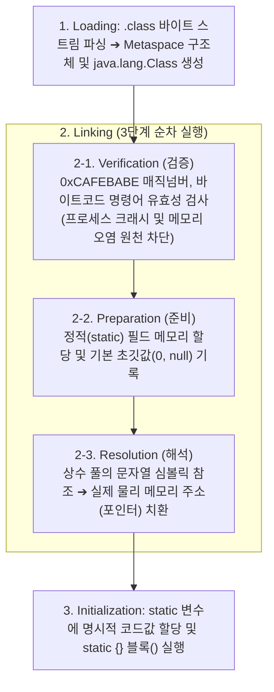
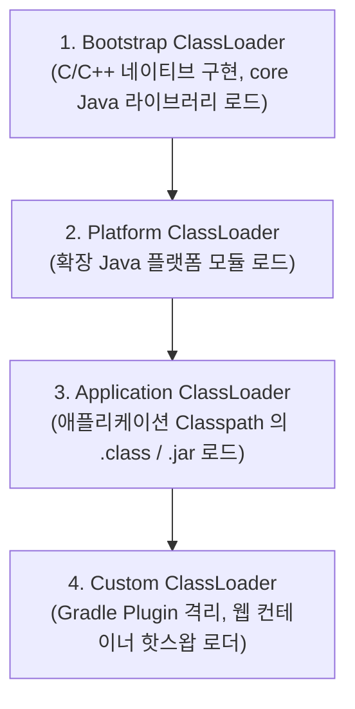
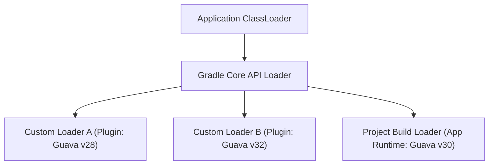

## JVM 클래스로더 메커니즘 (ClassLoader Subsystem)

### 개요

**클래스로더(ClassLoader)** 는 JVM 의 핵심 서브시스템으로, 컴파일된 바이트코드(`.class` 바이너리 바이트 스트림)를 [클래스패스(Classpath)](jvm-classpath.md)에서 찾아 **동적으로 읽어 들이고, 바이트코드 무결성을 검증하며, JVM 메모리(Metaspace)에 적재하여 실행 가능한 `Class<T>` 인스턴스로 변환**하는 엔진이다.

C/C++ 과 같은 네이티브 컴파일 언어는 빌드 시점에 링커(Linker)가 모든 심볼의 물리 주소를 정적으로 확정하여 단일 실행 파일로 묶지만, JVM 은 **클래스가 실행 흐름상 실제로 필요한 시점에 동적으로 로드(Lazy Dynamic Loading)하고 메모리 주소를 런타임에 결합(Dynamic Linking)** 한다.



---

### 1. 시스템 클래스와 사용자 클래스의 적재 시점

JVM 환경에서 모든 클래스가 시작 시점에 한꺼번에 메모리에 올라가는 것은 아니다. 시스템 핵심 클래스와 사용자 애플리케이션 코드는 적재 시점과 담당 클래스로더가 엄격히 구분된다.



#### 1) JVM 기동 시점 (Bootstrap Phase)

- OS 가 `java` 명령을 실행하면 C/C++ 로 구현된 JVM 네이티브 엔진이 초기화된다.
- **Bootstrap ClassLoader** 가 가장 먼저 구동되어 `java.lang.Object`, `java.lang.String`, `java.lang.Class`, `java.lang.System` 등 Java 플랫폼 실행에 필수적인 핵심 런타임 클래스들을 모듈 저장소(`lib/modules` 또는 레거시 `rt.jar`)에서 읽어 Metaspace 에 즉시 적재한다.
- 이후 `Platform ClassLoader`와 `Application ClassLoader` 인스턴스가 JVM 힙에 생성되고, 애플리케이션의 진입점인 `Main` 클래스를 로드하여 `main()` 메서드를 호출한다.

#### 2) 런타임 실행 시점 (Lazy Dynamic Loading Phase)

- 사용자가 작성한 수백, 수천 개의 비즈니스 클래스(예: `UserRepository`, `PaymentService`)는 시작할 때 메모리에 올라가지 않는다.
- 코드가 실행되다가 특정 클래스를 **최초로 참조하는 순간(Trigger Points)** 에 동적으로 로딩된다:
  1. `new MyService()` 인스턴스를 생성할 때
  2. `MyUtils.calculate()` 정적(static) 메서드를 호출할 때
  3. `MyConfig.MAX_SIZE` 정적(static) 필드에 접근할 때
  4. `Class.forName("com.example.MyService")` 리플렉션으로 조회할 때

---

### 2. 클래스로더 3 단계 생명주기와 내부 인과관계

클래스로더의 동작은 **Loading(로딩) ➔ Linking(링킹) ➔ Initialization(초기화)** 순서로 진행되며, 각 단계는 앞 단계의 메모리 안전성이 확보되어야만 다음 단계가 실행될 수 있는 엄격한 논리적 인과관계를 가진다.



---

#### 1 단계: Loading (로딩)

- 클래스의 완전한 패키지명(FQCN, 예: `com.example.OrderService`)을 파일 경로(`com/example/OrderService.class`)로 변환하여 디렉터리나 JAR 아카이브에서 바이트 배열로 읽어온다.
- 이 바이트 배열을 파싱하여 **JVM Metaspace(Native Memory)에 클래스의 필드, 메서드 바이트코드, 런타임 상수 풀(Constant Pool) 구조체를 생성**하고, Java 코드에서 접근할 수 있도록 Heap 에 해당 클래스를 대표하는 `java.lang.Class<OrderService>` 객체를 인스턴스화한다.

---

#### 2 단계: Linking (링킹)

읽어 들인 바이너리 데이터를 JVM 런타임 환경에 결합하는 단계로, **검증(Verification) ➔ 준비(Preparation) ➔ 해석(Resolution)** 순서로 실행된다.

##### ① Verification (검증): 왜 메모리 할당 전에 먼저 검증해야 하는가?

- 로드된 `.class` 파일은 신뢰할 수 없는 외부 네트워크나 조작된 파일일 수 있다.
- 검증 없이 기계어 수준으로 해석하거나 메모리를 연결하면 JVM 프로세스 전체가 메모리 세그멘테이션 폴트(Segmentation Fault)로 다운되거나 보안 취약점이 발생한다.
- **주요 검증 항목**:
  1. 파일의 첫 4 바이트가 Java 바이트코드 매직 넘버인 `0xCAFEBABE` 로 시작하는가?
  2. 메서드의 스택 바운드(Max Stack)를 초과하여 스택 오버플로우를 유발하는 명령어가 없는가?
  3. 변수 타입 변환(Type Casting)이 JVM 명세상 안전한가?
  4. `final`로 선언된 클래스를 불법으로 상속하거나 `final` 메서드를 오버라이드하지 않았는가?

##### ② Preparation (준비): 왜 정적 필드 메모리를 먼저 기본값으로 할당하는가?

- 클래스가 동작하기 위해서는 해당 클래스가 소유한 모든 **정적 변수(`static` fields)가 위치할 물리적 메모리 공간**이 Metaspace 에 미리 확정되어 있어야 한다.
- **기본 초깃값(Default Zero Value) 할당**:
  - 코드에 `public static int timeout = 5000;`이라고 작성되어 있더라도, 이 단계에서는 `5000` 을 넣지 않고 **`0` (참조형은 `null`, boolean 은 `false`)** 을 기록한다.
  - *이유*: 아직 다음 단계인 해석(Resolution)과 사용자 초기화 코드(`timeout = 5000`)가 실행되기 전이므로, 만약 다른 스레드나 클래스가 이 시점에 정적 메모리를 참조하더라도 쓰레기 값(Garbage memory)이 아닌 예측 가능한 기본 상태(`0`/`null`)를 보장하기 위함이다.
  - *예외*: `static final int MAX = 100;` 과 같은 컴파일 타임 상수는 런타임 초기화가 필요 없으므로 이 단계에서 상수 풀의 실제 값(`100`)이 즉시 기록된다.

##### ③ Resolution (해석): 심볼릭 참조(Symbolic Reference)를 직접 참조(Direct Reference)로 치환하는 이유

컴파일러(`javac`/`kotlinc`)가 소스 코드를 컴파일할 때, `OrderService`가 호출하는 `PaymentGateway` 클래스나 `pay()` 메서드가 **런타임 JVM 메모리의 어느 물리적 주소(Pointer)에 적재될지는 컴파일 시점에는 물리적으로 알 수 없다**.

따라서 컴파일러는 `.class` 파일 내부의 **런타임 상수 풀(Constant Pool)** 에 단순 텍스트 문자열 형태로 기록해 둔다. 이를 **심볼릭 참조(Symbolic Reference)** 라 한다.

```text
// 컴파일된 바이트코드의 상수 풀 (문자열 심볼릭 참조 상태)
#12 = Methodref #13.#14 // class: "com/example/PaymentGateway", name_and_type: "pay:(I)Z"
```

- **해석(Resolution) 과정**:
  - JVM 은 상수 풀에 기록된 문자열 이름(`"com/example/PaymentGateway"`)을 보고 `PaymentGateway` 클래스가 이미 로드되어 있는지 확인한다. (로드되어 있지 않다면 해당 클래스의 로딩 과정을 재귀적으로 유발한다).
  - 해당 클래스의 메서드 테이블(vtable) 및 필드 오프셋을 탐색하여, 문자열 심볼(`"pay:(I)Z"`)을 **JVM 프로세스 메모리 상의 실제 물리 주소 포인터(Direct Pointer)로 치환**한다.
- **치환하는 이유**:
  - 메서드를 호출할 때마다 문자열 이름을 문자열 비교(String Matching)로 검색하면 실행 성능이 극도로 저하된다.
  - 메모리 직접 주소(Direct Reference)로 한 번 변환해 두면, CPU 와 실행 엔진이 포인터를 타고 즉시 메모리에 접근(O(1))하여 호출할 수 있다.

---

#### 3 단계: Initialization (초기화)

- 준비(Preparation) 단계에서 메모리가 확보되고, 해석(Resolution) 단계에서 참조 주소가 모두 연결된 안전한 상태에서 비로소 **개발자가 작성한 실제 정적 초기화 코드를 실행**한다.
- 컴파일러가 클래스 내의 모든 정적 변수 할당문(`timeout = 5000`)과 `static { … }` 초기화 블록을 모아 자동으로 생성한 **`<clinit>`(Class Initialization) 특수 바이트코드 메서드**를 실행한다.
- **스레드 안전성 보장**: 멀티스레드가 동시에 동일한 클래스를 처음 참조하더라도 `<clinit>` 메서드는 JVM 내부 락(Lock)에 의해 단 하나의 스레드만 실행하도록 보장되어 클래스의 정적 상태가 단 한 번만 초기화된다.

---

### 3. 클래스로더 계층 구조와 위임 모델 (Delegation Model)

JVM 은 클래스 로딩을 위해 부모 - 자식 트리 계층 구조로 연결된 표준 클래스로더들을 사용한다.



| 클래스로더 | 구현 언어 | 로드 대상 경로 | 주요 로드 대상 |
|---|---|---|---|
| **Bootstrap ClassLoader** | C/C++ 네이티브 | JVM 코어 모듈 (`lib/modules`) | `java.lang.*`, `java.util.*` 등 핵심 런타임 클래스 |
| **Platform ClassLoader** | Java | 확장 플랫폼 모듈 | `java.sql`, `java.net.http` 등 플랫폼 확장 클래스 |
| **Application ClassLoader** | Java | [클래스패스(Classpath)](jvm-classpath.md) | 애플리케이션 소스(`.class`) 및 서드파티 라이브러리(`.jar`) |
| **Custom ClassLoader** | Java | 사용자 정의 경로 | Gradle 플러그인 격리, 동적 네트워크 로딩, OSGi 모듈 |

---

### 4. 클래스로더의 3 대 핵심 원칙

1. **위임 원칙 (Delegation Principle - Parent First)**:
   - 클래스 로드 요청을 받은 클래스로더는 스스로 클래스를 찾기 전에 **항상 상위(Parent) 클래스로더에게 로딩을 먼저 위임**한다.
   - 최상위(Bootstrap)까지 올라가서 부모가 클래스를 찾지 못했을 때 비로소 하위 클래스로더가 자기 자신의 클래스패스에서 클래스를 탐색한다.
   - *이유*: 사용자가 악의적으로 `java.lang.String` 클래스를 만들어 클래스패스에 두더라도, 항상 Bootstrap 로더가 원본 `String` 을 먼저 로드하므로 핵심 시스템 클래스의 변조를 원천 방어한다.
2. **가시성 원칙 (Visibility Principle)**:
   - 자식(Child) 클래스로더는 부모가 로드한 클래스를 참조할 수 있지만, **부모 클래스로더는 자식이 로드한 클래스를 볼 수 없다**.
   - *이유*: 기본 플랫폼 클래스들이 하위 애플리케이션의 세부 구현에 오염되지 않도록 단방향 가시성을 강제한다.
3. **유일성 원칙 (Uniqueness Principle)**:
   - 부모가 이미 로드한 클래스는 자식 클래스로더가 다시 로드하지 않음으로써, JVM 메모리 내에서 FQCN 클래스의 단일성과 메모리 효율을 보장한다.

---

### 5. 클래스로더 격리와 빌드 도구 (Gradle ClassLoader Isolation)

Gradle 과 같은 고도화된 빌드 도구는 프로젝트 의존성과 빌드 도구 플러그인 간의 라이브러리 충돌(Jar Hell)을 방지하기 위해 **클래스로더 계층을 수평으로 분리하는 클래스로더 격리(ClassLoader Isolation)** 를 사용한다.



- **격리 메커니즘**:
  - 플러그인 A 와 플러그인 B 가 서로 다른 버전의 라이브러리(`Guava 28.0` vs `Guava 32.0`)를 사용하더라도, 각 플러그인을 서로 다른 `Custom ClassLoader` 인스턴스에 로드한다.
  - 가시성 원칙에 의해 로더 A 와 로더 B 는 서로의 클래스를 볼 수 없으므로, 하나의 JVM 프로세스(Gradle 데몬) 안에서 버전 충돌 없이 안전하게 공존한다.

---

### 상위 및 연관 문서

- [JVM 아키텍처와 런타임 실행 엔진](jvm-architecture.md)
- [JVM 클래스패스 (Classpath)](jvm-classpath.md)
- [바이트코드 파일(.class)과 아카이브 파일(.jar)의 본질](jvm-bytecode-and-jar-archive.md)
- [API vs ABI](api-vs-abi.md)
- [Gradle 태스크 모델과 Provider API](../mobile/android/03_packaging_deployment/build/gradle/gradle-build/gradle-task-api.md)
