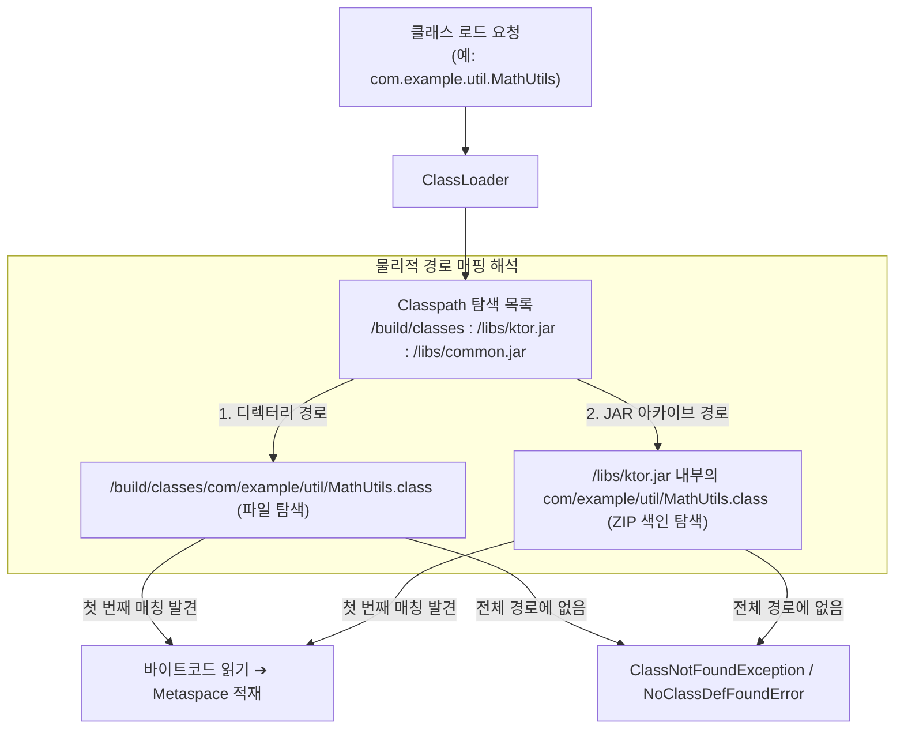
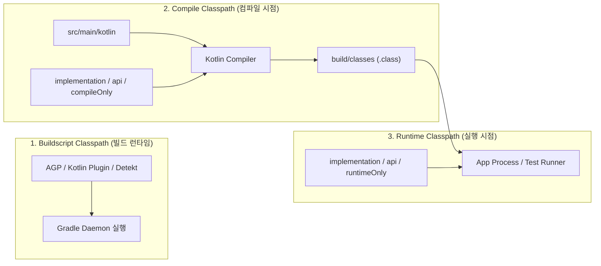

## JVM 클래스패스 (Classpath)와 탐색 메커니즘

### 개요

**클래스패스(Classpath)** 는 [JVM(Java Virtual Machine)](jvm-architecture.md) 및 Java/Kotlin 컴파일러가 특정 클래스를 필요로 할 때, 해당 클래스의 [바이트코드(.class)와 아카이브(.jar)](jvm-bytecode-and-jar-archive.md) 를 찾기 위해 탐색하는 **물리적 파일 시스템 경로들의 순서 있는 목록(Ordered List of File System Paths)** 이다.

C/C++ 과 같은 정적 링크 언어가 빌드 시점에 모든 라이브러리를 단일 바이너리로 묶는 것과 달리, JVM 은 **런타임에 [클래스로더(ClassLoader)](jvm-classloader.md) 가 클래스패스에 나열된 경로를 순차적으로 스캔하여 클래스를 동적으로 메모리에 적재(Dynamic Class Loading)** 한다.



---

### 1. '파일 시스템 경로 목록'의 구체적 동작 원리

클래스패스는 CLI 명령어나 환경변수(`CLASSPATH`), 또는 빌드 스크립트에서 다음과 같이 콜론(`:`, Windows 는 `;`)으로 구분된 경로 문자열로 전달된다:

```bash
java -classpath "/app/build/classes:/libs/ktor.jar:/libs/core.jar" com.example.MainApp
```

클래스로더는 찾고자 하는 클래스의 완전한 패키지명(FQCN, 예: `com.example.util.MathUtils`)을 파일 경로 형태(`com/example/util/MathUtils.class`)로 변환한 후, 클래스패스에 나열된 항목을 **왼쪽부터 오른쪽으로 순차 탐색**한다.

#### 1) 경로가 '디렉터리'인 경우 (`/app/build/classes`)

- 해당 디렉터리를 **패키지 루트 디렉터리**로 간주한다.
- 디렉터리 경로 뒤에 클래스 상대 경로를 이어 붙여 물리 파일(`/app/build/classes/com/example/util/MathUtils.class`)이 존재하는지 `stat` 파일 시스템 호출로 확인한다.

#### 2) 경로가 'JAR 아카이브 파일'인 경우 (`/libs/ktor.jar`)

- 해당 JAR(ZIP 파일)을 **패키지 루트 컨테이너**로 간주한다.
- JAR 파일을 디스크에 풀지 않고, JAR 내부의 **중앙 디렉터리 헤더(Central Directory Header)** 에서 엔트리 이름(`com/example/util/MathUtils.class`)이 존재하는지 O(1) 메모리 인덱스로 검색한다.

---

### 2. 빌드 도구 관점에서의 3 단계 클래스패스 분리

현대 빌드 시스템(Gradle, Bazel)은 클래스 오염과 불필요한 빌드 전파를 방지하기 위해 클래스패스를 3 단계로 엄격히 분리하여 관리한다.



| 구분 | 목적 | 포함 대상 | 배제 대상 |
|---|---|---|---|
| **Buildscript / Plugin Classpath** | 빌드 도구 자체 및 플러그인 구동 | AGP, Detekt, Compose Compiler Plugin, Kotlin Gradle Plugin | 앱 소스 코드, 앱 런타임 라이브러리 |
| **Compile Classpath** | 소스 코드(`src/`)의 문법 검증 및 바이트코드 생성 | `api`, `implementation`, `compileOnly` | `runtimeOnly` (컴파일 시점에 불필요한 구현체) |
| **Runtime Classpath** | 컴파일된 코드가 실제 실행/테스트될 때 클래스 로딩 | `api`, `implementation`, `runtimeOnly` | `compileOnly` (어노테이션, 빌드 전용 타입) |

---

### 3. 클래스패스 탐색 규칙과 Jar Hell (클래스 충돌)

클래스로더는 클래스패스에 지정된 순서대로 탐색하며, **가장 먼저 발견된 클래스를 로드하고 탐색을 즉시 종료(First-match wins)** 한다.

```text
클래스패스: [ lib-v1.0.jar : lib-v2.0.jar ]
             └── com.example.Util.class 가 양쪽에 존재할 때
                 ➔ 항상 lib-v1.0.jar 의 Util 이 로드됨 (Class Shadowing)
```

#### Jar Hell (의존성 지옥)과 클래스 섀도잉
- 서로 다른 라이브러리가 동일한 패키지/클래스명을 가진 구버전과 신버전 클래스를 각각 포함할 경우, 클래스패스 순서에 따라 런타임에 예기치 않은 메서드 누락(`NoSuchMethodError`)이나 비정상 동작이 발생한다.
- Gradle 은 이를 해결하기 위해 **의존성 그래프 단일 버전 해결 규칙(Dependency Conflict Resolution)**을 사용하여 최신 버전을 선택하거나 버전을 강제 통일한다.

---

### 4. ClassNotFoundException vs NoClassDefFoundError

- **`ClassNotFoundException` (런타임 동적 탐색 실패)**:
  - `Class.forName("com.example.MyClass")` 또는 리플렉션을 통해 동적으로 클래스명을 조회했으나, 클래스패스 상에 해당 `.class` 파일이 존재하지 않을 때 발생한다.
- **`NoClassDefFoundError` (컴파일 성공 후 런타임 로드 실패)**:
  - 컴파일 시점에는 클래스패스에 클래스가 존재하여 컴파일에 성공했으나, **런타임 클래스패스에서 해당 클래스나 의존 클래스가 누락되었거나 정적 초기화(`static {}`) 블록에서 예외가 발생**하여 클래스 정의를 읽지 못할 때 발생한다.

---

### 5. Classpath vs Modulepath (Java 9+ JPMS)

- **Classpath**: 평면적인(Flat) 경로 구조로, 모든 JAR 의 패키지가 하나의 전역 네임스페이스로 병합된다. 캡슐화가 없고 런타임 클래스 누락을 기동 전에 검증할 수 없다.
- **Modulepath**: Java 9 JPMS(Java Platform Module System)에서 도입된 명시적 모듈 경로(`module-info.java`)로, 모듈 간 공개 패키지와 의존성을 명시적으로 선언하여 컴파일/기동 시점에 캡슐화와 의존성 완전성을 엄격히 검증한다.

---

### 상위 및 연관 문서

- [JVM 아키텍처와 런타임 실행 엔진](jvm-architecture.md)
- [JVM 클래스로더 메커니즘 (ClassLoader)](jvm-classloader.md)
- [바이트코드 파일(.class)과 아카이브 파일(.jar)의 본질](jvm-bytecode-and-jar-archive.md)
- [API vs ABI](api-vs-abi.md)
- [Gradle 의존성 구성 및 클래스패스 격리](../mobile/android/03_packaging_deployment/build/gradle/gradle-build/gradle-dependency-configurations.md)
