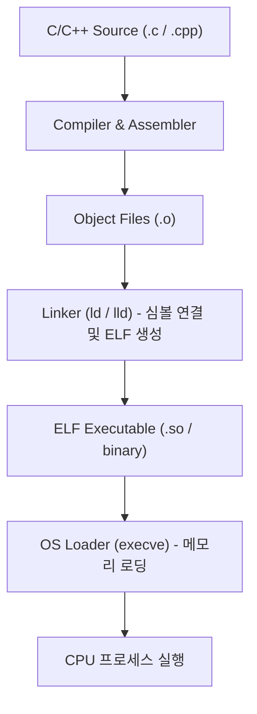

# Linker and Loader (링커와 로더)

## 1. 개요 (Overview)

**Linker(링커)와 Loader(로더)** 는 소스 코드가 컴파일된 후, **최종 실행 파일(Executable Binary)을 생성하고 이를 운영체제 메모리에 로드하여 실행하도록 만드는 빌드 파이프라인 및 OS 시스템 소프트웨어**이다.

- **Linker (링커)**: 여러 소스 파일이 각각 컴파일된 오브젝트 파일(`.o`)들과 라이브러리(`.a`, `.so`)들을 하나로 묶어, 함수/변수 심볼 주소를 연결(Symbol Resolution & Relocation)하고 단일 [elf-executable-and-linkable-format](elf-executable-and-linkable-format.md) 실행 바이너리를 생성한다.
- **Loader (로더)**: 생성된 실행 바이너리를 디스크에서 읽어 [virtual-memory](virtual-memory.md) 상의 가상 주소 공간으로 배치(Load)하고, CPU 의 프로그램 카운터(PC)를 시작점(Entry Point)으로 옮겨 앱을 실행시킨다.

---

### 초보자를 위한 쉽게 이해하는 비유

* **Linker & Loader (부품 조립 공장과 현장 배치 기사)**:
  - **Linker (조립 공장)**: 각각 제작된 엔진, 바퀴, 핸들(오브젝트 파일들)을 나사(심볼 주소)로 연결하여 완전한 자동차 1대(`ELF` 바이너리)로 합체하는 조립 공장.
  - **Loader (현장 배치 기사)**: 완성된 자동차를 실제 주행 도로([virtual-memory](virtual-memory.md)) 위에 차선에 맞게 올바르게 끌고 나가 시동(Entry Point)을 거는 운전 기사.

---

## 2. Linker 의 핵심 역할 2가지

1. **심볼 해독 (Symbol Resolution)**: 각 오브젝트 파일에 선언되거나 참조된 함수/변수 심볼(Symbol)의 정의 위치를 찾아 매칭시킴.
2. **재배치 (Relocation)**: 분리되어 있던 소스 코드의 세그먼트를 통합하면서, 상대적 위치로 작성되어 있던 메모리 주소를 실제 단일 바이너리 가상 주소로 재배치함. (이 과정에서 페이지 정렬 규약인 [data-structure-alignment](data-structure-alignment.md) 이 적용됨).

---

## 3. 연결 문서 (Related Links)

- [elf-executable-and-linkable-format](elf-executable-and-linkable-format.md) - ELF 바이너리 포맷
- [data-structure-alignment](data-structure-alignment.md) - 메모리 정렬 및 얼라인먼트
- [virtual-memory](virtual-memory.md) - 가상 메모리 시스템
- [android-16kb-page-alignment](../mobile/android/01_system_internals/kernel-and-hal/android-16kb-page-alignment.md) - 안드로이드 16KB 링커 정렬
