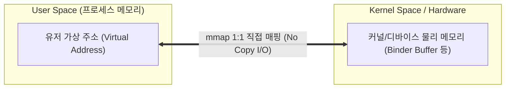

## mmap (Memory Map / 메모리 맵핑)

### 1. mmap 이란 무엇인가 (Overview)

운영체제(OS)에서 **`mmap` (Memory Map)** 은 **"파일이나 커널 공간의 메모리 영역을 프로세스의 유저 공간(User Space) 가상 메모리 주소에 직접 1:1 매핑(Mapping)하는 시스템 콜(System Call)"** 이다.

#### 초보자를 위한 쉽게 이해하는 비유

- **기존 I/O (`read()`, `write()`)**:
  - 서류(데이터)를 가져오기 위해 직원이 직접 창고(커널 메모리)로 가서 서류를 복사해 사무실(유저 메모리) 책상으로 가져오는 방식 (2 회 복사 발생).
- **`mmap` 방식**:
  - 사무실 책상에 창고 서류함을 바로 들여놓을 수 있는 **"투명한 가상 거울 통로"** 를 개설하는 방식.
  - 별도로 복사하지 않고도 책상 위 서류함을 만지면 창고 서류가 곧바로 변경된다. (데이터 복사 0 회 또는 1 회로 단축!)

---

### 2. mmap 의 핵심 이점과 작동 원리

1. **메모리 복사 횟수 최소화 (Zero Copy / Single Copy)**:
   - 디스크 파일이나 커널 버퍼를 읽고 쓸 때 `read()` 시스템 콜을 호출하여 유저 버퍼로 복사해 올 필요 없이, 매핑된 메모리 주소에 직접 `read/write` 연산을 수행하면 OS 가 백그라운드에서 데이터를 동기화한다.
2. **프로세스 간 고속 메모리 공유 (Shared Memory IPC)**:
   - 서로 다른 프로세스가 동일한 물리 메모리 영역이나 파일 영역을 `mmap` 으로 매핑하면 IPC 복사 없이도 고속으로 데이터 스트림을 주고받을 수 있다.

---

### 3. Android Platform 에서의 mmap 활용 (Binder IPC)

Android 런타임의 핵심 통신 메커니즘인 [Binder IPC](../mobile/android/01_system_internals/binder-ipc.md) 는 `mmap()` 시스템 콜을 활용하여 **단 1 회의 메모리 복사(Single Copy)** 만으로 데이터를 수신 프로세스에 전달한다.

- 수신자(Server/`system_server`) 프로세스는 앱 구동 시 `/dev/binder` 드라이버에 대해 `mmap()` 을 호출하여 커널 공유 메모리 공간을 자신의 메모리에 미리 매핑해 둔다.
- 송신자(Client)가 데이터를 보내면, Binder 커널 드라이버는 송신자 메모리에서 수신자가 매핑해둔 메모리로 **단 1 회만 직접 복사**하여 커널 - 유저 간의 복사 낭비를 극복한다.

---

### 4. 연결 문서 (Related Links)

- [Binder IPC](../mobile/android/01_system_internals/binder-ipc.md) - mmap() 시스템 콜을 활용하는 Android 백본 IPC
- [Linux Kernel](../operating-systems/linux-kernel.md) - mmap 시스템 콜을 제공하는 가상 메모리 관리 커널
