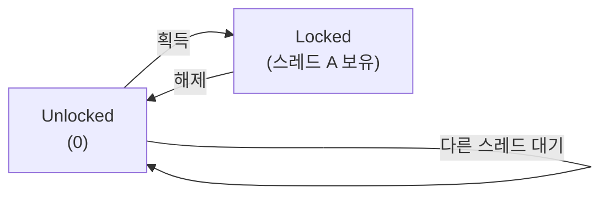

## Mutex / Lock (상호 배제)

**Mutex (Mutual Exclusion)**와 **Lock**은 임계 영역(Critical Section)에 한 번에 단 하나의 스레드만 접근할 수 있도록 제어하는 동기화 메커니즘입니다.

---

### 초보자를 위한 쉽게 이해하는 비유

**Mutex / Lock (화장실 열쇠)**:

열쇠를 가진 사람 1명만 화장실(임계 영역)에 들어가고 문을 잠급니다. 볼일이 끝나면 열쇠를 반납해야 다른 사람이 들어갈 수 있습니다.

---

## Lock의 정의 및 특징

### 기본 개념

```
스레드 A: Lock 획득 (Acquire) → 임계 영역 실행 → Lock 해제 (Release)
스레드 B: Lock 대기 ... → Lock 획득 → 임계 영역 실행 → Lock 해제
```

### Mutex의 핵심: Ownership (소유권)

**Mutex의 결정적 특징**:

1. **Ownership (소유권 존재)**
   - Mutex를 획득한 **바로 그 스레드만** 그 Mutex를 해제할 수 있음
   - 다른 스레드가 해제 불가

2. **Recursive Lock (재진입 가능)**
   - 같은 스레드가 같은 Mutex를 여러 번 획득 가능 (Reentrant Lock)
   - 획득한 횟수만큼 해제해야 완전히 해제됨

**Semaphore와의 차이**:

| 특징 | Mutex | Semaphore |
|------|-------|----------|
| **소유권** | 있음 (획득한 스레드만 해제 가능) | 없음 (누구나 해제 가능) |
| **용도** | 상호 배제 | 리소스 개수 제어 |
| **재진입** | Reentrant Lock 지원 | 재진입 일반적으로 불가 |

---

## Lock의 종류

### 1. Binary Mutex (Binary Lock)

```
상태: Locked (1) 또는 Unlocked (0)
허용 스레드: 1개
```



### 2. Reentrant Lock (Recursive Lock)

```
같은 스레드가 여러 번 획득 가능
획득 횟수 == 해제 횟수여야 완전히 해제
```

```kotlin
val lock = ReentrantLock()

fun methodA() {
    lock.lock()        // 획득 1
    try {
        methodB()      // 내부에서 같은 lock 재획득
    } finally {
        lock.unlock()  // 해제 1
    }
}

fun methodB() {
    lock.lock()        // 획득 2 (같은 스레드, 가능)
    try {
        // 작업
    } finally {
        lock.unlock()  // 해제 2
    }
}
```

### 3. RW Lock (Read-Write Lock)

```
읽기 스레드: 여러 개 동시 허용
쓰기 스레드: 1개만 허용 (배타적)
```

```kotlin
val rwLock = ReadWriteLock()

fun read() {
    rwLock.readLock().lock()
    try {
        // 여러 스레드가 동시 실행 가능
    } finally {
        rwLock.readLock().unlock()
    }
}

fun write() {
    rwLock.writeLock().lock()
    try {
        // 한 스레드만 실행 (배타적)
    } finally {
        rwLock.writeLock().unlock()
    }
}
```

### 4. SpinLock

```
Lock을 획득할 때까지 계속 시도 (루프 반복)
컨텍스트 스위칭 오버헤드 없음
짧은 시간 대기 시 효율적
```

```c
volatile int lock = 0;

void spin_lock() {
    while (lock != 0) {
        // 계속 반복 (CPU 낭비)
    }
    lock = 1;
}

void spin_unlock() {
    lock = 0;
}
```

---

## Lock의 사용 패턴

### 1. 명시적 Lock/Unlock

```kotlin
val lock = ReentrantLock()

fun criticalSection() {
    lock.lock()        // Lock 획득
    try {
        // 동기화된 코드
        sharedVariable++
    } finally {
        lock.unlock()  // 반드시 해제 (예외 발생 시에도)
    }
}
```

### 2. Synchronized 블록 (Java)

```java
synchronized (lock) {
    // 동기화된 코드
    sharedVariable++;
}
// 블록 종료 시 자동 해제
```

### 3. with 또는 use 확장 함수 (Kotlin)

```kotlin
val lock = ReentrantLock()

fun criticalSection() {
    lock.withLock {
        // 동기화된 코드
        sharedVariable++
    }  // 자동 해제
}
```

---

## Lock 기반 동기화의 문제점

### 1. Deadlock (교착 상태)

```
Lock A 획득 → Lock B 대기
Lock B 획득 → Lock A 대기
→ 무한 대기
```

해결책: [Lock Ordering](deadlock.md) 참고

### 2. Lock Contention (락 경합)

```
많은 스레드가 같은 Lock을 두고 경합
→ 대기 시간 증가 → 성능 저하
```

### 3. Priority Inversion

```
낮은 우선순위 스레드가 높은 우선순위 스레드를 대기하게 함
```

### 4. Lock Convoy

```
Lock 해제자 근처에서 대기하던 스레드만 우선 획득
→ 공평하지 않은 스케줄링
```

---

## Lock 기반 동기화 vs 다른 방식

### Lock 기반 동기화 (Pessimistic)

```
먼저 Lock을 획득한 후 작업 수행
```

**장점**:
- 구현이 직관적
- 유명한 패턴

**단점**:
- Deadlock 가능성
- 성능 저하 (락 경합)

### Lock-Free / Atomic 연산 (Optimistic)

```kotlin
val counter = AtomicInteger(0)
counter.incrementAndGet()  // CAS 기반, Lock 없음
```

**장점**:
- Deadlock 없음
- 성능 우수 (경합 적음)

**단점**:
- 복잡한 구현
- 제한적 사용처

### Immutability (불변성)

```kotlin
data class Counter(val value: Int)

fun increment(counter: Counter): Counter {
    return counter.copy(value = counter.value + 1)
}
```

**장점**:
- Race Condition 원천 차단
- 테스트 용이

**단점**:
- 객체 복사 오버헤드
- 함수형 프로그래밍 요구

---

## Lock 사용 시 Best Practice

### 1. Lock 범위 최소화

```kotlin
// ❌ Bad: 불필요한 코드도 Lock 내에
lock.withLock {
    val data = fetchFromNetwork()  // I/O 작업 (느림)
    sharedVariable = data
}

// ✅ Good: 임계 영역만 Lock
val data = fetchFromNetwork()  // Lock 밖에서
lock.withLock {
    sharedVariable = data      // 필요한 부분만 Lock
}
```

### 2. Lock 획득 순서 일관성 (Deadlock 방지)

```kotlin
// ❌ Bad: 순서가 일관되지 않음
fun transaction1() {
    lock1.withLock {
        lock2.withLock {
            // 작업
        }
    }
}

fun transaction2() {
    lock2.withLock {  // 반대 순서!
        lock1.withLock {
            // 작업
        }
    }
}

// ✅ Good: 항상 같은 순서로 획득
fun transaction1() {
    lock1.withLock {
        lock2.withLock { /* 작업 */ }
    }
}

fun transaction2() {
    lock1.withLock {  // 같은 순서
        lock2.withLock { /* 작업 */ }
    }
}
```

### 3. Timeout 사용 (Deadlock 방지)

```kotlin
val lock = ReentrantLock()

fun criticalSectionWithTimeout() {
    if (lock.tryLock(1, TimeUnit.SECONDS)) {
        try {
            // 동기화된 코드
        } finally {
            lock.unlock()
        }
    } else {
        // Timeout: Lock을 획득하지 못함
        println("Lock 획득 실패")
    }
}
```

### 4. Exception Safety

```kotlin
val lock = ReentrantLock()

// ❌ Bad: 예외 발생 시 Lock 해제 안 됨
lock.lock()
riskyOperation()  // 예외 발생 가능
lock.unlock()

// ✅ Good: 항상 해제됨
lock.withLock {
    riskyOperation()
}
```

---

## 실제 예시: Thread-Safe 카운터

```kotlin
import java.util.concurrent.locks.ReentrantLock

class ThreadSafeCounter {
    private val lock = ReentrantLock()
    private var count = 0
    
    fun increment() {
        lock.withLock {
            count++
        }
    }
    
    fun decrement() {
        lock.withLock {
            count--
        }
    }
    
    fun getValue(): Int {
        lock.withLock {
            return count
        }
    }
    
    fun reset() {
        lock.withLock {
            count = 0
        }
    }
}
```

---

## 연결 문서 (Related Documents)

- [Race Condition](race-condition.md) - Lock으로 해결하는 Race Condition
- [Deadlock](deadlock.md) - Lock 오용으로 인한 교착 상태
- [Immutability](immutability.md) - Lock을 대체하는 불변성 접근
- [Atomic Operations](atomic-operations.md) - Lock-free 동기화
- [Structured Concurrency](structured-concurrency.md) - 안전한 동시성 제어
