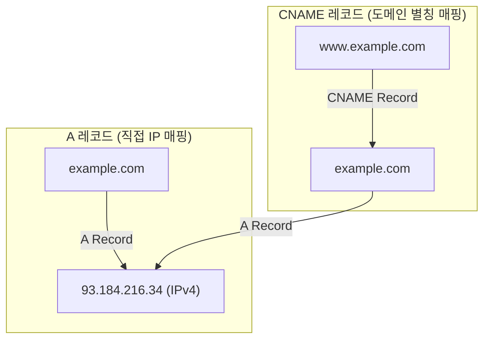

# A Record vs CNAME (DNS 레코드 설정 방식 비교)

## 1. 개요 (Overview)

DNS(Domain Name System)에서 도메인 이름을 대상과 연결할 때 사용하는 대표적인 레코드 타입인 **A 레코드 (Address Record)** 와 **CNAME 레코드 (Canonical Name Record)** 는 매핑하는 대상이 실제 IP 주소인가, 아니면 다른 도메인 이름인가에 따라 결정적인 차이를 가진다.

---

### 초보자를 위한 쉽게 이해하는 비유

* **A 레코드 (실제 지번 주소 등록)**:
  - "홍길동의 집 위치는 **서울특별시 강남구 테헤란로 123 (IP 주소)**이다"라고 직접 지번 주소를 적어두는 것.
* **CNAME 레코드 (별명 / 닉네임 참조)**:
  - "길동이네 블로그(`blog.example.com`)는 **홍길동의 본명 도메인(`example.com`)**을 따라간다"라고 별칭을 붙여주는 것. 본명 도메인의 지번 주소(IP)가 바뀌면 별칭도 자동으로 변경된 주소를 바라보게 됨.

---

## 2. A Record vs CNAME 핵심 기술 비교표

| 비교 항목 | A 레코드 (Address Record) | CNAME 레코드 (Canonical Name Record) |
| :--- | :--- | :--- |
| **매핑 대상** | 도메인 이름 ➔ **실제 IP 주소 (IPv4)** | 도메인 이름 ➔ **다른 도메인 이름 (Alias)** |
| **DNS 조회의 단계** | 1회 조회로 IP 주소 즉시 획득 | 최소 2회 이상의 쿼리 수행 (CNAME 추적 ➔ A 레코드 조회) |
| **IP 변경 시 영향** | IP 변경 시 **해당 A 레코드를 직접 수정**해야 함 | 참조 대상 도메인의 IP만 바꾸면 **자동 반영** |
| **루트 도메인 적용** | Apex/Root 도메인 (`example.com`)에 **설정 가능** | RFC 규격상 Apex/Root 도메인에 **설정 불가 (제약 사항)** |
| **다른 레코드와 공존** | MX, TXT 등 다른 레코드와 동일 이름 사용 가능 | **동일 이름에 다른 레코드(MX, NS 등) 중복 불가** |
| **주요 활용 사례** | 메인 웹 서버, 서버 IP 직접 지정 | CDN(Cloudfront), GitHub Pages, 서브도메인 별칭 |

---

## 3. CNAME 설정 시 주의 사항 (Apex Domain 제약)

1. **Root/Apex 도메인 제약**: `example.com` 같은 루트 도메인에는 CNAME을 올릴 수 없습니다. (루트 도메인은 NS, SOA 레코드가 필수이므로 CNAME과 충돌함. 대신 ALIAS / ANAME 레코드 또는 A 레코드 사용).
2. **조회 오버헤드**: CNAME 체인(Chain)이 깊어지면 DNS 조회 단계가 늘어나 네트워크 지연(Latency)이 추가될 수 있습니다.

---

## 4. 연결 문서 (Related Links)

- [DNS Fundamentals](dns-fundamentals.md) - DNS 동작 원리, 계층 구조 및 레코드 종류 종합
- [IP 주소 체계](ip-addressing.md) - IPv4 및 IPv6 주소 구조
- [TCP/IP 모델](tcp-ip-model.md) - 응용 계층의 DNS 쿼리 동작
