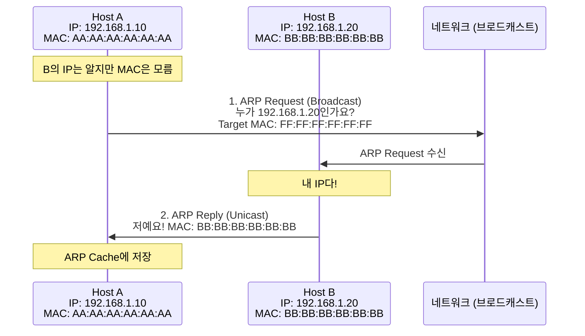
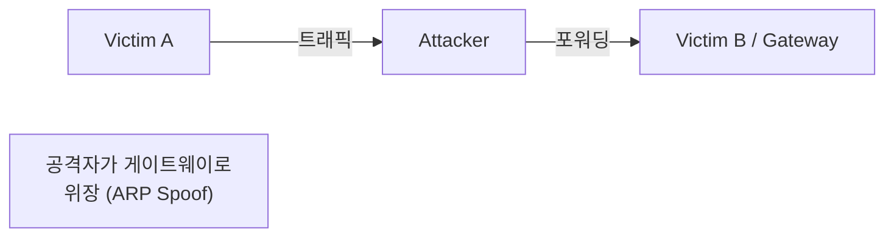

## 🌐 개요 (Overview)

**ARP (Address Resolution Protocol)** 는 논리적 주소 (IP)를 물리적 주소 (MAC)로 변환하는 프로토콜입니다.

## 📋 ARP 동작 원리



### ARP 동작 과정

1. **ARP Request (브로드캐스트)**
   - 목적지 MAC: `FF:FF:FF:FF:FF:FF` (브로드캐스트)
   - 네트워크의 모든 호스트에게 전송

2. **ARP Reply (유니캐스트)**
   - 해당 IP 를 가진 호스트만 응답
   - 자신의 MAC 주소를 담아 응답

---

## 📦 ARP 패킷 구조

```plaintext
 0                   1                   2                   3
 0 1 2 3 4 5 6 7 8 9 0 1 2 3 4 5 6 7 8 9 0 1 2 3 4 5 6 7 8 9 0 1
+-+-+-+-+-+-+-+-+-+-+-+-+-+-+-+-+-+-+-+-+-+-+-+-+-+-+-+-+-+-+-+-+
|       Hardware Type (16)      |       Protocol Type (16)      |
+-+-+-+-+-+-+-+-+-+-+-+-+-+-+-+-+-+-+-+-+-+-+-+-+-+-+-+-+-+-+-+-+
| HW Len (8)    | Proto Len (8) |       Operation (16)          |
+-+-+-+-+-+-+-+-+-+-+-+-+-+-+-+-+-+-+-+-+-+-+-+-+-+-+-+-+-+-+-+-+
|                    Sender Hardware Address (48)               |
+-+-+-+-+-+-+-+-+-+-+-+-+-+-+-+-+-+-+-+-+-+-+-+-+-+-+-+-+-+-+-+-+
|       Sender Hardware Address |     Sender IP Address (32)    |
+-+-+-+-+-+-+-+-+-+-+-+-+-+-+-+-+-+-+-+-+-+-+-+-+-+-+-+-+-+-+-+-+
|       Sender IP Address       |  Target Hardware Address (48) |
+-+-+-+-+-+-+-+-+-+-+-+-+-+-+-+-+-+-+-+-+-+-+-+-+-+-+-+-+-+-+-+-+
|                    Target Hardware Address                    |
+-+-+-+-+-+-+-+-+-+-+-+-+-+-+-+-+-+-+-+-+-+-+-+-+-+-+-+-+-+-+-+-+
|                    Target IP Address (32)                     |
+-+-+-+-+-+-+-+-+-+-+-+-+-+-+-+-+-+-+-+-+-+-+-+-+-+-+-+-+-+-+-+-+
```

### 주요 필드

| 필드 | 값 | 설명 |
|------|-----|------|
| **Hardware Type** | 1 | Ethernet |
| **Protocol Type** | 0x0800 | IPv4 |
| **HW Length** | 6 | MAC 주소 길이 (6 bytes) |
| **Proto Length** | 4 | IP 주소 길이 (4 bytes) |
| **Operation** | 1 또는 2 | 1 = Request, 2 = Reply |

---

## 📊 ARP 캐시 (ARP Cache)

ARP 결과를 **메모리에 캐시**하여 반복 요청을 줄입니다.

```bash
# ARP 캐시 확인
arp -a
arp -n

# 특정 IP의 MAC 확인
arp -a 192.168.1.1

# ARP 캐시 삭제
sudo arp -d 192.168.1.20

# 수동 ARP 항목 추가
sudo arp -s 192.168.1.100 00:11:22:33:44:55
```

**출력 예시**:
```plaintext
? (192.168.1.1) at aa:bb:cc:dd:ee:ff [ether] on eth0
? (192.168.1.20) at 00:11:22:33:44:55 [ether] on eth0
```

---

## 🔄 RARP (Reverse ARP)

**MAC 주소로 IP 주소를 알아내는** 프로토콜입니다.

| 특성 | ARP | RARP |
|------|-----|------|
| **변환** | IP → MAC | MAC → IP |
| **용도** | 일반 통신 | 디스크 없는 호스트 부팅 |
| **현재** | 사용 중 | BOOTP/DHCP 로 대체 |

---

## 📢 GARP (Gratuitous ARP)

**자신의 IP/MAC 을 브로드캐스트**하는 특수한 ARP 입니다.

### 용도

1. **IP 충돌 감지**:
   - 자신의 IP 로 ARP Request 전송
   - 응답이 오면 IP 충돌

2. **ARP Cache 갱신**:
   - 다른 장비의 ARP Cache 를 업데이트
   - Failover, VRRP 등에서 사용

3. **MAC 변경 알림**:
   - NIC 교체 시 새 MAC 주소 알림

```bash
# GARP 전송 (arping)
sudo arping -U 192.168.1.10 -I eth0

# IP 충돌 감지
sudo arping -D 192.168.1.10 -I eth0
```

---

## ⚠️ ARP 스푸핑 (ARP Spoofing)

공격자가 **거짓 ARP 응답**을 보내 트래픽을 가로채는 공격입니다.



### 대응 방안

| 방법 | 설명 |
|------|------|
| **Static ARP** | 중요 장비의 ARP 항목 수동 등록 |
| **ARP Inspection** | 스위치에서 ARP 패킷 검증 (DAI) |
| **암호화** | HTTPS, VPN 사용으로 도청 방지 |
| **모니터링** | arpwatch 등으로 ARP 변경 감시 |

```bash
# 정적 ARP 등록
sudo arp -s 192.168.1.1 aa:bb:cc:dd:ee:ff

# arpwatch 설치 및 실행
sudo apt install arpwatch
sudo arpwatch -i eth0
```

---

## 💡 실무 명령어

```bash
# ARP 테이블 전체 확인
arp -a

# IP로 ARP 캐시 조회
arp 192.168.1.1

# ARP 캐시 비우기 (Linux)
sudo ip -s neigh flush all

# ARP 패킷 캡처
sudo tcpdump -i eth0 arp

# 특정 호스트의 MAC 찾기
arping 192.168.1.100
```

## 🔗 연결 문서 (Related Documents)

- [[osi-7-layer-model]] - OSI 7 계층 (2, 3 계층)
- [[ip-header-structure]] - IP 헤더 구조
- [[icmp-protocol]] - ICMP 프로토콜
- [[network-security-protocols]] - 네트워크 보안
