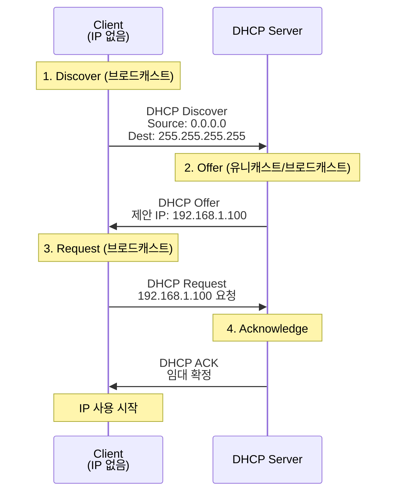
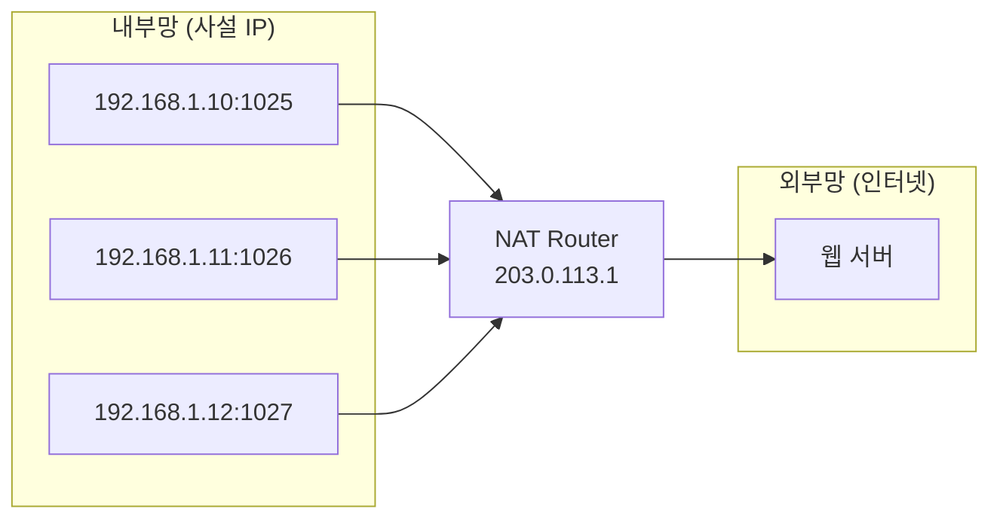

## 🌐 개요 (Overview)

**DHCP**는 IP 주소를 동적으로 할당하고, **NAT**는 사설 IP 를 공인 IP 로 변환합니다. 두 기술 모두 IPv4 주소 부족 문제를 해결하는 데 핵심적인 역할을 합니다.

---

## 📋 DHCP (Dynamic Host Configuration Protocol)

IP 주소, 서브넷 마스크, 게이트웨이, DNS 서버 등을 **자동으로 할당**합니다.

### 포트 번호

| 포트 | 역할 |
|:----:|------|
| **UDP 67** | DHCP 서버 |
| **UDP 68** | DHCP 클라이언트 |

### DORA 프로세스



#### DORA 단계별 설명

| 단계 | 메시지 | 방향 | 설명 |
|:----:|--------|------|------|
| **D** | Discover | Client → Server | IP 요청 (브로드캐스트) |
| **O** | Offer | Server → Client | IP 제안 |
| **R** | Request | Client → Server | 제안 IP 요청 (브로드캐스트) |
| **A** | Acknowledge | Server → Client | 임대 확정 |

> **DHCP Decline**: 클라이언트가 제안된 IP 가 충돌 시 거부
> **DHCP NAK**: 서버가 요청을 거부
> **DHCP Release**: 클라이언트가 IP 반환

### IP 임대 갱신

```plaintext
임대 시간 (Lease Time) 예: 24시간

50% 경과 (T1): 갱신 시도 (유니캐스트)
    ↓ 실패 시
87.5% 경과 (T2): 갱신 시도 (브로드캐스트)
    ↓ 실패 시
100% 경과: IP 반환, DORA 재시작
```

### 실무 명령어

```bash
# Linux에서 DHCP 갱신
sudo dhclient -r eth0   # 해제
sudo dhclient eth0      # 재할당

# Windows에서 DHCP 갱신
ipconfig /release
ipconfig /renew

# DHCP 임대 정보 확인
cat /var/lib/dhcp/dhclient.leases
```

---

## 🔄 NAT (Network Address Translation)

**사설 IP 를 공인 IP 로 변환**하여 주소 부족 문제를 해결하고 내부망을 보호합니다.

### NAT 유형

#### 1. Static NAT (1:1)

```plaintext
내부 IP (사설)          외부 IP (공인)
192.168.1.10     ↔     203.0.113.10
192.168.1.11     ↔     203.0.113.11
```

- 1:1 고정 매핑
- 서버 등 고정 IP 필요 시 사용

#### 2. Dynamic NAT (N:M)

```plaintext
내부 IP (사설)          외부 IP Pool (공인)
192.168.1.10     →     203.0.113.10
192.168.1.11     →     203.0.113.11
192.168.1.12     →     203.0.113.10 (재사용)
```

- 공인 IP 풀에서 동적 할당
- N 개 내부 주소, M 개 공인 주소 (N ≥ M)

#### 3. PAT / NAPT (N:1)

```plaintext
내부 IP:Port (사설)           외부 IP:Port (공인)
192.168.1.10:1025     →     203.0.113.1:40001
192.168.1.11:1026     →     203.0.113.1:40002
192.168.1.12:1027     →     203.0.113.1:40003
```

- **Port Address Translation**
- 하나의 공인 IP 로 여러 내부 호스트 지원
- **가장 많이 사용되는 방식**



### NAT 변환 테이블

| 내부 IP | 내부 Port | 외부 IP | 외부 Port | 프로토콜 |
|---------|-----------|---------|-----------|----------|
| 192.168.1.10 | 1025 | 203.0.113.1 | 40001 | TCP |
| 192.168.1.11 | 1026 | 203.0.113.1 | 40002 | TCP |
| 192.168.1.10 | 1030 | 203.0.113.1 | 40003 | UDP |

### NAT 설정 (Linux iptables)

```bash
# SNAT (Source NAT) - 내부 → 외부
sudo iptables -t nat -A POSTROUTING -o eth0 -j MASQUERADE

# DNAT (Destination NAT) - 외부 → 내부 (포트 포워딩)
sudo iptables -t nat -A PREROUTING -p tcp --dport 80 -j DNAT --to-destination 192.168.1.100:80

# NAT 테이블 확인
sudo iptables -t nat -L -n -v

# 연결 추적 확인
cat /proc/net/nf_conntrack
```

### NAT 의 장단점

#### 장점

| 장점 | 설명 |
|------|------|
| **주소 절약** | 하나의 공인 IP 로 다수 접속 |
| **보안** | 내부 구조 은닉 |
| **유연성** | 내부 네트워크 자유롭게 구성 |

#### 단점

| 단점 | 설명 |
|------|------|
| **성능** | 변환 오버헤드 |
| **P2P 제한** | 양방향 직접 연결 어려움 |
| **프로토콜 제한** | FTP, SIP 등 별도 처리 필요 |

---

### 🆚 DHCP vs Static IP

| 특성 | DHCP | Static IP |
|------|------|-----------|
| **관리** | 자동 | 수동 |
| **충돌** | DHCP 서버가 관리 | 관리자 책임 |
| **용도** | 클라이언트 PC | 서버, 네트워크 장비 |
| **이동성** | 네트워크 이동 시 편리 | 재설정 필요 |

### 🔗 연결 문서 (Related Documents)

- [[ip-header-structure]] - IP 주소 체계
- [[ip-addressing]] - IP 주소 클래스와 사설 IP
- [[osi-7-layer-model]] - OSI 7 계층
- [[firewall-ids-ips]] - 방화벽과 NAT
