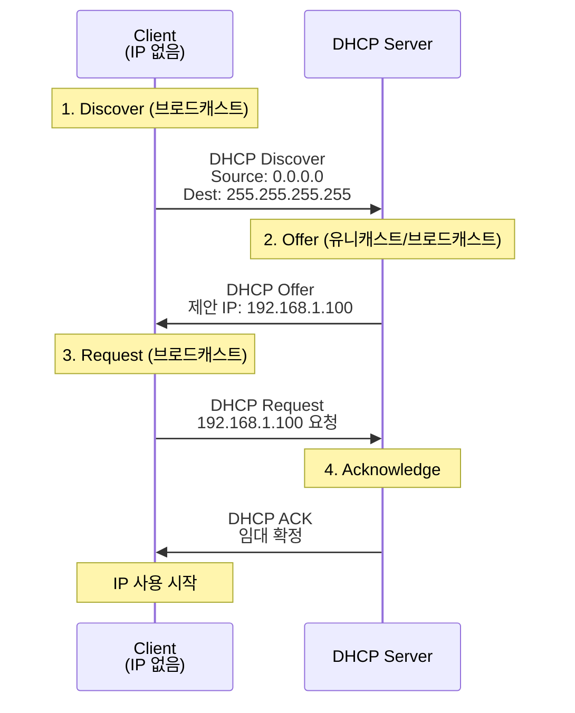
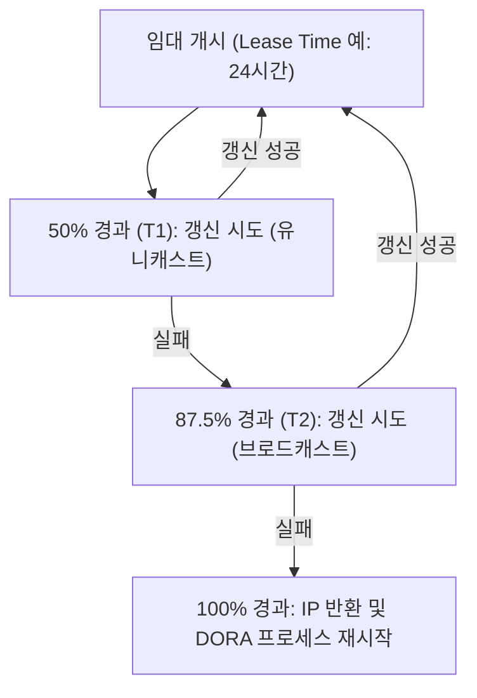
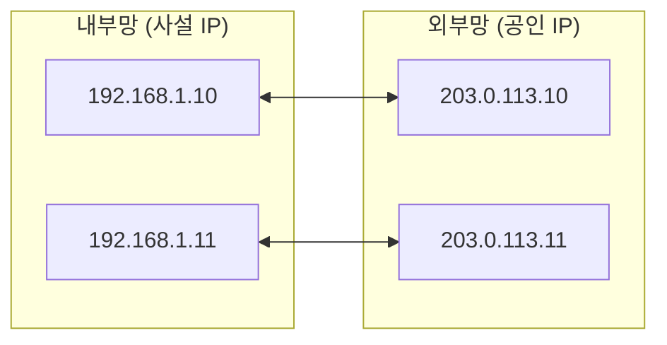
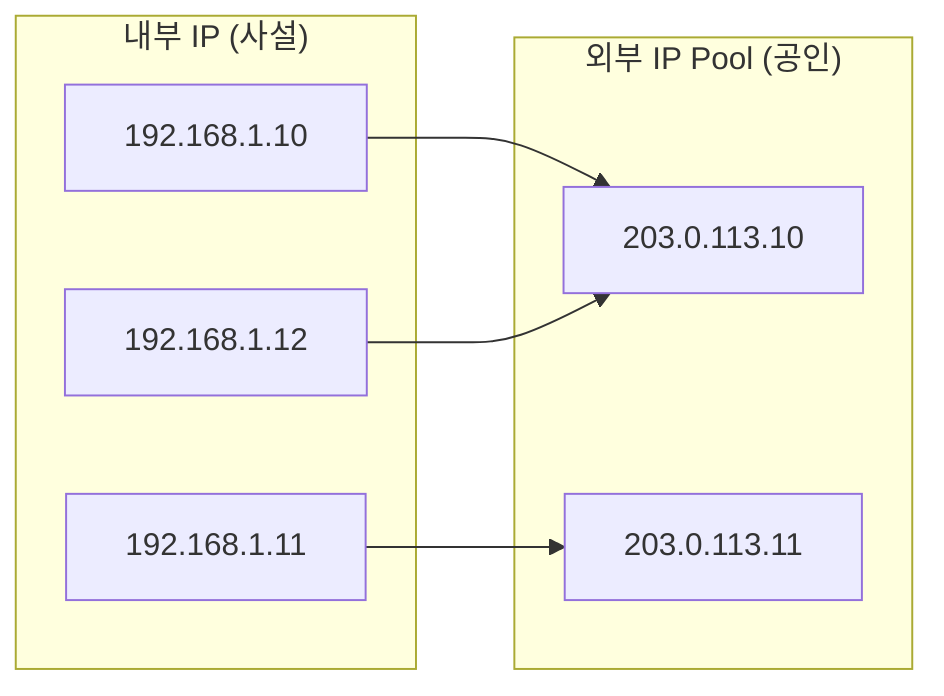
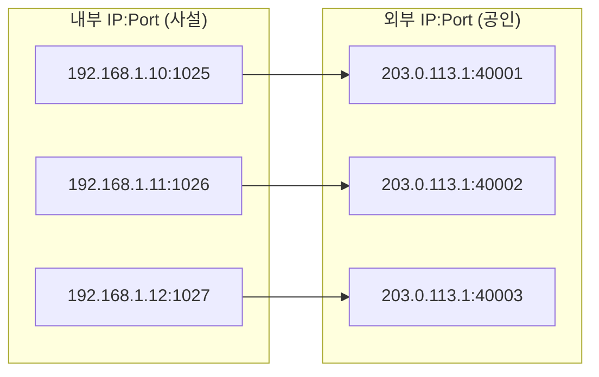
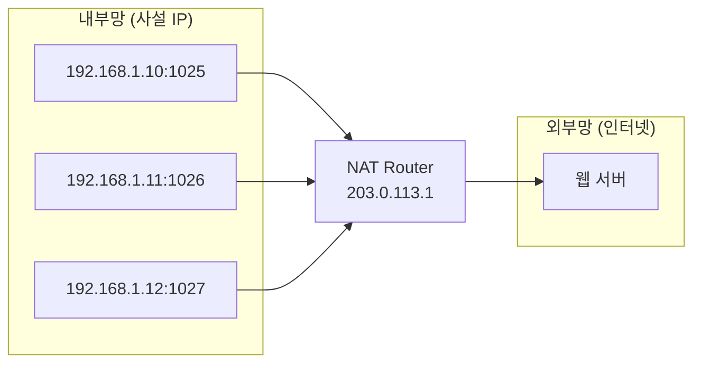

## 🌐 개요 (Overview)

**DHCP (Dynamic Host Configuration Protocol)** 는 네트워크 접속 시 IP 주소를 동적으로 자동 할당하며, **NAT (Network Address Translation)** 는 사설 IP 를 공인 IP 로 변환합니다. 두 기술 모두 IPv4 주소 고갈 문제를 해결하고 효율적인 네트워크 관리를 가능하게 하는 핵심 프로토콜입니다.

---

### 초보자를 위한 쉽게 이해하는 비유

* **DHCP (카페 진동벨 시스템)**:
  - 무기명 손님이 들어오면 카운터(DHCP 서버)가 사용 가능한 진동벨(IP 주소)을 자동으로 빌려주고, 나갈 때 진동벨을 회수하여 다음 손님에게 재할당하는 시스템.
* **NAT (아파트 세대별 대표 주소 발송)**:
  - 아파트의 수많은 세대(사설 IP)가 각자 편지를 외부로 보낼 때, 아파트 정문의 통합 우편함(NAT 라우터)에서 대표 주소와 세대 번호(공인 IP + Port)로 변환해 인터넷으로 전달하는 시스템.

---

## 📋 DHCP (Dynamic Host Configuration Protocol)

IP 주소, 서브넷 마스크, 게이트웨이, DNS 서버 등을 **자동으로 할당**합니다.

### 포트 번호

| 포트 | 역할 |
|:----:|------|
| **UDP 67** | DHCP 서버 |
| **UDP 68** | DHCP 클라이언트 |

### DORA 프로세스


```mermaid
sequenceDiagram
    participant C as Client<br/>(IP 없음)
    participant S as DHCP Server
    
    Note over C: 1. Discover (브로드캐스트)
    C->>S: DHCP Discover<br/>Source: 0.0.0.0<br/>Dest: 255.255.255.255
    
    Note over S: 2. Offer (유니캐스트/브로드캐스트)
    S->>C: DHCP Offer<br/>제안 IP: 192.168.1.100
    
    Note over C: 3. Request (브로드캐스트)
    C->>S: DHCP Request<br/>192.168.1.100 요청
    
    Note over S: 4. Acknowledge
    S->>C: DHCP ACK<br/>임대 확정
    
    Note over C: IP 사용 시작
```

#### DORA 단계별 설명

| 단계 | 메시지 | 방향 | 설명 |
|:----:|--------|------|------|
| **D** | Discover | Client → Server | IP 요청 (브로드캐스트) |
| **O** | Offer | Server → Client | IP 제안 |
| **R** | Request | Client → Server | 제안 IP 요청 (브로드캐스트) |
| **A** | Acknowledge | Server → Client | 임대 확정 |

> **DHCP Decline**: 클라이언트가 제안된 IP 가 충돌 시 거부
> **DHCP NAK**: 서버가 요청을 거부
> **DHCP Release**: 클라이언트가 IP 반환

### IP 임대 갱신


```mermaid
flowchart TD
    T0["임대 개시 (Lease Time 예: 24시간)"] --> T1["50% 경과 (T1): 갱신 시도 (유니캐스트)"]
    T1 -->|"갱신 성공"| T0
    T1 -->|"실패"| T2["87.5% 경과 (T2): 갱신 시도 (브로드캐스트)"]
    T2 -->|"갱신 성공"| T0
    T2 -->|"실패"| Expired["100% 경과: IP 반환 및 DORA 프로세스 재시작"]
```

### 실무 명령어

```bash
# Linux에서 DHCP 갱신
sudo dhclient -r eth0   # 해제
sudo dhclient eth0      # 재할당

# Windows에서 DHCP 갱신
ipconfig /release
ipconfig /renew

# DHCP 임대 정보 확인
cat /var/lib/dhcp/dhclient.leases
```

---

## 🔄 NAT (Network Address Translation)

**사설 IP 를 공인 IP 로 변환**하여 주소 부족 문제를 해결하고 내부망을 보호합니다.

### NAT 유형

#### 1. Static NAT (1:1)


```mermaid
graph LR
    subgraph Inside ["내부망 (사설 IP)"]
        A1["192.168.1.10"]
        A2["192.168.1.11"]
    end
    subgraph Outside ["외부망 (공인 IP)"]
        B1["203.0.113.10"]
        B2["203.0.113.11"]
    end
    A1 <--> B1
    A2 <--> B2
```

- 1:1 고정 매핑
- 서버 등 고정 IP 필요 시 사용

#### 2. Dynamic NAT (N:M)


```mermaid
graph LR
    subgraph Private ["내부 IP (사설)"]
        C1["192.168.1.10"]
        C2["192.168.1.11"]
        C3["192.168.1.12"]
    end
    subgraph PublicPool ["외부 IP Pool (공인)"]
        P1["203.0.113.10"]
        P2["203.0.113.11"]
    end
    C1 --> P1
    C2 --> P2
    C3 --> P1
```

- 공인 IP 풀에서 동적 할당
- N 개 내부 주소, M 개 공인 주소 (N ≥ M)

#### 3. PAT / NAPT (N:1)


```mermaid
graph LR
    subgraph PrivatePort ["내부 IP:Port (사설)"]
        D1["192.168.1.10:1025"]
        D2["192.168.1.11:1026"]
        D3["192.168.1.12:1027"]
    end
    subgraph PublicPort ["외부 IP:Port (공인)"]
        E1["203.0.113.1:40001"]
        E2["203.0.113.1:40002"]
        E3["203.0.113.1:40003"]
    end
    D1 --> E1
    D2 --> E2
    D3 --> E3
```

- **Port Address Translation**
- 하나의 공인 IP 로 여러 내부 호스트 지원
- **가장 많이 사용되는 방식**


```mermaid
graph LR
    subgraph "내부망 (사설 IP)"
        PC1[192.168.1.10:1025]
        PC2[192.168.1.11:1026]
        PC3[192.168.1.12:1027]
    end
    
    NAT[NAT Router<br/>203.0.113.1]
    
    subgraph "외부망 (인터넷)"
        WEB[웹 서버]
    end
    
    PC1 --> NAT
    PC2 --> NAT
    PC3 --> NAT
    NAT --> WEB
```

### NAT 변환 테이블

| 내부 IP | 내부 Port | 외부 IP | 외부 Port | 프로토콜 |
|---------|-----------|---------|-----------|----------|
| 192.168.1.10 | 1025 | 203.0.113.1 | 40001 | TCP |
| 192.168.1.11 | 1026 | 203.0.113.1 | 40002 | TCP |
| 192.168.1.10 | 1030 | 203.0.113.1 | 40003 | UDP |

### NAT 설정 (Linux iptables)

```bash
# SNAT (Source NAT) - 내부 → 외부
sudo iptables -t nat -A POSTROUTING -o eth0 -j MASQUERADE

# DNAT (Destination NAT) - 외부 → 내부 (포트 포워딩)
sudo iptables -t nat -A PREROUTING -p tcp --dport 80 -j DNAT --to-destination 192.168.1.100:80

# NAT 테이블 확인
sudo iptables -t nat -L -n -v

# 연결 추적 확인
cat /proc/net/nf_conntrack
```

### NAT 의 장단점

#### 장점

| 장점 | 설명 |
|------|------|
| **주소 절약** | 하나의 공인 IP 로 다수 접속 |
| **보안** | 내부 구조 은닉 |
| **유연성** | 내부 네트워크 자유롭게 구성 |

#### 단점

| 단점 | 설명 |
|------|------|
| **성능** | 변환 오버헤드 |
| **P2P 제한** | 양방향 직접 연결 어려움 |
| **프로토콜 제한** | FTP, SIP 등 별도 처리 필요 |

---

## 🆚 DHCP vs Static IP (주소 할당 방식 비교)

DHCP의 자동 주소 할당 메커니즘과 고정 수동 IP 할당 방식(Static IP)의 세부적 특성 비교 및 실무 적용 지침은 별도 문서로 분리되어 있습니다.

- **[DHCP vs Static IP](dhcp-vs-static-ip.md)** - 자동 동적 할당과 수동 고정 할당의 기술 비교표 및 선택 기준

---

## 🔗 연결 문서 (Related Documents)

- [DHCP vs Static IP](dhcp-vs-static-ip.md) - IP 주소 할당 방식 비교 및 선택 가이드
- [IP 헤더 구조](ip-header-structure.md) - IP 주소 체계
- [IP 주소 체계](ip-addressing.md) - IP 주소 클래스와 사설 IP
- [OSI 7 계층 모델](osi-7-layer-model.md) - OSI 7 계층
