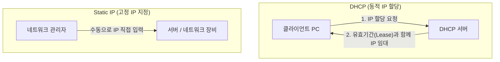

# DHCP vs Static IP (IP 주소 할당 방식 비교)

## 1. 개요 (Overview)

네트워크 장치가 인터넷이나 로컬 네트워크에 접속할 때 IP 주소를 할당받는 방식은 동적으로 자동으로 임대받는 **[DHCP (Dynamic Host Configuration Protocol)](dhcp-nat-protocols.md)** 방식과 관리자가 직접 고정값을 수동 지정하는 **Static IP (고정 IP)** 방식으로 나뉜다.

---

### 초보자를 위한 쉽게 이해하는 비유

* **DHCP (호텔 방 키 / 임대 아파트)**:
  - 호텔에 투숙할 때마다 카운터(DHCP 서버)에서 사용 가능한 방(IP 주소)을 임시로 빌려준다. 체크아웃(임대 만료)하거나 다음에 방문하면 다른 방 번호를 받을 수 있지만, 수동으로 번호를 지정할 필요가 없다. (자동 관리, 사용자 편리)
* **Static IP (자가 소유 집 / 지정 주소)**:
  - 자기 소유의 집처럼 주소가 영구히 고정되어 있다. 우편물(서버 요청)을 보낼 때 항상 동일한 주소로 찾아올 수 있지만, 이사를 가거나 네트워크 환경이 바뀌면 주소를 직접 새로 등록해야 한다. (고정 위치 필요, 수동 관리)

---

## 2. DHCP vs Static IP 핵심 기술 비교표

| 비교 항목 | DHCP (Dynamic Host Configuration Protocol) | Static IP (고정 IP) |
| :--- | :--- | :--- |
| **할당 주체 및 방식** | DHCP 서버에 의한 **자동 임대 (DORA 프로세스)** | 관리자의 네트워크 설정 **수동 입력** |
| **IP 변경 가능성** | 임대 기간(Lease Time) 만료 및 재접속 시 **동적 변경 가능** | 설정 변경 전까지 **영구 고정** |
| **주소 충돌 관리** | DHCP 서버가 중앙에서 중복 할당 방지 관리 | 관리자 실수 시 **IP 충돌 (IP Conflict) 위험** |
| **설정 편의성** | 접속 시 자동 설정으로 **사용자 개입 0** | 장비마다 IP/서브넷/게이트웨이/DNS **직접 입력** |
| **주요 사용 대상** | 스마트폰, 노트북, 사무실 PC 등 **일반 클라이언트** | 웹/DB 서버, 라우터, 프린터, NAS 등 **고정 접속 장비** |
| **네트워크 이동성** | 다른 Wi-Fi/네트워크 이동 시 **자동 재할당** | 네트워크 대역이 바뀌면 **접속 불가 (재설정 필요)** |

---

## 3. 실무적 선택 기준

- **DHCP 선택**: 수많은 사용자 단말(스마트폰, 노트북)이 수시로 접속/해제되는 환경. IP 주소 자원을 효율적으로 재사용하고 관리를 자동화하고자 할 때 사용.
- **Static IP 선택**: 외부 또는 내부망의 다른 장비들이 해당 장비의 IP를 지속적으로 조회하여 접속해야 하는 서버, 네트워크 장비, DNS 서버, 프린터 등.

---

## 4. 연결 문서 (Related Links)

- [DHCP & NAT 프로토콜](dhcp-nat-protocols.md) - DHCP의 DORA 동작 과정과 NAT 메커니즘
- [IP 주소 체계](ip-addressing.md) - 사설 IP, 공인 IP 및 서브넷 마스크 개념
- [OSI 7 계층 모델](osi-7-layer-model.md) - 응용 계층의 DHCP 프로토콜 위치
