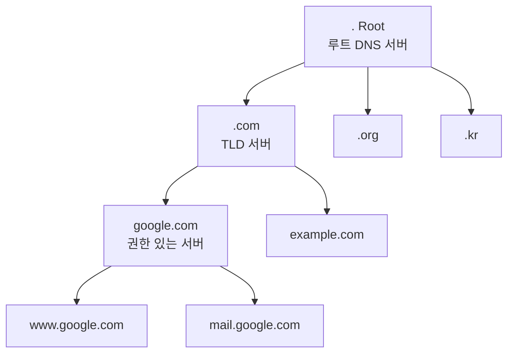
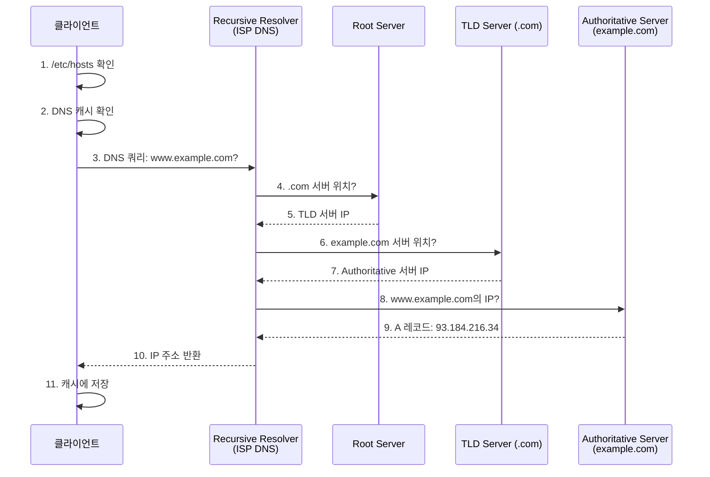

## 🌐 개요 (Overview)

**DNS (Domain Name System)** 은 인터넷의 "전화번호부"입니다. 사람이 이해하기 쉬운 도메인 이름 (예: `google.com`)을 컴퓨터가 사용하는 [[ip-addressing|IP 주소]] (예: `142.250.207.46`)로 변환하는 역할을 합니다.

## 🎯 DNS의 목적 (Purpose)

1. **사용자 편의성**: IP 주소보다 도메인 이름이 기억하기 쉬움
2. **유연성**: IP 주소가 변경되어도 도메인 이름은 유지
3. **부하 분산**: 하나의 도메인을 여러 IP로 매핑
4. **서비스 추상화**: 서버 위치를 숨기고 서비스만 노출

## 🏗️ DNS 계층 구조 (DNS Hierarchy)



### 도메인 구조
```
www.example.com.
│   │       │   └─ 루트 (.)
│   │       └───── 최상위 도메인 (TLD: Top-Level Domain)
│   └─────────────  2차 도메인 (SLD: Second-Level Domain)
└─────────────────  서브도메인 (Subdomain)
```

**예시**:
- **FQDN** (Fully Qualified Domain Name): `mail.google.com.`
- **TLD**: `.com`, `.org`, `.kr`, `.io` 등
- **서브도메인**: `www`, `mail`, `ftp` 등

## 🔍 DNS 조회 과정 (DNS Resolution Process)



### 조회 단계 설명

1. **로컬 캐시**: 브라우저, OS 캐시 확인
2. **/etc/hosts**: 로컬 호스트 파일 확인 (우선순위 높음)
3. **Recursive Resolver**: ISP의 DNS 서버로 쿼리
4. **Root Server**: 최상위 DNS 서버 (전 세계 13개)
5. **TLD Server**: `.com`, `.org` 등 관리
6. **Authoritative Server**: 실제 IP 주소 보유
7. **캐시 저장**: TTL (Time To Live) 동안 저장

## 📋 DNS 레코드 타입 (DNS Record Types)

|레코드 타입 | 용도 | 예시 |
|------|------|------|
| **A** | IPv4 주소 | `example.com → 93.184.216.34` |
| **AAAA** | IPv6 주소 | `example.com → 2001:db8::1` |
| **CNAME** | 별칭 (Canonical Name) | `www.example.com → example.com` |
| **MX** | 메일 서버 | `example.com → mail.example.com` |
| **NS** | 네임서버 | `example.com → ns1.example.com` |
| **TXT** | 텍스트 정보 | SPF, DKIM, 도메인 소유 인증 |
| **PTR** | 역방향 조회 (IP→도메인) | `34.216.184.93.in-addr.arpa → example.com` |
| **SOA** | 권한 시작 (Start of Authority) | 도메인 관리 정보 |
| **SRV** | 서비스 레코드 | `_sip._tcp.example.com` |

### A vs CNAME 차이
```
A 레코드:
example.com.     A     93.184.216.34    # IP 직접 지정

CNAME 레코드:
www.example.com. CNAME example.com.     # 다른 도메인 참조
blog.example.com. CNAME example.com.

주의: CNAME은 다른 레코드(MX, NS 등)와 공존 불가!
```

## 🛠️ DNS 설정 파일 (Linux)

### /etc/resolv.conf

DNS 서버 설정:

```bash
nameserver 8.8.8.8       # Google Public DNS
nameserver 8.8.4.4
nameserver 1.1.1.1       # Cloudflare DNS
search example.com       # 도메인 검색 순서
domain example.com       # 로컬 도메인
```

**필드 설명**:
- `nameserver`: DNS 서버 IP (최대 3개)
- `search`: 도메인 이름 자동 완성
- `domain`: 로컬 도메인

### /etc/hosts

정적 호스트 매핑 (DNS보다 우선):
```bash
127.0.0.1   localhost localhost.localdomain
::1         localhost ip6-localhost ip6-loopback
192.168.1.10 server1.example.com server1
192.168.1.20 server2.example.com server2
```

### /etc/nsswitch.conf

이름 해석 순서 설정:

```bash
hosts: files dns  # /etc/hosts 먼저, 그 다음 DNS
```

## 🔧 DNS 조회 도구 (DNS Query Tools)

### host
간단한 DNS 조회:
```bash
# A 레코드 조회
host google.com
# google.com has address 142.250.207.46

# MX 레코드 조회
host -t MX google.com
# google.com mail is handled by 10 smtp.google.com.

# 역방향 조회
host 8.8.8.8
# 8.8.8.8.in-addr.arpa domain name pointer dns.google.
```

### nslookup
대화형 DNS 조회:
```bash
# 기본 조회
nslookup google.com

# 특정 DNS 서버 사용
nslookup google.com 8.8.8.8

# 대화형 모드
nslookup
> set type=MX
> google.com
```

### dig (권장)
상세한 DNS 정보:
```bash
# A 레코드 조회
dig google.com

# 간단한 출력
dig google.com +short
# 142.250.207.46

# MX 레코드
dig google.com MX +short

# 특정 DNS 서버 사용
dig @8.8.8.8 google.com

# 역방향 조회
dig -x 8.8.8.8 +short

# 모든 레코드
dig google.com ANY

# 조회 경로 추적
dig google.com +trace
```

## ⚡ DNS 캐싱 (DNS Caching)

### 캐시 계층
1. **브라우저 캐시**: 브라우저 자체 캐시 (수초~수분)
2. **OS 캐시**: systemd-resolved, nscd 등
3. **Recursive Resolver 캐시**: ISP DNS 서버
4. **Authoritative Server**: 원본 정보

### TTL (Time To Live)
```bash
dig google.com

;; ANSWER SECTION:
google.com.  300  IN  A  142.250.207.46
             ^^^
             TTL (초)
```
- 300초 = 5분 동안 캐시 유효
- TTL 후에는 다시 조회

### 캐시 비우기
```bash
# Linux (systemd-resolved)
sudo systemd-resolve --flush-caches

# macOS
sudo dscacheutil -flushcache

# Windows
ipconfig /flushdns

# 브라우저 (Chrome)
chrome://net-internals/#dns → Clear host cache
```

## 🌍 공개 DNS 서버 (Public DNS Servers)

| 제공자 | IPv4 | 특징 |
|--------|------|------|
| **Google** | 8.8.8.8, 8.8.4.4 | 빠르고 신뢰성 높음 |
| **Cloudflare** | 1.1.1.1, 1.0.0.1 | 프라이버시 중심 |
| **Quad9** | 9.9.9.9 | 악성 사이트 차단 |
| **OpenDNS** | 208.67.222.222 | 콘텐츠 필터링 |

**변경 방법 (Linux)**:
```bash
# 임시 변경
sudo nano /etc/resolv.conf
# nameserver 1.1.1.1 추가

# 영구 변경 (NetworkManager)
sudo nmcli connection modify eth0 ipv4.dns "1.1.1.1"
sudo nmcli connection up eth0
```

## 🔐 보안 (DNS Security)

### DNS 위험

1. **DNS Spoofing**: 가짜 DNS 응답으로 피싱 사이트 유도
2. **DNS Hijacking**: 라우터 설정 변경으로 DNS 조작
3. **DDoS**: DNS 서버 과부하 공격

### 보안 기술

- **DNSSEC** (DNS Security Extensions): 응답 서명으로 위변조 방지
- **DNS over HTTPS (DoH)**: 암호화된 DNS 조회
- **DNS over TLS (DoT)**: TLS로 보호

```bash
# DNSSEC 확인
dig google.com +dnssec
```

## 💡 실무 활용 (Practical Examples)

### DNS 문제 디버깅

```bash
# 1. 연결 확인
ping 8.8.8.8  # DNS 서버 응답 확인

# 2. DNS 조회 확인
dig google.com @8.8.8.8  # Google DNS로 직접 조회

# 3. /etc/hosts 확인
cat /etc/hosts

# 4. resolv.conf 확인
cat /etc/resolv.conf

# 5. 캐시 플러시
sudo systemd-resolve --flush-caches
```

### 로컬 개발 환경

```bash
# /etc/hosts로 로컬 도메인 설정
sudo nano /etc/hosts

# 추가
127.0.0.1  myproject.local
127.0.0.1  api.myproject.local

# 브라우저에서 http://myproject.local 접속 가능
```

### DNS 기반 부하 분산

```bash
# Round-robin DNS: 여러 IP 반환
dig google.com +short
# 142.250.207.46
# 142.250.207.78
# 142.250.207.110
# (매번 새로 조회 시 순서 변경)
```

## 🔗 연결 문서 (Related Documents)

- [[ip-addressing]] - IP 주소와 DNS의 관계
- [[tcp-ip-model]] - DNS가 동작하는 응용 계층
- [[routing-basics]] - DNS 쿼리의 라우팅
