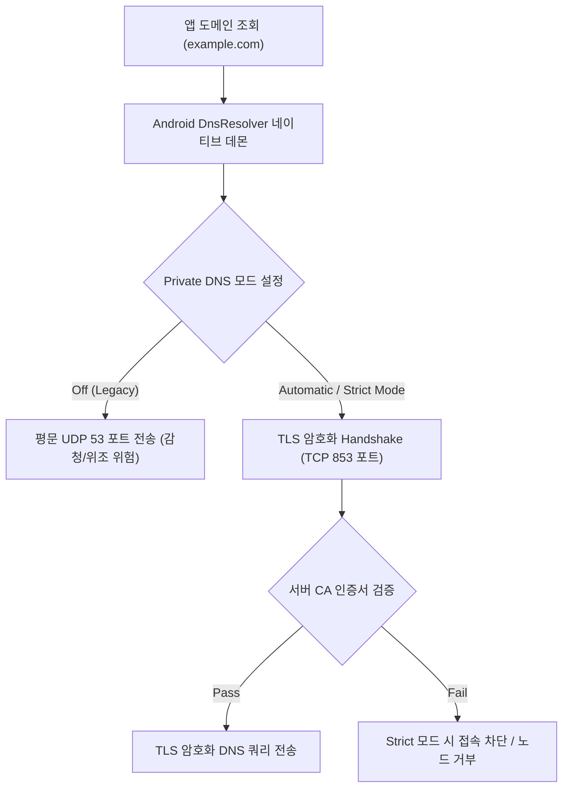

# Private DNS & DNS-over-TLS (DoT 보안 DNS 프로토콜)

## 1. 개요 (Overview)

**Private DNS & DNS-over-TLS (DoT)** 는 도메인 이름을 IP 주소로 변환할 때 사용하는 기존의 암호화되지 않은 UDP 53 포트 DNS 쿼리를 **TLS (Transport Layer Security) 암호화 채널(TCP 853 포트)로 감싸서 송수신하는 컴퓨터 네트워크 보안 프로토콜**이다.

Android 9(Pie) 이상부터 OS 차원에서 **Private DNS** 라는 이름으로 기본 탑재되었으며, ISP(통신사)나 공용 Wi-Fi 해커에 의한 **DNS 감청, 중간자 공격(MITM), DNS 스푸핑/위조**를 근본적으로 방지한다.

---

#### 초보자를 위한 쉽게 이해하는 비유

- **DNS-over-TLS (밀봉된 보안 방탄 수송 전용 등기 우편)**:
  - 기존 DNS 는 주소를 물어볼 때 엽서(평문 UDP/53)에 적어서 보내므로 지나가는 누구나 어디 접속하는지 볼 수 있었지만, DoT 는 **밀봉된 특수 보안 강철 상자(TLS 암호화 TCP/853)**에 주소 질의서를 넣고 열쇠를 가진 검증된 전용 주소록 서버(Private DNS Server)만 열어보게 하는 보안 시스템.



---

### 2. 핵심 동작 메커니즘 (Internal Mechanism)

1. **Private DNS 3 가지 모드**:
   - **Off**: 전통적인 평문 UDP/53 포트 DNS 사용.
   - **Automatic (기본값)**: 네트워크가 DoT(853 포트)를 지원하면 자동으로 TLS 암호화 적용, 지원하지 않으면 평문 DNS 로 폴백.
   - **Strict Mode (개인 지정)**: 사용자가 지정한 특정 보안 DNS 도메인(예: `dns.google`, `1.1.1.1`)만 사용하며, TLS 검증 실패 시 **모든 인터넷 접속을 차단**하여 안전을 보장.
2. **`DnsResolver` 네이티브 모듈 및 검증기**:
   - Android 메인라인(Mainline) 모듈인 `DnsResolver` 가 배경에서 백그라운드 validation 통신을 지속 수행하며, TLS 핸드셰이크 및 CA 인증서 지문을 실시간 검증한다.

---

## 3. 관측 가능 증거 및 네트워크 CLI 명령어 (Observable Evidence)

DoT 전용 853 포트로 전송되는 TLS 암호화 DNS 쿼리 및 서버 인증서는 `kdig` 또는 `openssl` 도구로 진단할 수 있다:

```bash
# 1. DoT 853 포트로 TLS 암호화 DNS 쿼리 송신 (kdig 도구 활용)
kdig @dns.google +tls example.com

# 2. DoT 서버 853 포트 TLS 핸드셰이크 및 인증서 정합성 검증
openssl s_client -connect dns.google:853 -brief
```

---

### 4. 연결 문서 (Related Links)

- [Android Connectivity 런타임](../../mobile/android/01_system_internals/connectivity/android-connectivity.md) - Connectivity 전체 계층 구조
- [NetId & Multi-Routing Table](../../mobile/android/01_system_internals/connectivity/netid-routing-table.md) - DNS 쿼리가 전송되는 NetId 라우팅
- [dumpsys 시스템 진단 도구](../../mobile/android/06_testing_performance/debugging/dumpsys.md) - dumpsys dnsresolver 진단
- [VPN Always-on vs Lockdown](../../mobile/android/05_security_privacy/vpn-always-on-vs-lockdown.md) - VPN 환경에서의 DNS 누출 방지
