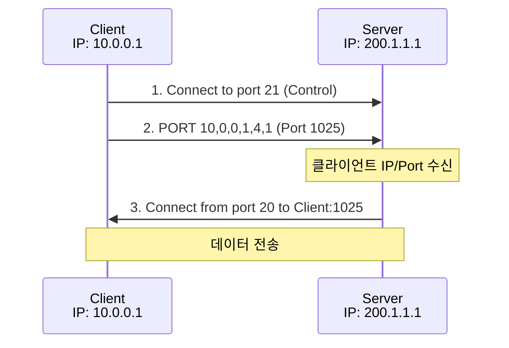
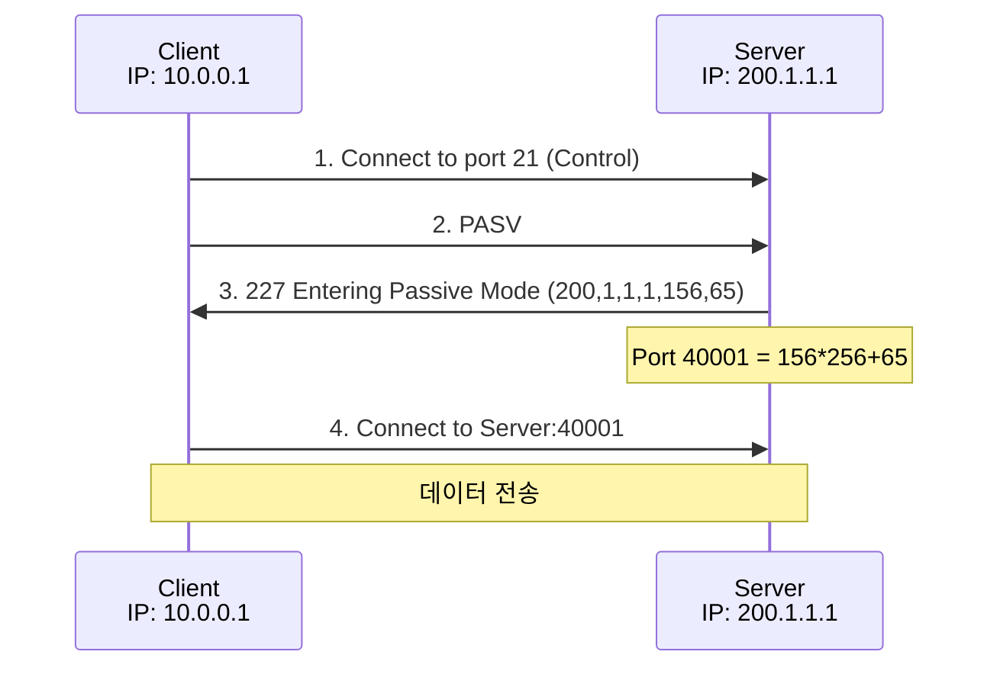

## 🌐 개요 (Overview)

**FTP (File Transfer Protocol)** 는 파일 전송을 위한 프로토콜로, **제어 채널**과 **데이터 채널**을 분리하여 사용합니다.

## 📋 FTP 포트

| 포트 | 용도 |
|:----:|------|
| **TCP 21** | 제어 채널 (Control) - 명령어 전송 |
| **TCP 20** | 데이터 채널 (Data) - Active 모드 |

---

## 🔄 FTP 동작 모드

### 1. Active Mode (능동 모드)



**과정**:
1. 클라이언트가 서버 21 번 포트로 제어 연결
2. 클라이언트가 `PORT` 명령으로 자신의 데이터 포트 알림
3. **서버가 20 번 포트에서 클라이언트에 연결**

**⚠️ 문제점**: 클라이언트 방화벽이 외부에서의 연결을 차단하면 실패

### 2. Passive Mode (수동 모드)



**과정**:
1. 클라이언트가 서버 21 번 포트로 제어 연결
2. 클라이언트가 `PASV` 명령 전송
3. 서버가 임의의 데이터 포트 알림
4. **클라이언트가 서버의 데이터 포트에 연결**

**✅ 장점**: 클라이언트 방화벽 문제 해결

---

## 🆚 Active vs Passive 비교

| 특성 | Active Mode | Passive Mode |
|------|-------------|--------------|
| **데이터 연결 시작** | 서버 → 클라이언트 | 클라이언트 → 서버 |
| **서버 데이터 포트** | 고정 (20 번) | 임의 포트 |
| **클라이언트 방화벽** | 문제 발생 가능 | **문제 없음** |
| **서버 방화벽** | 문제 없음 | 포트 범위 열어야 함 |
| **명령어** | PORT | PASV |

---

## 📨 주요 FTP 명령어

| 명령어 | 설명 |
|--------|------|
| **USER** | 사용자 이름 |
| **PASS** | 비밀번호 |
| **PORT** | Active 모드 데이터 포트 지정 |
| **PASV** | Passive 모드 요청 |
| **LIST** | 디렉토리 목록 |
| **RETR** | 파일 다운로드 |
| **STOR** | 파일 업로드 |
| **QUIT** | 연결 종료 |
| **TYPE** | 전송 모드 (A=ASCII, I=Binary) |

---

## 📊 FTP 응답 코드

| 코드 | 의미 |
|:----:|------|
| **1xx** | 긍정적 예비 응답 |
| **2xx** | 긍정적 완료 응답 |
| **3xx** | 긍정적 중간 응답 |
| **4xx** | 일시적 부정 응답 |
| **5xx** | 영구적 부정 응답 |

| 코드 | 설명 |
|:----:|------|
| 150 | 파일 상태 OK, 데이터 연결 열기 |
| 200 | 명령 OK |
| 220 | 서비스 준비 |
| 226 | 데이터 연결 종료 |
| 227 | Passive 모드 진입 |
| 230 | 로그인 성공 |
| 331 | 사용자 OK, 비밀번호 필요 |
| 421 | 서비스 사용 불가 |
| 530 | 로그인 실패 |

---

## ⚠️ FTP 보안 취약점

| 취약점 | 설명 |
|--------|------|
| **평문 전송** | ID/Password 가 암호화되지 않음 |
| **데이터 노출** | 파일 내용이 평문으로 전송 |
| **Bounce Attack** | PORT 명령 악용한 포트 스캔 |

### Secure FTP 대안

| 프로토콜 | 포트 | 설명 |
|----------|:----:|------|
| **FTPS** | 990 | FTP over TLS/SSL |
| **SFTP** | 22 | FTP over SSH |
| **SCP** | 22 | Secure Copy (SSH) |

---

## 🔧 TFTP (Trivial FTP)

**간단한 파일 전송**을 위한 경량 프로토콜입니다.

| 특성 | FTP | TFTP |
|------|-----|------|
| **프로토콜** | TCP | **UDP** |
| **포트** | 21/20 | **69** |
| **인증** | ID/Password | **없음** |
| **기능** | 풍부함 | 최소화 |
| **용도** | 일반 파일 전송 | 펌웨어 업로드, PXE 부팅 |

**⚠️ 보안 주의**: TFTP 는 인증이 없어 네트워크 부팅 등 제한된 환경에서만 사용

---

## 💡 실무 명령어

```bash
# FTP 접속
ftp ftp.example.com

# 명령어 예시
ftp> open ftp.example.com
ftp> user username
ftp> pass password
ftp> ls
ftp> cd /pub
ftp> get file.txt
ftp> put local.txt
ftp> bye

# Passive 모드 설정
ftp> passive

# lftp (확장 FTP 클라이언트)
lftp -u user,password ftp.example.com
```

## 🔗 연결 문서 (Related Documents)

- [[osi-7-layer-model]] - OSI 7 계층 (응용 계층)
- [[tcp-udp-protocols]] - TCP 프로토콜
- [[network-security-protocols]] - SFTP, FTPS
- [[http-protocol]] - HTTP 프로토콜
