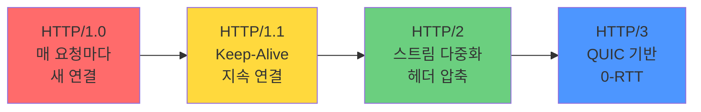

## HTTP 버전 비교 (HTTP/1.0 vs HTTP/1.1 vs HTTP/2 vs HTTP/3)

---

### 초보자를 위한 쉽게 이해하는 비유

* **HTTP/1.0 (우편배달원 한 명이 한 번에 한 편지씩)**:
  - 편지를 보낼 때마다 배달원을 따로 부르고, 편지 전달 후 돌아감. 매우 비효율적.

* **HTTP/1.1 (우편배달원이 여러 편지를 한 번에 전달)**:
  - 배달원 한 명이 여러 편지를 들고 계속 왕복. 더 효율적 (Keep-Alive).

* **HTTP/2 (택배 회사의 분류 센터)**:
  - 여러 편지를 더 똑똑하게 분류해서 동시에 전달. 헤더 압축으로 무게도 줄임.

* **HTTP/3 (드론 배송)**:
  - 기존 도로(TCP) 대신 새로운 경로(QUIC/UDP)로 더 빠르고 안정적으로 전달.

---

## HTTP 버전별 핵심 특성 비교표

| 특성 | HTTP/1.0 | HTTP/1.1 | HTTP/2 | HTTP/3 |
|------|----------|----------|--------|--------|
| **출시 연도** | 1996 | 1997 | 2015 | 2022 |
| **연결** | 매 요청마다 새로운 연결 | **Keep-Alive** (지속 연결) | 한 연결로 다중화 | QUIC 프로토콜 |
| **파이프라이닝** | 없음 | 있음 (제한적) | 스트림 다중화 | 스트림 다중화 |
| **헤더 압축** | 없음 | 없음 | **HPACK** | QPACK |
| **암호화** | 선택 | 선택 | 사실상 필수 (TLS 1.2+) | **필수 (QUIC + TLS 1.3)** |
| **HOL 블로킹** | TCP 레벨, HTTP 레벨 | TCP 레벨, HTTP 레벨 | TCP 레벨 (HOL 문제) | 없음 |
| **프로토콜** | TCP | TCP | TCP | UDP (QUIC) |
| **성능** | ⭐ | ⭐⭐ | ⭐⭐⭐ | ⭐⭐⭐⭐ |

---

## 버전별 상세 설명

### HTTP/1.0 (1996)

**특징**: 매 요청마다 새로운 TCP 연결
```
요청1 (TCP 연결 수립) → 응답1 → 연결 종료
요청2 (TCP 연결 수립) → 응답2 → 연결 종료
요청3 (TCP 연결 수립) → 응답3 → 연결 종료
```

**문제점**: 
- 3-Way Handshake 오버헤드 반복
- 느린 성능
- 리소스 낭비

### HTTP/1.1 (1997) - Keep-Alive 도입

**특징**: 지속 연결 (Persistent Connection)
```
연결 수립 → 요청1 → 응답1 → 요청2 → 응답2 → 요청3 → 응답3 → 연결 종료
```

**개선사항**:
- Keep-Alive로 연결 재사용
- 파이프라이닝 지원 (여러 요청 한 번에 전송, 하지만 응답은 순서대로)
- 청킹 전송 인코딩

**HTTP/1.0 vs HTTP/1.1 Keep-Alive**:
```http
# HTTP/1.0 - Connection 헤더로 명시 필요
GET /resource1 HTTP/1.0
Connection: keep-alive

# HTTP/1.1 - 기본값이 keep-alive
GET /resource1 HTTP/1.1
# 자동으로 연결 유지
```

**한계**: 파이프라이닝 사용 시 첫 번째 응답이 느리면 뒤의 모든 요청이 대기 (HOL Blocking)

### HTTP/2 (2015) - 다중화 및 압축

**특징**: 바이너리 프레임 기반 다중화
```
한 TCP 연결에서 여러 스트림이 동시에 전송
스트림1: 요청1 → 응답1 (부분적으로)
스트림2: 요청2 → 응답2 (동시에)
스트림3: 요청3 → 응답3 (동시에)
```

**주요 개선**:

1. **Server Push** - 클라이언트 요청 전 필요한 리소스 먼저 전송
```
클라이언트: index.html 요청
서버: index.html + style.css + script.js 함께 전송
```

2. **헤더 압축 (HPACK)**
```
HTTP/1.1: 각 요청마다 전체 헤더 전송
HTTP/2: 변경된 헤더만 전송 (30-50% 대역폭 감소)
```

3. **우선순위 지정** - 중요한 리소스 먼저 전송
```
스트림 우선순위: 3 > 1 > 2
```

**한계**: 여전히 TCP 기반이므로 TCP HOL Blocking 존재

### HTTP/3 (2022) - QUIC/UDP 기반

**특징**: QUIC 프로토콜 (UDP 기반)
```
TCP의 3-Way Handshake 제거
→ 0-RTT (Zero Round-Trip Time) 연결 수립
```

**주요 개선**:

1. **더 빠른 연결**
```
HTTP/2: TCP 핸드셰이크 (1-RTT) + TLS (1-2 RTT) = 최소 1-2 RTT
HTTP/3: QUIC 핸드셰이크 (1-RTT, TLS 내장) 또는 0-RTT
```

2. **패킷 손실 시 빠른 복구**
```
TCP: 손실된 패킷 때문에 뒤의 모든 데이터 대기 (HOL Blocking)
QUIC: 손실된 스트림만 재전송, 다른 스트림은 계속 진행
```

3. **연결 마이그레이션**
```
Wi-Fi → LTE 전환 시 연결 유지
QUIC은 Connection ID 기반이므로 IP 변경과 무관
```

**필수 암호화**: TLS 1.3 내장
```
평문 HTTP/3은 지원하지 않음 (모든 HTTP/3은 HTTPS)
```

---

## 성능 비교 차트



---

## 실제 적용 현황

### 2026년 현재 사용 현황

| 버전 | 사용률 | 주요 서비스 |
|------|-------|---------|
| HTTP/1.1 | ~40% | 레거시 서비스, 소규모 웹사이트 |
| HTTP/2 | ~55% | 대부분의 현대 웹 서비스 (Google, Facebook 등) |
| HTTP/3 | ~5% | 최신 서비스 (Chrome, Firefox, Cloudflare) |

### 브라우저별 지원 현황
```
HTTP/1.1: 모든 브라우저 지원
HTTP/2: Chrome, Firefox, Safari, Edge (2015+)
HTTP/3: Chrome, Firefox, Safari, Edge (2020+)
```

---

## 실무 선택 기준

| 상황 | 추천 버전 | 이유 |
|------|---------|------|
| 새 프로젝트 | HTTP/2 또는 HTTP/3 | 성능, 브라우저 지원 우수 |
| 레거시 지원 필수 | HTTP/1.1 + Keep-Alive | 호환성 |
| 고성능 요구 | HTTP/3 (QUIC) | 최고 성능, 모바일 친화 |
| 모바일 앱 | HTTP/3 | 네트워크 전환 시 연결 유지 |

---

## 연결 문서 (Related Documents)

- [HTTP Protocol](http-protocol.md) - HTTP 개요, 메서드, 상태 코드
- [GET vs POST](get-vs-post.md) - HTTP 요청 메서드 비교
- **HTTPS / TLS** - 전송 계층 암호화 보안 프로토콜
