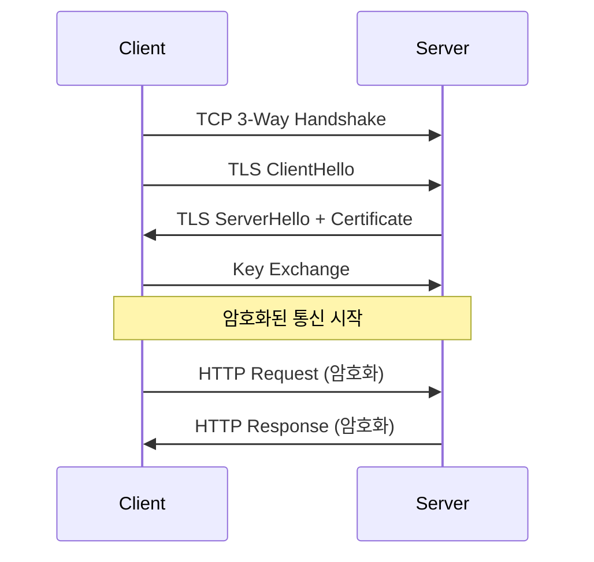

## 🌐 개요 (Overview)

**HTTP (HyperText Transfer Protocol)** 는 웹 상에서 하이퍼텍스트 문서를 전송하기 위한 프로토콜입니다. **TCP 80 번** 포트를 사용합니다.

## 📋 HTTP 특징

| 특징 | 설명 |
|------|------|
| **Stateless** | 상태를 유지하지 않음 (쿠키/세션으로 보완) |
| **Request-Response** | 클라이언트 요청, 서버 응답 |
| **Text-based** | ASCII 텍스트 기반 프로토콜 |
| **Keep-Alive** | HTTP/1.1 부터 지속 연결 지원 |

---

## 📨 HTTP 요청 메서드 (Method)

| 메서드 | 설명 | 특징 |
|--------|------|------|
| **GET** | 리소스 조회 | 데이터가 URL 에 노출 |
| **POST** | 리소스 생성/데이터 전송 | 본문에 데이터 포함 |
| **PUT** | 리소스 수정 (전체) | 멱등성 보장 |
| **PATCH** | 리소스 수정 (일부) | |
| **DELETE** | 리소스 삭제 | |
| **HEAD** | 헤더 정보만 조회 | GET 과 동일하나 본문 없음 |
| **OPTIONS** | 지원 메서드 확인 | CORS preflight |
| **TRACE** | 경로 추적 | XST 공격에 취약 |
| **CONNECT** | 프록시 터널링 | HTTPS 프록시 |

### GET vs POST

| 특성 | GET | POST |
|------|-----|------|
| **데이터 위치** | URL (Query String) | 본문 (Body) |
| **데이터 길이** | 제한 있음 (~2KB) | 제한 없음 |
| **캐시** | 가능 | 불가능 |
| **보안** | URL 에 노출 | 상대적 안전 |
| **북마크** | 가능 | 불가능 |
| **용도** | 조회 | 생성/수정 |

---

## 📊 HTTP 상태 코드 (Status Code)

### 1xx: 정보 (Informational)

| 코드 | 이름 | 설명 |
|:----:|------|------|
| 100 | Continue | 요청 계속 진행 |
| 101 | Switching Protocols | 프로토콜 전환 (WebSocket) |

### 2xx: 성공 (Success)

| 코드 | 이름 | 설명 |
|:----:|------|------|
| **200** | OK | 요청 성공 |
| 201 | Created | 리소스 생성 완료 |
| 204 | No Content | 성공, 본문 없음 |

### 3xx: 리다이렉션 (Redirection)

| 코드 | 이름 | 설명 |
|:----:|------|------|
| **301** | Moved Permanently | 영구 이동 |
| **302** | Found | 임시 이동 |
| 304 | Not Modified | 캐시 사용 |

### 4xx: 클라이언트 오류 (Client Error)

| 코드 | 이름 | 설명 |
|:----:|------|------|
| **400** | Bad Request | 잘못된 요청 문법 |
| **401** | Unauthorized | 인증 필요 |
| **403** | Forbidden | 접근 금지 (권한 없음) |
| **404** | Not Found | 리소스 없음 |
| 405 | Method Not Allowed | 메서드 미허용 |
| 413 | Payload Too Large | 요청 본문 너무 큼 |
| 429 | Too Many Requests | 요청 횟수 초과 |

### 5xx: 서버 오류 (Server Error)

| 코드 | 이름 | 설명 |
|:----:|------|------|
| **500** | Internal Server Error | 서버 내부 오류 |
| 502 | Bad Gateway | 게이트웨이 오류 |
| 503 | Service Unavailable | 서비스 이용 불가 |
| 504 | Gateway Timeout | 게이트웨이 타임아웃 |

---

## 📦 HTTP 메시지 구조

### 요청 (Request)

```http
GET /index.html HTTP/1.1
Host: www.example.com
User-Agent: Mozilla/5.0
Accept: text/html
Accept-Language: ko-KR
Connection: keep-alive

[Request Body - POST일 경우]
```

### 응답 (Response)

```http
HTTP/1.1 200 OK
Date: Wed, 08 Jan 2026 07:00:00 GMT
Server: Apache/2.4.41
Content-Type: text/html; charset=utf-8
Content-Length: 1234
Connection: keep-alive

<!DOCTYPE html>
<html>
...
```

---

## 🔄 HTTP 버전 비교

| 특성 | HTTP/1.0 | HTTP/1.1 | HTTP/2 | HTTP/3 |
|------|----------|----------|--------|--------|
| **연결** | 매 요청마다 연결 | **Keep-Alive** | 다중화 | QUIC |
| **파이프라이닝** | 없음 | 있음 | 스트림 다중화 | 스트림 다중화 |
| **헤더 압축** | 없음 | 없음 | **HPACK** | QPACK |
| **암호화** | 선택 | 선택 | 사실상 필수 | **필수 (QUIC)** |
| **HOL 블로킹** | 있음 | 있음 | TCP 레벨 | 없음 |

### Keep-Alive

```http
# HTTP/1.0 - 매 요청마다 연결
요청1 → 응답1 → 연결 종료 → 연결 → 요청2 → ...

# HTTP/1.1 - 지속 연결
연결 → 요청1 → 응답1 → 요청2 → 응답2 → ... → 연결 종료
```

---

## 🔒 HTTPS (HTTP Secure)

**TLS/SSL**로 암호화된 HTTP 입니다. **TCP 443 번** 포트 사용.



---

## 💡 실무 명령어

```bash
# curl로 HTTP 요청
curl -v http://example.com

# GET 요청
curl http://example.com/api/users

# POST 요청
curl -X POST -d "name=test" http://example.com/api/users

# 헤더만 확인
curl -I http://example.com

# 응답 헤더 포함
curl -i http://example.com

# HTTP/2로 요청
curl --http2 https://example.com
```

## 🔗 연결 문서 (Related Documents)

- [[osi-7-layer-model]] - OSI 7 계층 (응용 계층)
- [[network-security-protocols]] - TLS/SSL
- [[web-security]] - 웹 보안 (XSS, CSRF)
- [[ftp-protocol]] - FTP 프로토콜
