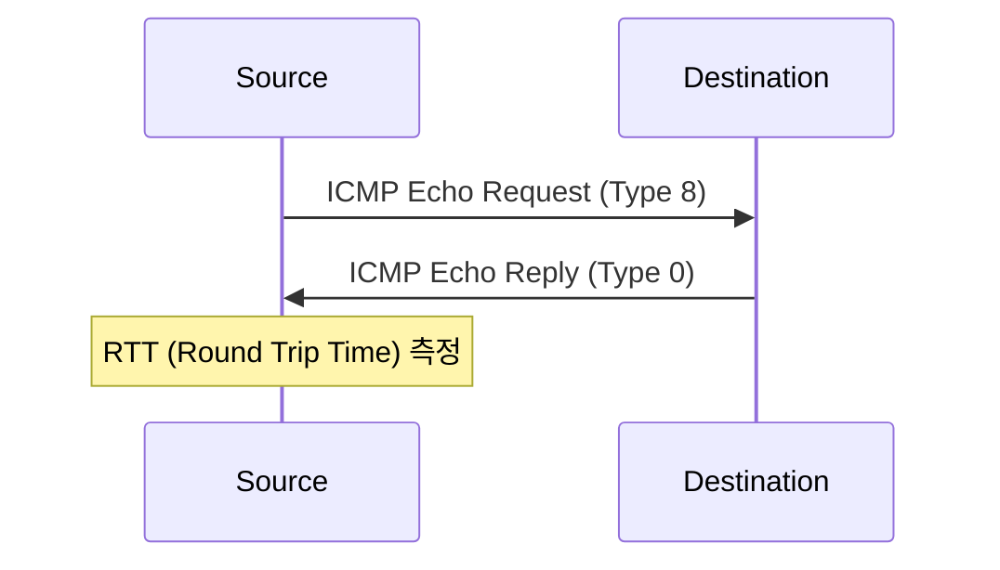
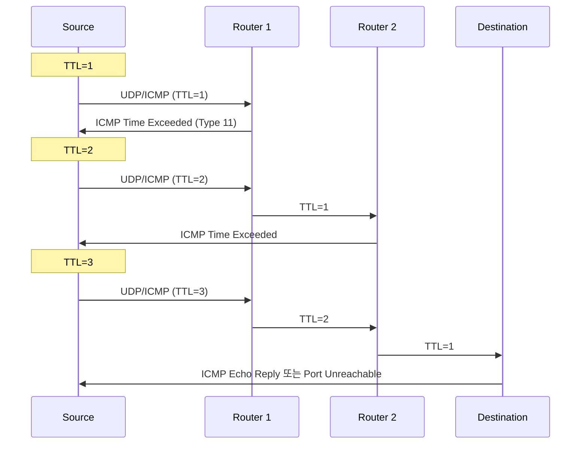

## 🌐 개요 (Overview)

**ICMP (Internet Control Message Protocol)** 는 IP 패킷 전송 중 발생하는 **오류를 보고**하거나 **네트워크 상태를 진단**하는 프로토콜입니다.

## 📦 ICMP 메시지 구조

```plaintext
 0                   1                   2                   3
 0 1 2 3 4 5 6 7 8 9 0 1 2 3 4 5 6 7 8 9 0 1 2 3 4 5 6 7 8 9 0 1
+-+-+-+-+-+-+-+-+-+-+-+-+-+-+-+-+-+-+-+-+-+-+-+-+-+-+-+-+-+-+-+-+
|     Type (8)  |     Code (8)  |        Checksum (16)          |
+-+-+-+-+-+-+-+-+-+-+-+-+-+-+-+-+-+-+-+-+-+-+-+-+-+-+-+-+-+-+-+-+
|                    Message Body (가변)                         |
+-+-+-+-+-+-+-+-+-+-+-+-+-+-+-+-+-+-+-+-+-+-+-+-+-+-+-+-+-+-+-+-+
```

| 필드 | 크기 | 설명 |
|------|------|------|
| **Type** | 8 bit | 메시지 유형 |
| **Code** | 8 bit | 세부 코드 |
| **Checksum** | 16 bit | 오류 검사 |

---

## 📊 주요 ICMP Type 코드

| Type | 이름 | 설명 | 주요 Code |
|:----:|------|------|-----------|
| **0** | Echo Reply | Ping 응답 | 0 |
| **3** | Destination Unreachable | 목적지 도달 불가 | 0~15 |
| **4** | Source Quench | 송신 속도 감소 요청 | 0 (현재 미사용) |
| **5** | Redirect | 더 좋은 경로 알림 | 0~3 |
| **8** | Echo Request | **Ping 요청** | 0 |
| **11** | Time Exceeded | **TTL 만료** | 0~1 |
| **12** | Parameter Problem | 헤더 오류 | 0~2 |

---

## 🔍 Type 3: Destination Unreachable

목적지에 도달할 수 없을 때 발생합니다.

| Code | 의미 |
|:----:|------|
| 0 | Network Unreachable (네트워크 도달 불가) |
| 1 | Host Unreachable (호스트 도달 불가) |
| 2 | Protocol Unreachable (프로토콜 미지원) |
| 3 | Port Unreachable (포트 도달 불가) |
| 4 | Fragmentation Needed but DF Set |
| 5 | Source Route Failed |
| 13 | Administratively Prohibited (방화벽 차단) |

---

## 🔍 Type 5: Redirect

라우터가 더 나은 경로를 알려줄 때 사용합니다.

| Code | 의미 |
|:----:|------|
| 0 | Redirect for Network |
| 1 | Redirect for Host |
| 2 | Redirect for Type of Service and Network |
| 3 | Redirect for Type of Service and Host |

---

## 🔍 Type 11: Time Exceeded

**TTL 이 0 이 되어 패킷이 폐기**될 때 발생합니다.

| Code | 의미 |
|:----:|------|
| 0 | TTL Exceeded in Transit (라우터 통과 중 만료) |
| 1 | Fragment Reassembly Time Exceeded |

>`traceroute` 명령어가 이 메시지를 이용해 경로를 추적합니다.

---

## 🛠️ Ping (ICMP Echo)

네트워크 연결 상태를 확인하는 가장 기본적인 도구입니다.



```bash
# 기본 ping
ping 8.8.8.8

# 횟수 제한
ping -c 4 google.com

# 패킷 크기 지정
ping -s 1000 192.168.1.1

# TTL 값 지정
ping -t 10 192.168.1.1
```

**출력 예시**:
```plaintext
PING 8.8.8.8 (8.8.8.8): 56 data bytes
64 bytes from 8.8.8.8: icmp_seq=0 ttl=117 time=12.5 ms
64 bytes from 8.8.8.8: icmp_seq=1 ttl=117 time=11.8 ms
```

---

## 🛠️ Traceroute

패킷이 목적지까지 거치는 **경로(라우터)를 추적**합니다.

### 동작 원리



1. TTL=1 로 패킷 전송 → 첫 번째 라우터에서 Time Exceeded
2. TTL=2 로 패킷 전송 → 두 번째 라우터에서 Time Exceeded
3. 목적지 도착까지 반복

```bash
# Linux
traceroute google.com

# Windows
tracert google.com

# ICMP 사용 (기본은 UDP)
traceroute -I google.com

# TCP 사용
traceroute -T -p 80 google.com
```

**출력 예시**:
```plaintext
traceroute to google.com (142.250.185.46), 30 hops max
 1  192.168.1.1 (192.168.1.1)  1.234 ms
 2  10.0.0.1 (10.0.0.1)  5.678 ms
 3  * * *
 4  142.250.185.46 (142.250.185.46)  12.345 ms
```

---

## ⚠️ ICMP 관련 공격

### Ping Flood (Smurf Attack)

```plaintext
공격자 → 브로드캐스트 주소로 Ping (Source IP = 피해자)
         ↓
모든 호스트가 피해자에게 Echo Reply 전송
         ↓
피해자 네트워크 마비 (DDoS)
```

### Ping of Death

정상 크기를 초과하는 ICMP 패킷을 전송하여 버퍼 오버플로우 유발

### ICMP Redirect 공격

악의적인 Redirect 메시지로 트래픽 경로 변경

### 대응

```bash
# ICMP 차단 (iptables)
sudo iptables -A INPUT -p icmp --icmp-type echo-request -j DROP

# ICMP Redirect 무시
sudo sysctl -w net.ipv4.conf.all.accept_redirects=0
```

## 🔗 연결 문서 (Related Documents)

- [[ip-header-structure]] - IP 헤더 구조 (TTL 필드)
- [[osi-7-layer-model]] - OSI 7 계층 (3 계층)
- [[arp-protocol]] - ARP 프로토콜
- [[attack-types]] - 네트워크 공격 유형
