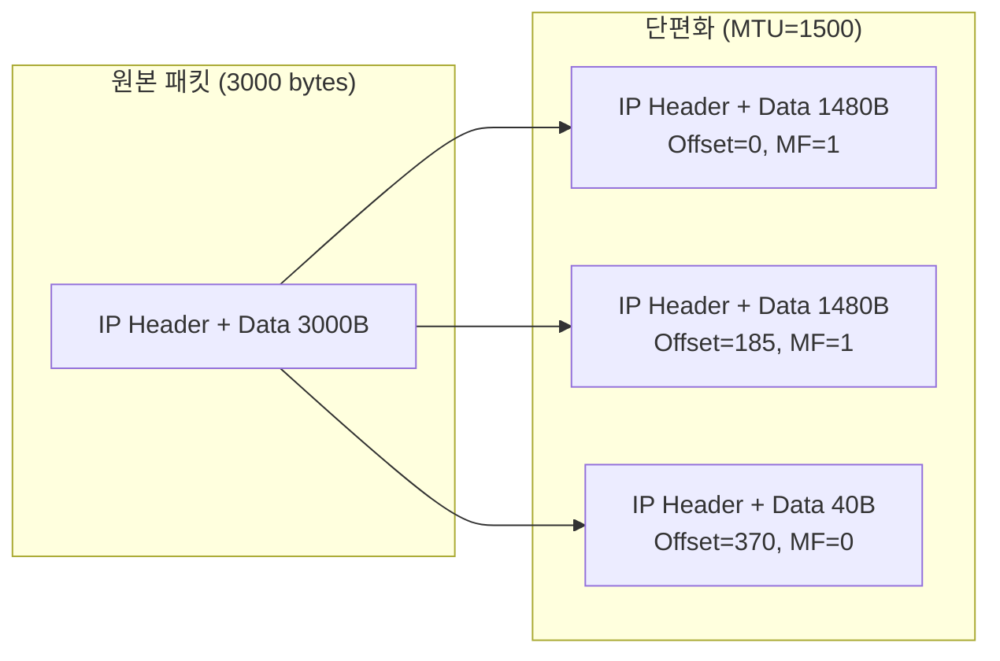

## 🌐 개요 (Overview)

**IP (Internet Protocol)** 는 비연결형, 비신뢰성 프로토콜로 **최선형 (Best Effort)** 서비스를 제공합니다. 이 문서에서는 IPv4 와 IPv6 의 헤더 구조를 상세히 다룹니다.

## 📦 IPv4 헤더 구조 (20~60 Bytes)

```plaintext
 0                   1                   2                   3
 0 1 2 3 4 5 6 7 8 9 0 1 2 3 4 5 6 7 8 9 0 1 2 3 4 5 6 7 8 9 0 1
+-+-+-+-+-+-+-+-+-+-+-+-+-+-+-+-+-+-+-+-+-+-+-+-+-+-+-+-+-+-+-+-+
|Version|  IHL  |    TOS (8)    |         Total Length (16)     |
+-+-+-+-+-+-+-+-+-+-+-+-+-+-+-+-+-+-+-+-+-+-+-+-+-+-+-+-+-+-+-+-+
|      Identification (16)      |Flags|    Fragment Offset (13) |
+-+-+-+-+-+-+-+-+-+-+-+-+-+-+-+-+-+-+-+-+-+-+-+-+-+-+-+-+-+-+-+-+
|   TTL (8)     |  Protocol (8) |      Header Checksum (16)     |
+-+-+-+-+-+-+-+-+-+-+-+-+-+-+-+-+-+-+-+-+-+-+-+-+-+-+-+-+-+-+-+-+
|                    Source IP Address (32)                     |
+-+-+-+-+-+-+-+-+-+-+-+-+-+-+-+-+-+-+-+-+-+-+-+-+-+-+-+-+-+-+-+-+
|                 Destination IP Address (32)                   |
+-+-+-+-+-+-+-+-+-+-+-+-+-+-+-+-+-+-+-+-+-+-+-+-+-+-+-+-+-+-+-+-+
|                    Options (가변, 0~40 bytes)                  |
+-+-+-+-+-+-+-+-+-+-+-+-+-+-+-+-+-+-+-+-+-+-+-+-+-+-+-+-+-+-+-+-+
```

### 필드별 상세 설명

| 필드 | 크기 | 설명 |
|------|------|------|
| **Version** | 4 bit | IP 버전 (IPv4 = 4) |
| **IHL (Header Length)** | 4 bit | 헤더 길이 (32bit 단위, 최소 5 = 20 bytes) |
| **TOS (Type of Service)** | 8 bit | 서비스 품질 (QoS) 우선순위 |
| **Total Length** | 16 bit | 헤더 + 데이터 전체 길이 (최대 65,535 bytes) |
| **Identification** | 16 bit | 단편화된 패킷들이 같은 데이터그램인지 식별 |
| **Flags** | 3 bit | 단편화 제어 플래그 |
| **Fragment Offset** | 13 bit | 조각의 원래 위치 (8 byte 단위) |
| **TTL (Time To Live)** | 8 bit | 패킷 수명 (라우터 통과 시 1 감소, 0 이면 폐기) |
| **Protocol** | 8 bit | 상위 계층 프로토콜 |
| **Header Checksum** | 16 bit | 헤더 오류 검사 |
| **Source IP** | 32 bit | 출발지 IP 주소 |
| **Destination IP** | 32 bit | 목적지 IP 주소 |

### Flags 필드

```plaintext
 0   1   2
+---+---+---+
| R | DF| MF|
+---+---+---+
```

| 플래그 | 이름 | 설명 |
|--------|------|------|
| **R** | Reserved | 예약 (항상 0) |
| **DF** | Don't Fragment | 1 = 단편화 금지 |
| **MF** | More Fragments | 1 = 더 많은 조각 존재, 0 = 마지막 조각 |

### Protocol 번호

| 번호 | 프로토콜 |
|------|----------|
| 1 | **ICMP** |
| 6 | **TCP** |
| 17 | **UDP** |
| 41 | IPv6 |
| 47 | GRE |
| 50 | ESP |
| 51 | AH |

---

## 🔢 IPv4 주소 클래스

| 클래스 | 범위 | 기본 마스크 | 특징 |
|:------:|------|-------------|------|
| **A** | 0.0.0.0 ~ 127.255.255.255 | /8 | 대규모 (0 으로 시작) |
| **B** | 128.0.0.0 ~ 191.255.255.255 | /16 | 중규모 (10 으로 시작) |
| **C** | 192.0.0.0 ~ 223.255.255.255 | /24 | 소규모 (110 으로 시작) |
| **D** | 224.0.0.0 ~ 239.255.255.255 | - | 멀티캐스트 |
| **E** | 240.0.0.0 ~ 255.255.255.255 | - | 예약 (실험용) |

### 사설 IP (Private IP)

인터넷에서 라우팅되지 않는 내부용 주소입니다.

| 클래스 | 사설 IP 범위 |
|--------|-------------|
| A | 10.0.0.0/8 |
| B | 172.16.0.0/12 |
| C | 192.168.0.0/16 |

---

## 🔷 IPv6 헤더 구조 (고정 40 Bytes)

IPv4 의 주소 고갈, 보안성, QoS 문제를 해결하기 위해 등장했습니다.

```plaintext
 0                   1                   2                   3
 0 1 2 3 4 5 6 7 8 9 0 1 2 3 4 5 6 7 8 9 0 1 2 3 4 5 6 7 8 9 0 1
+-+-+-+-+-+-+-+-+-+-+-+-+-+-+-+-+-+-+-+-+-+-+-+-+-+-+-+-+-+-+-+-+
|Version| Traffic Class |           Flow Label                  |
+-+-+-+-+-+-+-+-+-+-+-+-+-+-+-+-+-+-+-+-+-+-+-+-+-+-+-+-+-+-+-+-+
|         Payload Length        |  Next Header  |   Hop Limit   |
+-+-+-+-+-+-+-+-+-+-+-+-+-+-+-+-+-+-+-+-+-+-+-+-+-+-+-+-+-+-+-+-+
|                                                               |
+                                                               +
|                      Source Address (128 bit)                 |
+                                                               +
|                                                               |
+                                                               +
|                                                               |
+-+-+-+-+-+-+-+-+-+-+-+-+-+-+-+-+-+-+-+-+-+-+-+-+-+-+-+-+-+-+-+-+
|                                                               |
+                                                               +
|                   Destination Address (128 bit)               |
+                                                               +
|                                                               |
+                                                               +
|                                                               |
+-+-+-+-+-+-+-+-+-+-+-+-+-+-+-+-+-+-+-+-+-+-+-+-+-+-+-+-+-+-+-+-+
```

### 필드별 설명

| 필드                      | 크기      | 설명                          |
| ----------------------- | ------- | --------------------------- |
| **Version**             | 4 bit   | IP 버전 (IPv6 = 6)            |
| **Traffic Class**       | 8 bit   | 서비스 클래스 (QoS)               |
| **Flow Label**          | 20 bit  | 패킷 흐름 식별 (실시간 처리 지원)        |
| **Payload Length**      | 16 bit  | 헤더 제외 데이터 길이                |
| **Next Header**         | 8 bit   | 다음 헤더 타입 (확장 헤더 또는 상위 프로토콜) |
| **Hop Limit**           | 8 bit   | TTL 과 동일 (0 이면 폐기)          |
| **Source Address**      | 128 bit | 출발지 주소                      |
| **Destination Address** | 128 bit | 목적지 주소                      |

---

## 🆚 IPv4 vs IPv6 비교

| 특성 | IPv4 | IPv6 |
|------|------|------|
| **주소 길이** | 32 bit | **128 bit** |
| **표기법** | 10 진수 (.) | 16 진수 (:) |
| **헤더 크기** | 20~60 bytes | **고정 40 bytes** |
| **주소 개수** | 약 43 억 개 | 340 간 개 이상 |
| **보안** | 선택 (IPSec) | **기본 내장** |
| **브로드캐스트** | 있음 | **없음** (멀티캐스트로 대체) |
| **단편화** | 라우터에서 가능 | **송신 노드에서만** |

### IPv6 주소 유형

| 유형 | 설명 |
|------|------|
| **유니캐스트 (Unicast)** | 1:1 통신 |
| **멀티캐스트 (Multicast)** | 1:N 통신 |
| **애니캐스트 (Anycast)** | 1:1, 가장 가까운 노드 |

>브로드캐스트는 IPv6 에서 삭제됨 (멀티캐스트로 대체)

---

## 📦 IP 단편화 (Fragmentation)

MTU (Maximum Transmission Unit)보다 큰 패킷을 분할합니다.



**Fragment Offset 계산**: 원 위치 / 8

## 🔗 연결 문서 (Related Documents)

- [[osi-7-layer-model]] - OSI 7 계층 모델
- [[tcp-ip-model]] - TCP/IP 4 계층
- [[tcp-udp-protocols]] - TCP/UDP 프로토콜
- [[icmp-protocol]] - ICMP 프로토콜
- [[ip-addressing]] - IP 주소 체계
