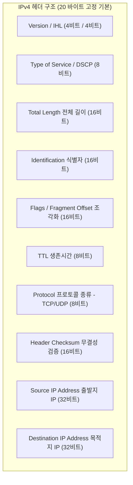

# IP 헤더 구조 (IP Header Structure)

## 1. 개요 (Overview)

**IP 헤더 (IP Header)** 는 인터넷 통신에서 데이터 패킷(Packet)의 맨 앞에 붙는 **배송 전용 제어 정보 데이터 블록**이다.

우체국 택배 상자 위에 붙는 배송 송장 스티커처럼, 출발지 IP 주소, 목적지 IP 주소, 생존 시간(TTL), 프로토콜 종류 등의 필수 라우팅 정보가 기록되어 있다.

---

### 초보자를 위한 쉽게 이해하는 비유

* **IP 데이터 패킷**: 보내려는 진짜 택배 상자 (내용물)
* **IP 헤더**: 상자 겉면에 붙은 **우체국 정품 배송 송장 (보내는 사람 주소, 받는 사람 주소, 유통기한 등)**

---

## 2. IPv4 헤더의 핵심 구조

IPv4 헤더는 옵션 필드 포함 20~60 바이트 가변 크기를 가진다.

```mermaid
graph TD
    subgraph IPv4Header ["IPv4 헤더 구조 (20 바이트 고정 기본)"]
        V["Version / IHL (4비트 / 4비트)"]
        ToS["Type of Service / DSCP (8비트)"]
        TL["Total Length 전체 길이 (16비트)"]
        ID["Identification 식별자 (16비트)"]
        Flags["Flags / Fragment Offset 조각화 (16비트)"]
        TTL["TTL 생존시간 (8비트)"]
        Proto["Protocol 프로토콜 종류 - TCP/UDP (8비트)"]
        Checksum["Header Checksum 무결성 검증 (16비트)"]
        SrcIP["Source IP Address 출발지 IP (32비트)"]
        DstIP["Destination IP Address 목적지 IP (32비트)"]
    end
```

- **Source IP / Destination IP**: 패킷의 출발지와 최종 도착지 IP 주소 (각 32비트).
- **TTL (Time to Live)**: 패킷이 네트워크 상에서 영원히 맴돌지 않도록 라우터를 거칠 때마다 1씩 감가되는 생존 카운트. 0 이 되면 패킷이 파기된다.
- **Protocol**: 상위 계층인 전송 계층의 프로토콜이 [TCP](tcp-udp-protocols.md) 인지 [UDP](tcp-udp-protocols.md) 인지 식별하는 값.

---

## 3. IPv4 와 IPv6 의 비교

IPv4 와 128비트 차세대 IPv6 주소 체계 간의 헤더 구조 및 기술적 차이점 비교표는 독립된 [IPv4 vs IPv6 비교 문서](ipv4-vs-ipv6.md)를 참고한다.

---

## 4. 연결 문서 (Related Links)

- [IPv4 vs IPv6 비교](ipv4-vs-ipv6.md) - 32비트 IPv4 와 128비트 IPv6 차이점 종합 비교
- [TCP/IP 모델](tcp-ip-model.md) - IP 프로토콜이 속한 인터넷 계층 아키텍처
- [TCP & UDP 프로토콜](tcp-udp-protocols.md) - IP 헤더 상위에 올려지는 전송 계층 프로토콜
