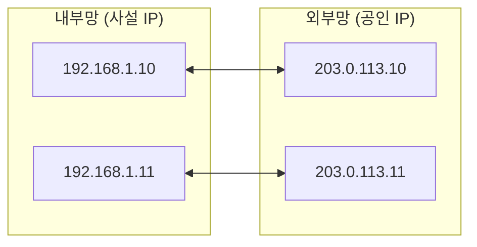
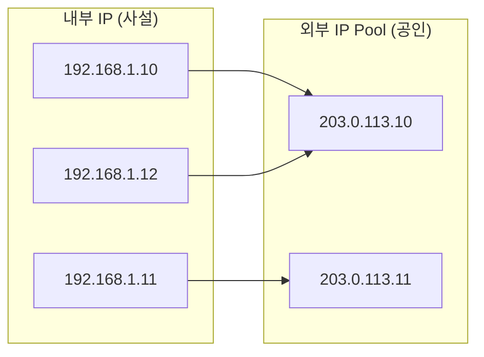
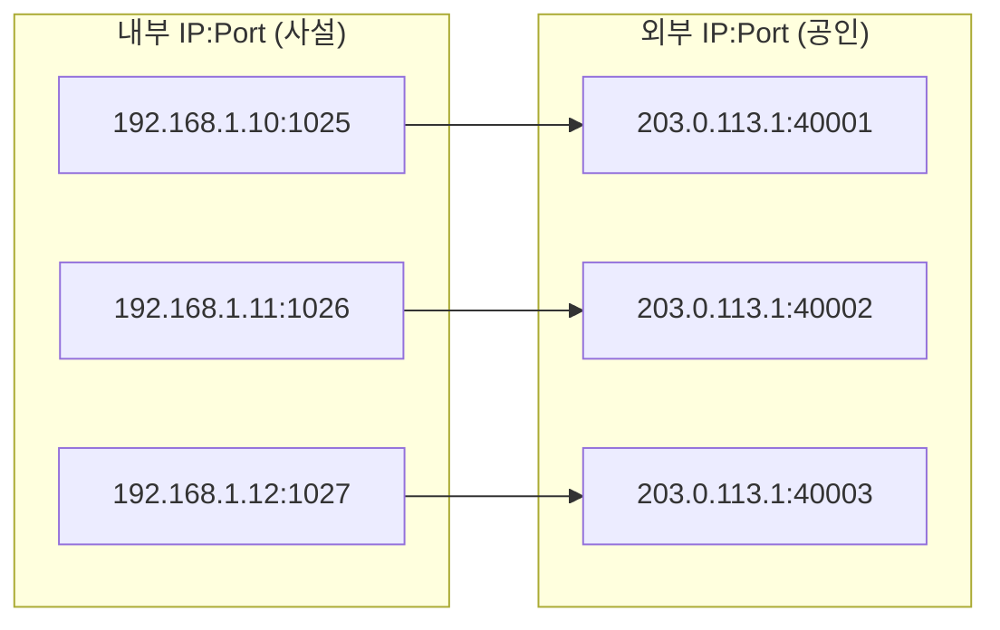
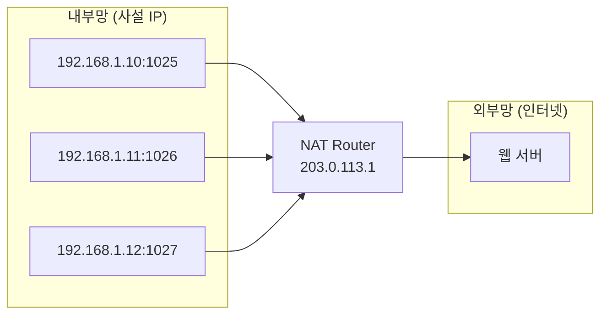

## NAT (Network Address Translation)

**NAT (Network Address Translation)** 는 사설 IP를 공인 IP로 변환하여 IPv4 주소 부족 문제를 해결하고 내부 네트워크를 외부로부터 보호합니다.

---

### 초보자를 위한 쉽게 이해하는 비유

**NAT (아파트 세대별 대표 주소 발송)**:
아파트의 수많은 세대(사설 IP)가 각자 편지를 외부로 보낼 때, 아파트 정문의 통합 우편함(NAT 라우터)에서 대표 주소와 세대 번호(공인 IP + Port)로 변환해 인터넷으로 전달하는 시스템입니다.

---

## NAT 유형

### 1. Static NAT (1:1)



- 1:1 고정 매핑
- 서버 등 고정 IP 필요 시 사용

### 2. Dynamic NAT (N:M)



- 공인 IP 풀에서 동적 할당
- N개 내부 주소, M개 공인 주소 (N ≥ M)

### 3. PAT / NAPT (N:1)



- **Port Address Translation**
- 하나의 공인 IP로 여러 내부 호스트 지원
- **가장 많이 사용되는 방식**



---

## NAT 변환 테이블

| 내부 IP | 내부 Port | 외부 IP | 외부 Port | 프로토콜 |
|---------|-----------|---------|-----------|----------|
| 192.168.1.10 | 1025 | 203.0.113.1 | 40001 | TCP |
| 192.168.1.11 | 1026 | 203.0.113.1 | 40002 | TCP |
| 192.168.1.10 | 1030 | 203.0.113.1 | 40003 | UDP |

---

## NAT 설정 (Linux iptables)

```bash
# SNAT (Source NAT) - 내부 → 외부
sudo iptables -t nat -A POSTROUTING -o eth0 -j MASQUERADE

# DNAT (Destination NAT) - 외부 → 내부 (포트 포워딩)
sudo iptables -t nat -A PREROUTING -p tcp --dport 80 -j DNAT --to-destination 192.168.1.100:80

# NAT 테이블 확인
sudo iptables -t nat -L -n -v

# 연결 추적 확인
cat /proc/net/nf_conntrack
```

---

## NAT의 장단점

### 장점

| 장점 | 설명 |
|------|------|
| **주소 절약** | 하나의 공인 IP로 다수 접속 |
| **보안** | 내부 구조 은닉 |
| **유연성** | 내부 네트워크 자유롭게 구성 |

### 단점

| 단점 | 설명 |
|------|------|
| **성능** | 변환 오버헤드 |
| **P2P 제한** | 양방향 직접 연결 어려움 |
| **프로토콜 제한** | FTP, SIP 등 별도 처리 필요 |

---

## 연결 문서 (Related Documents)

- [DHCP/NAT Protocols](dhcp-nat-protocols.md) - DHCP와 NAT의 역할 및 IP 주소 관리 프로토콜
- [DHCP vs Static IP](dhcp-vs-static-ip.md) - IP 주소 할당 방식 비교
- [IP 주소 체계](ip-addressing.md) - IP 주소 클래스와 사설 IP
