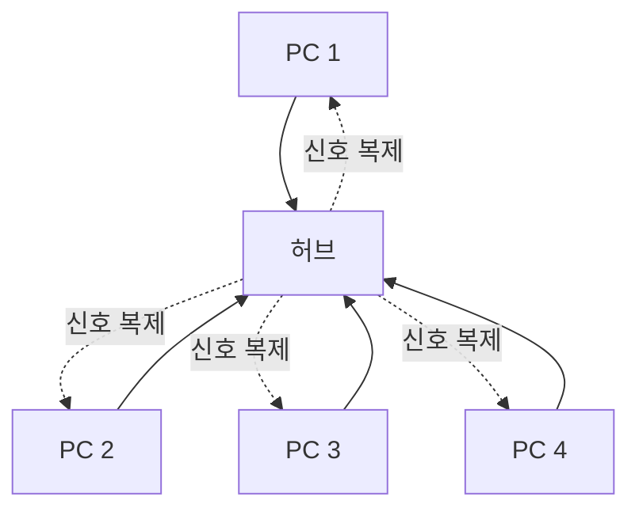
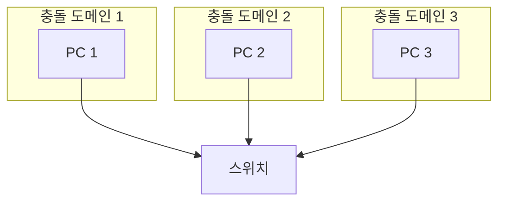
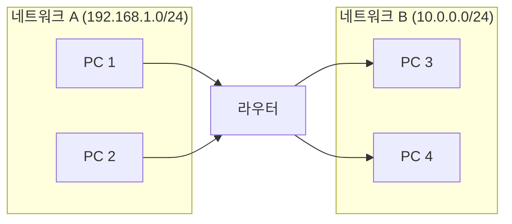
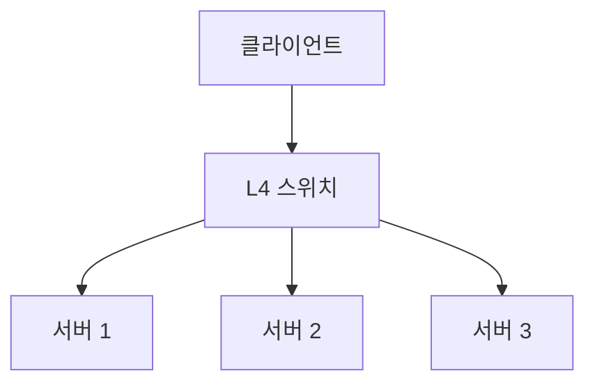
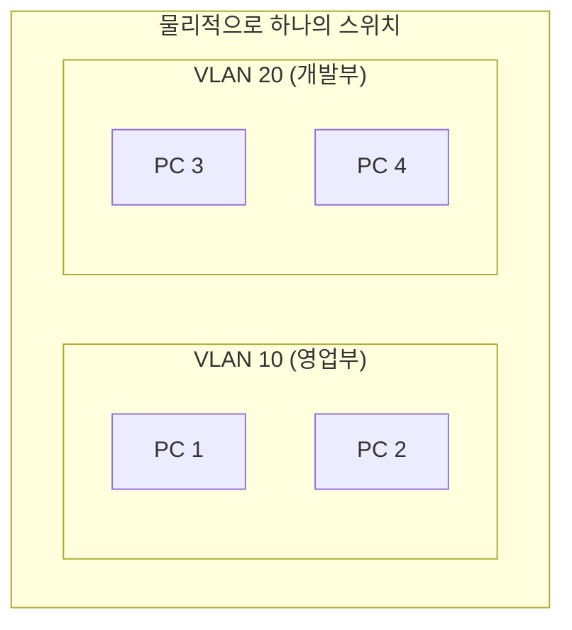
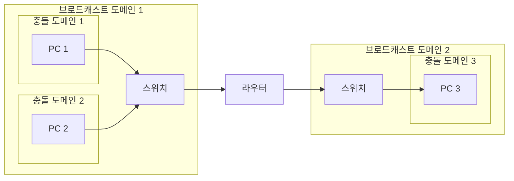

## 🌐 개요 (Overview)

네트워크 장비는 OSI 계층에 따라 동작하는 레이어가 다릅니다. 이 문서에서는 각 계층별 장비의 기능과 특징을 다룹니다.

## 🔌 전송 매체

### UTP 케이블 (Twisted Pair)

8가닥의 구리선이 **꼬여있는** 형태로 전자기 간섭을 줄입니다.

| 케이블 유형 | 용도 | 배열 |
|------------|------|------|
| **다이렉트 (Straight-through)** | 서로 다른 계층 장비 (PC-스위치) | T568B-T568B |
| **크로스 (Crossover)** | 같은 계층 장비 (PC-PC, 스위치-스위치) | T568A-T568B |

### 광섬유 (Fiber Optic)

빛의 **전반사**를 이용하며 코어(Core)와 클래드(Clad)로 구성됩니다.

| 특성 | 설명 |
|------|------|
| 전자기 간섭 | 없음 |
| 전송 거리 | 장거리 가능 |
| 대역폭 | 매우 높음 |
| 비용 | 높음 |

---

## 🏗️ OSI 계층별 네트워크 장비

### 1계층 (Physical Layer) - 리피터, 허브

#### 리피터 (Repeater)

**감쇄된 신호를 증폭/재생**하여 전송 거리를 연장합니다.

#### 허브 (Hub)

**멀티포트 리피터**입니다. 들어온 신호를 연결된 **모든 포트로 플러딩 (Flooding)** 합니다.



**Dummy Hub 특징**:
- 대역폭 공유 (Shared Bandwidth)
- 반이중 (Half-Duplex)
- **충돌 도메인 (Collision Domain)** 이 하나

---

### 2계층 (Data Link Layer) - 브리지, 스위치

#### 브리지 (Bridge)

LAN 세그먼트를 연결하며 **MAC 주소 테이블**을 보고 트래픽을 필터링합니다.

- **충돌 도메인을 분리**
- 소프트웨어 기반 처리

#### 스위치 (Switch / L2 Switch)

**하드웨어 기반**으로 빠르게 패킷을 처리합니다.



**스위치 5대 기능**:

| 기능 | 설명 |
|------|------|
| **Learning** | 출발지 MAC 주소를 학습하여 테이블에 기록 |
| **Flooding** | 목적지 MAC을 모르면 모든 포트로 전송 |
| **Forwarding** | 목적지 MAC을 알면 해당 포트로만 전송 (유니캐스트) |
| **Filtering** | 다른 포트로 가지 않게 차단 |
| **Aging** | 일정 시간 통신이 없으면 테이블에서 삭제 |

**스위치 전송 방식**:

| 방식 | 설명 | 특징 |
|------|------|------|
| **Store and Forward** | 전체 프레임 수신 후 CRC 검사하고 전송 | 안정성 높음, 느림 |
| **Cut-Through** | 목적지 주소만 보고 즉시 전송 | 빠름, 에러 전파 가능 |
| **Fragment-Free** | 앞 64바이트만 검사 후 전송 | 충돌 패킷 필터링 |

---

### 3계층 (Network Layer) - 라우터, L3 스위치

#### 라우터 (Router)

서로 다른 네트워크 (LAN-WAN)를 연결하고 **IP 주소 기반**으로 경로를 지정합니다.



**라우터 기능**:
- **브로드캐스트 도메인 분리**
- 경로 결정 (라우팅 테이블)
- 패킷 필터링 (ACL)
- NAT

#### L3 스위치

**라우팅 기능을 가진 스위치**로, 하드웨어 기반 처리로 라우터보다 속도가 빠릅니다.

---

### 4계층 이상 - L4 스위치, 게이트웨이

#### 게이트웨이 (Gateway)

서로 다른 **프로토콜**을 사용하는 네트워크 간 통신을 가능하게 합니다 (프로토콜 변환).

#### L4 스위치

**로드 밸런싱 (Load Balancing)** 기능을 수행합니다. TCP/UDP 포트 정보를 보고 트래픽을 여러 서버에 분산합니다.



**로드 밸런싱 알고리즘**:

| 알고리즘 | 설명 |
|----------|------|
| **라운드 로빈** | 순서대로 분배 |
| **최소 연결** | 연결이 가장 적은 서버로 |
| **가중치 기반** | 서버 성능에 따라 비율 분배 |
| **IP 해시** | 클라이언트 IP 기반 고정 |

---

## 🌐 VLAN (Virtual LAN)

### 개념

물리적 연결과 상관없이 **논리적으로 LAN을 구성**하는 기술입니다.



### VLAN 장점

| 장점 | 설명 |
|------|------|
| **브로드캐스트 제어** | 브로드캐스트 도메인 분리 |
| **보안 강화** | VLAN 간 통신 제한 |
| **유연성** | 물리적 위치와 무관하게 그룹핑 |
| **관리 용이** | 논리적 네트워크 분리 |

### 트렁킹 (Trunking)

스위치 간 연결된 하나의 링크로 **여러 VLAN 트래픽**을 전송하는 기술입니다.

**802.1Q 태깅**:
```plaintext
Original Frame:
[Dest MAC][Src MAC][Type][Data][FCS]

Tagged Frame:
[Dest MAC][Src MAC][802.1Q Tag][Type][Data][FCS]
                    └── VLAN ID (12bit) + Priority (3bit)
```

---

## 📊 도메인 비교

| 도메인 | 분리 장비 | 설명 |
|--------|----------|------|
| **충돌 도메인 (Collision)** | 스위치, 브리지 | 충돌 발생 범위 |
| **브로드캐스트 도메인 (Broadcast)** | **라우터, VLAN** | 브로드캐스트 전파 범위 |



---

## 📋 계층별 장비 요약

| 계층 | 장비 | PDU | 주소 | 충돌 도메인 | 브로드캐스트 도메인 |
|:---:|------|-----|-----|:---:|:---:|
| **1** | 허브, 리피터 | Bit | - | 공유 | 공유 |
| **2** | 스위치, 브리지 | Frame | MAC | **분리** | 공유 |
| **3** | 라우터, L3 스위치 | Packet | IP | 분리 | **분리** |
| **4+** | L4 스위치, 게이트웨이 | Segment | Port | 분리 | 분리 |

## 🔗 연결 문서 (Related Documents)

- [[osi-7-layer-model]] - OSI 7계층
- [[routing-basics]] - 라우팅 기초
- [[routing-protocols]] - 라우팅 프로토콜
- [[router-acl-security]] - 라우터 ACL 보안
- [[arp-protocol]] - MAC 주소 해석
