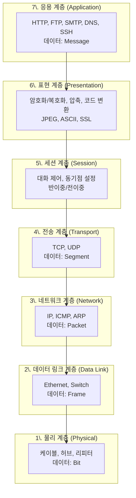
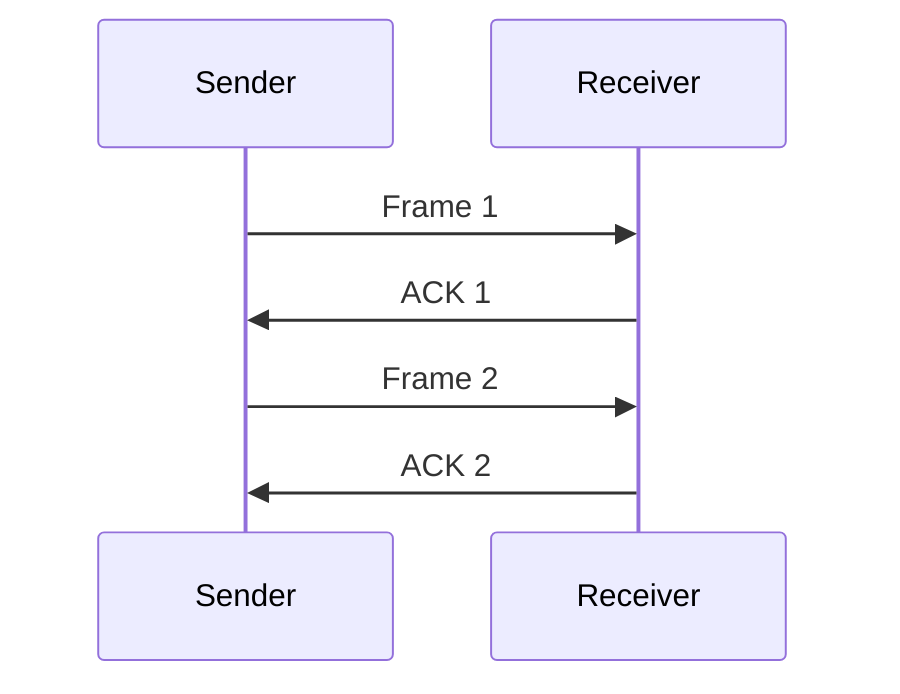
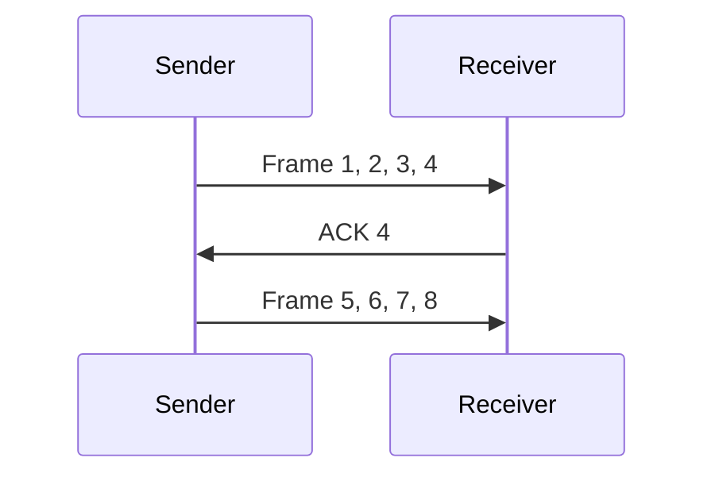

## 🌐 개요 (Overview)

**OSI 7 계층 모델 (Open System Interconnection)** 은 ISO 에서 제정한 네트워크 표준 모델입니다. 네트워크 통신을 **7 개의 계층**으로 분리하여 각 계층이 독립적으로 동작하도록 설계되었습니다.

## 📋 프로토콜의 기본 요소

프로토콜은 통신을 원하는 두 개체 간에 **무엇을, 어떻게, 언제** 할 것인지를 정의한 규약입니다.

| 요소 | 설명 | 예시 |
|------|------|------|
| **구문 (Syntax)** | 데이터의 형식, 부호화 방법, 신호 레벨 | 패킷 헤더 구조, 인코딩 방식 |
| **의미 (Semantics)** | 제어 정보와 그 의미 (오류 관리) | ACK, NACK 의미 |
| **타이밍 (Timing)** | 통신 속도 조절, 순서 제어 | 전송 속도, 응답 시간 |

## 🔧 프로토콜의 주요 기능

| 기능 | 설명 |
|------|------|
| **단편화/재조립** | 대용량 데이터를 작은 단위로 나누고(송신) 다시 합침(수신) |
| **캡슐화 (Encapsulation)** | 데이터에 헤더/트레일러 추가 (주소, 에러 검출 코드 등) |
| **연결 제어** | 연결 설정, 유지, 해제 관리 |
| **흐름 제어 (Flow Control)** | 송수신 속도 차이로 인한 데이터 유실 방지 |
| **오류 제어 (Error Control)** | 전송 중 오류 검출 (Parity, CRC) 및 복구 (재전송) |
| **동기화 (Synchronization)** | 송수신 간 상태(타이밍) 일치 |
| **순서 결정 (Sequencing)** | 패킷에 순서 번호 부여하여 올바른 순서로 조립 |
| **주소 지정 (Addressing)** | MAC, IP, Port 등으로 시스템 식별 |
| **다중화 (Multiplexing)** | 하나의 회선에 여러 신호 동시 전송 |

---

## 🏗️ OSI 7 계층 구조



---

## 📊 계층별 상세 설명

### 1. 물리 계층 (Physical Layer)

**비트(Bit)** 단위의 데이터를 **전기적 신호**로 변환하여 전송합니다.

| 항목 | 내용 |
|------|------|
| **기능** | 기계적, 전기적, 기능적 절차 규정 |
| **PDU** | Bit (비트) |
| **장비** | 리피터 (Repeater), 허브 (Hub) |
| **예시** | 케이블, 커넥터, 전압 레벨 |

### 2. 데이터 링크 계층 (Data Link Layer)

**인접한 시스템 간의 신뢰성 있는 전송**을 보장합니다.

| 항목 | 내용 |
|------|------|
| **기능** | MAC 주소 지정, 오류 제어, 흐름 제어, 회선 제어 |
| **PDU** | Frame (프레임) |
| **장비** | 브리지 (Bridge), 스위치 (L2 Switch) |
| **프로토콜** | Ethernet, PPP, HDLC |

**MAC 주소 (Media Access Control)**:
- 48 비트 (6 바이트) 물리적 주소
- 앞 24 비트: OUI (제조사 코드)
- 뒤 24 비트: 일련번호

```plaintext
예: 00:1A:2B:3C:4D:5E
    ├─────┴─────┤ ├─────┴─────┤
       OUI (3B)     일련번호 (3B)
```

### 3. 네트워크 계층 (Network Layer)

패킷을 목적지까지 **경로 설정 (Routing)** 합니다.

| 항목 | 내용 |
|------|------|
| **기능** | 논리적 주소(IP) 지정, 라우팅, 단편화 |
| **PDU** | Packet (패킷) |
| **장비** | 라우터 (Router), L3 스위치 |
| **프로토콜** | IP, ICMP, ARP, RARP |

### 4. 전송 계층 (Transport Layer)

**종단 간 (End-to-End) 신뢰성** 있는 데이터 전송을 담당합니다.

| 항목 | 내용 |
|------|------|
| **기능** | 분할/재조립, 연결 제어, 흐름 제어, 오류 제어 |
| **PDU** | Segment (세그먼트) |
| **장비** | 게이트웨이, L4 스위치 |
| **프로토콜** | TCP, UDP |

### 5. 세션 계층 (Session Layer)

**응용 프로세스 간의 대화**를 제어하고 동기화를 유지합니다.

| 항목 | 내용 |
|------|------|
| **기능** | 대화 제어 (반이중/전이중), 동기점 설정 |
| **PDU** | Data |
| **예시** | NetBIOS, SQL Session |

### 6. 표현 계층 (Presentation Layer)

데이터의 **형식 차이를 변환**하여 호환성을 제공합니다.

| 항목 | 내용 |
|------|------|
| **기능** | 암호화/복호화, 압축, 코드 변환 |
| **PDU** | Data |
| **예시** | JPEG, MPEG, ASCII/EBCDIC, SSL |

### 7. 응용 계층 (Application Layer)

**사용자가 네트워크에 접근**할 수 있도록 인터페이스를 제공합니다.

| 항목 | 내용 |
|------|------|
| **기능** | 사용자 인터페이스, 네트워크 서비스 |
| **PDU** | Data / Message |
| **프로토콜** | HTTP, FTP, SMTP, DNS, Telnet, SSH |

---

## 📋 계층별 요약표

| 계층 | 이름 | PDU | 주요 장비 | 프로토콜 |
|:----:|------|-----|----------|----------|
| **7** | Application | Message | - | HTTP, FTP, DNS, SMTP |
| **6** | Presentation | Data | - | JPEG, SSL |
| **5** | Session | Data | - | NetBIOS |
| **4** | Transport | Segment | L4 스위치 | **TCP, UDP** |
| **3** | Network | Packet | **라우터** | **IP, ICMP, ARP** |
| **2** | Data Link | Frame | **스위치, 브리지** | Ethernet |
| **1** | Physical | Bit | 허브, 리피터 | - |

---

## 🔀 흐름 제어 (Flow Control)

송수신 속도 차이로 인한 데이터 유실을 방지합니다.

### Stop-and-Wait



- 프레임 전송 후 ACK 받을 때까지 대기
- 단순하지만 비효율적

### Sliding Window



- 윈도우 크기만큼 연속 전송
- ACK 없이도 여러 프레임 전송 가능
- TCP 에서 사용

---

## 🚨 오류 제어 (Error Control)

### 오류 검출 방식

| 방식 | 설명 |
|------|------|
| **Parity Check** | 홀수/짝수 패리티 비트 추가 |
| **CRC (Cyclic Redundancy Check)** | 다항식 기반 검출, 높은 정확도 |
| **Checksum** | 합계 검사 |

### 오류 복구 방식

| 방식 | 설명 |
|------|------|
| **ARQ (Automatic Repeat reQuest)** | 오류 시 재전송 요청 |
| **FEC (Forward Error Correction)** | 수신 측에서 직접 오류 정정 |

## 🔗 연결 문서 (Related Documents)

- [[tcp-ip-model]] - TCP/IP 4 계층 모델
- [[ip-header-structure]] - IP 헤더 구조
- [[tcp-udp-protocols]] - TCP/UDP 상세
- [[arp-protocol]] - ARP 프로토콜
