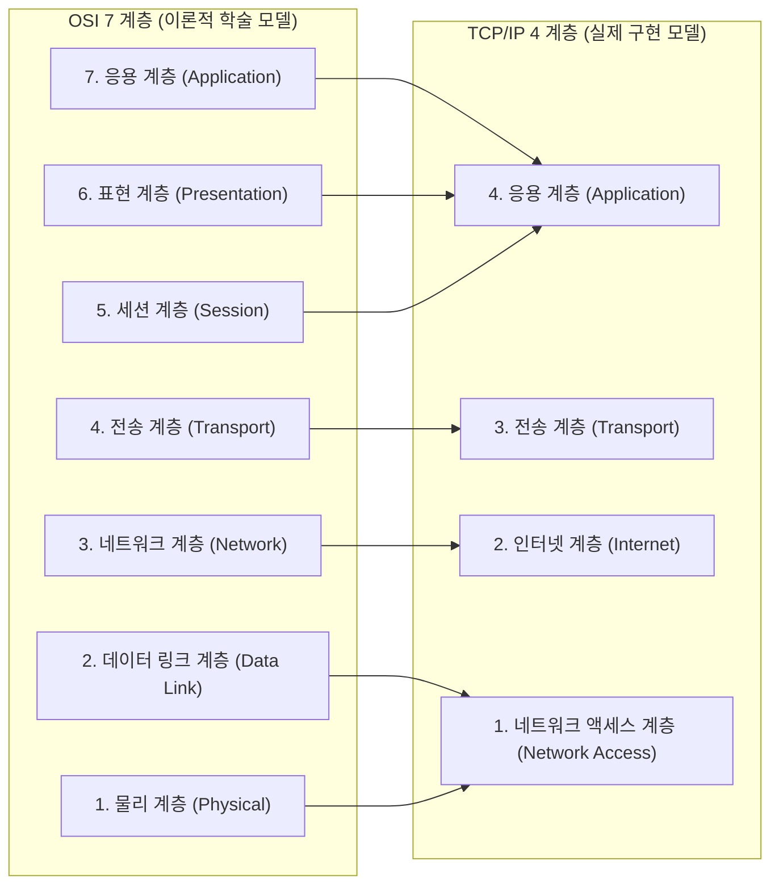

# OSI 7계층 vs TCP/IP 4계층 (네트워크 아키텍처 모델 비교)

## 1. 개요 (Overview)

네트워크 아키텍처 표준 모델은 이론적 규격인 **OSI 7계층 (OSI 7-Layer Reference Model)** 과 실제 인터넷 통신에서 구현되어 쓰이는 **TCP/IP 4계층 (TCP/IP Model)** 으로 나뉜다.

---

### 초보자를 위한 쉽게 이해하는 비유

* **OSI 7계층 (건축 설계 학술 표준 도면)**:
  - 학자들이 만든 매우 상세하고 세분화된 표준 이론 규격서 (세세하지만 실제 적용 시 복잡함).
* **TCP/IP 4계층 (실제 지어진 실용 건물의 인테리어)**:
  - 실제 인터넷이 움직이도록 통신 엔지니어들이 구현한 실용적인 네트워크 규격 (실제 모든 인터넷은 이 구조로 움직임).

---

## 2. OSI 7계층 vs TCP/IP 4계층 핵심 기술 비교표

| 비교 항목 | OSI 7 계층 (OSI Reference Model) | TCP/IP 4 계층 (TCP/IP Suite) |
| :--- | :--- | :--- |
| **목적** | 학술적/이론적 네트워크 통신 표준 정립 | **실제 인터넷 통신 구현 및 표준화** |
| **계층 수** | 7 계층 | **4 계층 (또는 5 계층)** |
| **응용 계층 묶음** | 응용(7) + 표현(6) + 세션(5) 으로 세분화 | **응용 계층(Application) 하나로 통합** |
| **하위 계층 묶음** | 데이터 링크(2) + 물리(1) 로 세분화 | **네트워크 액세스 계층(Network Access)으로 통합** |
| **주요 프로토콜** | 학술적 규격 위주 | **HTTP, DNS, TCP, UDP, IP, ARP, Ethernet** |

---

## 3. 연결 문서 (Related Links)

- [OSI 7계층 모델](osi-7-layer-model.md) - OSI 7계층의 학술적 구조
- [TCP/IP 모델](tcp-ip-model.md) - 실제 인터넷 통신에 사용되는 TCP/IP 4계층 모델
- [TCP vs UDP 비교](tcp-vs-udp.md) - 전송 계층의 두 핵심 프로토콜 비교
