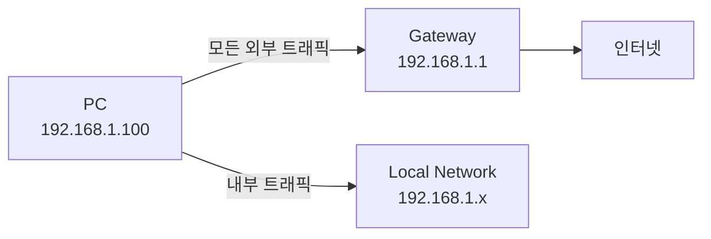
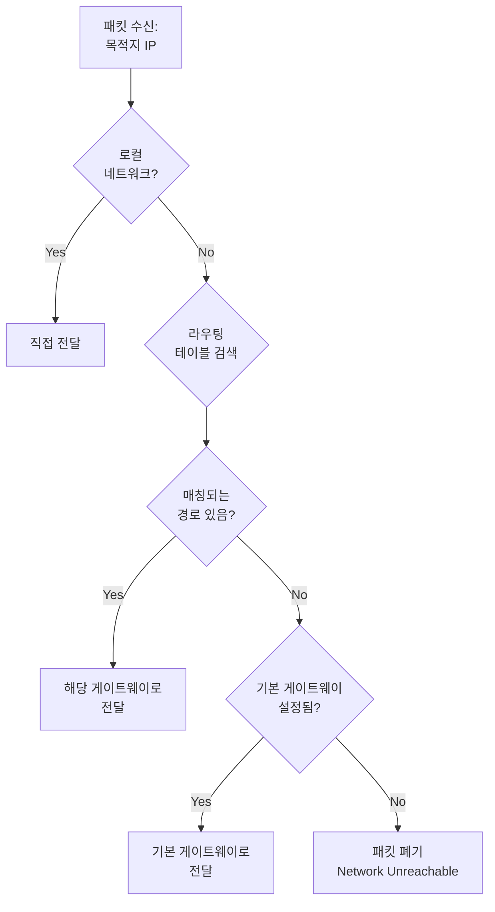
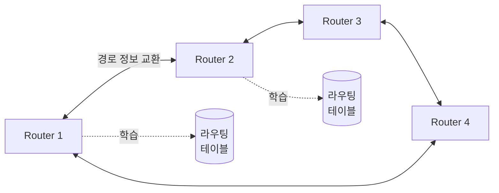

## 🌐 개요 (Overview)

**라우팅 (Routing)** 은 [[ip-addressing|IP 패킷]]이 출발지에서 목적지까지 도달하는 최적의 경로를 결정하는 과정입니다. 인터넷의 "교통 경찰" 역할을 하여 패킷을 올바른 방향으로 안내합니다.

## 🎯 라우팅의 목적 (Purpose)

1. **경로 결정**: 패킷이 목적지로 가는 최적 경로 선택
2. **네트워크 간 연결**: 서로 다른 네트워크를 상호 연결
3. **부하 분산**: 여러 경로를 통해 트래픽 분산
4. **장애 대응**: 경로 장애 시 대체 경로 자동 선택

## 📊 라우팅 테이블 (Routing Table)

각 라우터와 호스트는 라우팅 데이블을 유지합니다.

```bash
# 라우팅 테이블 확인
ip route          # 권장 (Linux)
route -n          # 숫자 형식
netstat -rn       # 구식
```

**출력 예시**:
```
Destination     Gateway         Genmask         Flags  Iface
default         192.168.1.1     0.0.0.0         UG     eth0
192.168.1.0     0.0.0.0         255.255.255.0   U      eth0
172.16.0.0      192.168.1.254   255.255.0.0     UG     eth0
```

### 테이블 필드 설명

| 필드 | 설명 | 예시 |
|------|------|------|
| **Destination** | 목적지 네트워크 | `192.168.1.0` |
| **Gateway** | 다음 홉 라우터 | `192.168.1.1` |
| **Genmask** | 서브넷 마스크 | `255.255.255.0` |
| **Flags** | 경로 상태 | `U`=Up, `G`=Gateway |
| **Iface** | 출력 인터페이스 | `eth0` |

## 🏠 기본 게이트웨이 (Default Gateway)

**정의**: 로컬 네트워크 외부로 나가는 모든 패킷이 전달되는 라우터입니다.



**설정**:

```bash
# Linux
sudo ip route add default via 192.168.1.1

# 확인
ip route | grep default
# default via 192.168.1.1 dev eth0
```

**가정용 네트워크 예**:
- PC IP: `192.168.1.100`
- Router (Gateway): `192.168.1.1`
- PC가 `8.8.8.8`에 접속 → 게이트웨이로 전달 → 인터넷

## 🔍 라우팅 결정 과정 (Routing Decision)



**예시**: PC (`192.168.1.100`)에서 `8.8.8.8`로 패킷 전송
1. 목적지 `8.8.8.8`이 로컬 네트워크 (`192.168.1.0/24`)에 속하는가? → No
2. 라우팅 테이블에서 `8.8.0.0/16` 경로 있는가? → No
3. 기본 게이트웨이 (`192.168.1.1`)로 전달

## 📍 정적 라우팅 (Static Routing)

관리자가 수동으로 경로를 설정하는 방식입니다.

### 라우트 추가

```bash
# 기본 게이트웨이 추가
sudo ip route add default via 192.168.1.1

# 특정 네트워크 라우트 추가
sudo ip route add 10.0.0.0/8 via 192.168.1.254

# 특정 인터페이스로 직접 라우팅
sudo ip route add 172.16.0.0/12 dev eth1
```

### 라우트 삭제

```bash
sudo ip route del default
sudo ip route del 10.0.0.0/8
```

### 라우트 수정

```bash
sudo ip route change 10.0.0.0/8 via 192.168.1.200
```

### 장단점

| 장점 | 단점 |
|------|------|
| ✅ 간단하고 예측 가능 | ❌ 확장성 낮음 |
| ✅ 보안 (외부 경로 광고 차단) | ❌ 장애 대응 수동 |
| ✅ 대역폭 낭비 없음 | ❌ 대규모 네트워크 부적합 |

**사용 사례**:
- 소규모 네트워크 (< 10개 라우터)
- 고정된 토폴로지
- 보안 중심 환경

## 🤖 동적 라우팅 (Dynamic Routing)

라우터가 프로토콜을 통해 자동으로 경로를 학습하고 교환합니다.

### 주요 프로토콜

| 프로토콜 | 타입 | 메트릭 | 특징 |
|---------|------|--------|------|
| **RIP** (Routing Information Protocol) | Distance-Vector | Hop Count | 간단, 소규모, 최대 15홉 |
| **OSPF** (Open Shortest Path First) | Link-State | Cost (대역폭) | 대규모, 빠른 수렴 |
| **BGP** (Border Gateway Protocol) | Path-Vector | AS Path | 인터넷 백본, ISP 간 |
| **EIGRP** (Enhanced Interior Gateway Routing Protocol) | Hybrid | 복합 | Cisco 전용, 빠름 |

### 동작 방식



### 장단점

| 장점 | 단점 |
|------|------|
| ✅ 자동 장애 복구 | ❌ 복잡한 설정 |
| ✅ 확장성 우수 | ❌ CPU/메모리 사용 증가 |
| ✅ 최적 경로 자동 선택 | ❌ 보안 위협 (경로 하이재킹) |

## 🌐 IP 포워딩 (IP Forwarding)

Linux 호스트를 라우터로 사용하려면 IP 포워딩을 활성화해야 합니다.

### 일시적 활성화

```bash
# IPv4 포워딩 활성화
sudo sysctl -w net.ipv4.ip_forward=1

# 또는
echo 1 | sudo tee /proc/sys/net/ipv4/ip_forward

# 확인
cat /proc/sys/net/ipv4/ip_forward  # 1이면 활성화
```

### 영구 활성화

```bash
# /etc/sysctl.conf 편집
sudo nano /etc/sysctl.conf

# 다음 줄 추가 또는 주석 해제
net.ipv4.ip_forward = 1

# 적용
sudo sysctl -p
```

### 실습: Linux를 라우터로 사용

```bash
# 시나리오: Linux 서버가 두 네트워크 사이에 있음
# eth0: 192.168.1.0/24
# eth1: 10.0.0.0/24

# 1. IP 포워딩 활성화
sudo sysctl -w net.ipv4.ip_forward=1

# 2. 양쪽 네트워크의 PC에서 게이트웨이 설정
# 192.168.1.100 → 게이트 웨이: 192.168.1.1 (Linux eth0)
# 10.0.0.100 → 게이트웨이: 10.0.0.1 (Linux eth1)

# 3. Linux에 NAT 설정 (필요 시)
sudo iptables -t nat -A POSTROUTING -o eth0 -j MASQUERADE
```

## 🛠️ 라우팅 진단 도구 (Troubleshooting Tools)

### ping

연결 테스트 (ICMP Echo):
```bash
ping 8.8.8.8

# Windows: 4번만 전송
ping -c 4 8.8.8.8  # Linux
```

### traceroute / tracepath

경로 추적:
```bash
# 목적지까지 거쳐가는 라우터 표시
traceroute google.com

# Windows
tracert google.com

# Linux (root 불필요)
tracepath google.com
```

**출력 예**:

```plaintext
 1  192.168.1.1 (192.168.1.1)      1.234 ms
 2  10.0.0.1 (10.0.0.1)            5.678 ms
 3  172.16.0.1 (172.16.0.1)        10.234 ms
 ...
```

### mtr (My TraceRoute)

실시간 traceroute + ping:
```bash
mtr google.com

# 통계 모드
mtr --report google.com
```

### ip route get

특정 목적지의 라우팅 경로 확인:
```bash
ip route get 8.8.8.8
# 8.8.8.8 via 192.168.1.1 dev eth0 src 192.168.1.100
```

## 💡 실무 활용 (Practical Examples)

### 듀얼 홈 (Dual-Homed) 설정

두 개의 인터넷 연결이 있는 경우:
```bash
# 주 연결: ISP1 (eth0)
sudo ip route add default via 192.168.1.1 dev eth0 metric 100

# 백업 연결: ISP2 (eth1)
sudo ip route add default via 10.0.0.1 dev eth1 metric 200

# metric이 낮을수록 우선순위 높음
# ISP1 장애 시 자동으로 ISP2 사용
```

### VPN 라우팅

```bash
# VPN을 통해 특정 네트워크만 라우팅
sudo ip route add 10.10.0.0/16 via 10.8.0.1 dev tun0
```

### 블랙홀 라우브 (Blackhole Route)

특정 IP 차단:
```bash
sudo ip route add blackhole 192.0.2.0/24
# 해당 네트워크로 가는 모든 패킷 폐기
```

## 🔗 연결 문서 (Related Documents)

- [[ip-addressing]] - IP 주소와 서브넷
- [[tcp-ip-model]] - 라우팅이 동작하는 인터넷 계층
- [[dns-fundamentals]] - DNS 쿼리의 라우팅
