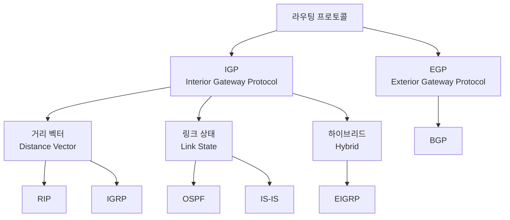
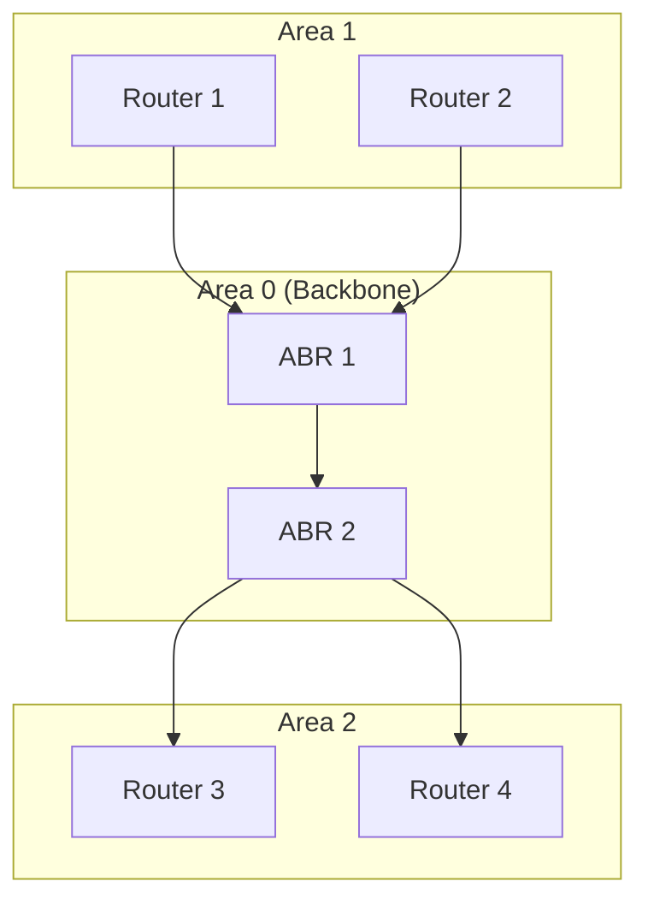
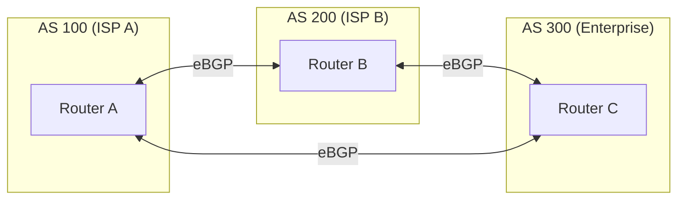

## 🌐 개요 (Overview)

라우팅 프로토콜은 라우터 간 경로 정보를 교환하여 **최적 경로를 자동으로 결정**하는 프로토콜입니다. AS(Autonomous System) 내부냐 외부냐에 따라 **IGP**와 **EGP**로 분류됩니다.

## 🏗️ 라우팅 프로토콜 분류

### IGP vs EGP

| 구분 | IGP | EGP |
|------|-----|-----|
| **범위** | AS 내부 | AS 간 |
| **예시** | RIP, OSPF, EIGRP | **BGP** |
| **관리** | 단일 조직 | 다른 조직 간 |

> **AS (Autonomous System)**: 동일한 라우팅 정책을 가진 네트워크의 집합 (예: ISP)

---

## 📏 거리 벡터 (Distance Vector)

### 특징

- 인접 라우터와 **주기적으로 라우팅 테이블 전체 교환**
- "목적지까지의 거리"와 "방향(Vector)"만 알음
- **전체 토폴로지를 모름**

### RIP (Routing Information Protocol)

**가장 오래된** 라우팅 프로토콜입니다.

| 항목 | 값 |
|------|-----|
| **메트릭** | Hop Count (홉 수) |
| **최대 홉** | 15 (16 = 도달 불가) |
| **갱신 주기** | 30초 |
| **포트** | UDP 520 |
| **AD 값** | 120 |

**한계**:
- 최대 15홉 → **대규모 망 사용 불가**
- 느린 수렴 (Convergence)
- 라우팅 루프 발생 가능

### RIP 루프 방지 기술

| 기술 | 설명 |
|------|------|
| **Split Horizon** | 경로를 받은 인터페이스로 다시 광고하지 않음 |
| **Route Poisoning** | 다운된 경로를 16(무한)으로 설정하여 광고 |
| **Poison Reverse** | 다운된 경로를 16으로 돌려보냄 |
| **Hold-down Timer** | 다운 경로 정보를 일정 시간 무시 |

### RIPv1 vs RIPv2

| 특성 | RIPv1 | RIPv2 |
|------|-------|-------|
| **VLSM** | 미지원 | **지원** |
| **인증** | 없음 | 지원 |
| **전송 방식** | 브로드캐스트 | 멀티캐스트 (224.0.0.9) |

---

## 🔗 링크 상태 (Link State)

### 특징

- 모든 라우터가 **네트워크 전체 토폴로지 맵** 보유
- **변화가 생길 때만** 정보 전파 (Triggered Update)
- 빠른 수렴, 루프 없음

### OSPF (Open Shortest Path First)

**대규모 네트워크**에 적합한 표준 프로토콜입니다.

| 항목 | 값 |
|------|-----|
| **알고리즘** | Dijkstra (SPF) |
| **메트릭** | Cost (대역폭 기반) |
| **전송** | 멀티캐스트 (224.0.0.5, 224.0.0.6) |
| **AD 값** | 110 |
| **프로토콜** | IP Protocol 89 |

**주요 특징**:
- **계층적 구조 (Area)**: Area 0 (Backbone) 필수
- 빠른 수렴 속도
- **VLSM/CIDR 지원**
- 인증 지원 (MD5)

### OSPF 라우터 유형

| 유형 | 설명 |
|------|------|
| **Internal Router** | 하나의 영역에만 속함 |
| **ABR (Area Border Router)** | 여러 영역 연결 |
| **ASBR (AS Boundary Router)** | 다른 AS와 연결 |
| **DR (Designated Router)** | 대표 라우터 (선출) |
| **BDR (Backup DR)** | 백업 대표 라우터 |

---

## 🔀 하이브리드 / 경로 벡터

### EIGRP (Enhanced Interior Gateway Routing Protocol)

**Cisco 전용** (현재 일부 개방)으로 거리 벡터 + 링크 상태의 장점을 결합했습니다.

| 항목 | 값 |
|------|-----|
| **알고리즘** | DUAL (Diffusing Update Algorithm) |
| **메트릭** | 대역폭, 지연, 신뢰성, 부하 등 복합 |
| **전송** | 멀티캐스트 (224.0.0.10) |
| **AD 값** | 90 (내부), 170 (외부) |

**장점**:
- 빠른 수렴 (DUAL 알고리즘)
- 루프 방지 보장
- 다양한 메트릭 사용

---

### BGP (Border Gateway Protocol)

**EGP의 대표 프로토콜**로, 서로 다른 **AS 간 라우팅**에 사용됩니다. 인터넷의 핵심 프로토콜입니다.

| 항목 | 값 |
|------|-----|
| **알고리즘** | Path Vector |
| **기준** | **정책 (Policy)** 기반 |
| **포트** | TCP 179 |
| **AD 값** | 20 (eBGP), 200 (iBGP) |

**특징**:
- 단순 속도보다 **관리자 정책**에 따라 경로 선택
- AS 경로 (AS Path) 정보 저장
- 매우 느린 수렴 (의도적)
- ISP, 대기업에서 사용

---

## 📊 라우팅 프로토콜 비교

| 프로토콜 | 유형 | 알고리즘 | 메트릭 | AD | 용도 |
|---------|------|----------|--------|:---:|------|
| **RIP** | 거리 벡터 | Bellman-Ford | Hop Count | 120 | 소규모 |
| **OSPF** | 링크 상태 | Dijkstra | Cost | 110 | 대규모 (IGP) |
| **EIGRP** | 하이브리드 | DUAL | 복합 | 90 | Cisco 환경 |
| **BGP** | 경로 벡터 | Path Vector | Policy | 20 | AS 간 |

---

## 📈 Administrative Distance (AD)

라우팅 소스의 **신뢰도**를 나타내며, 값이 **낮을수록 우선**합니다.

| 소스 | AD |
|------|:---:|
| **직접 연결** | 0 |
| **정적 라우팅** | 1 |
| eBGP | 20 |
| EIGRP (내부) | 90 |
| OSPF | 110 |
| IS-IS | 115 |
| RIP | 120 |
| EIGRP (외부) | 170 |
| iBGP | 200 |

## 🔗 연결 문서 (Related Documents)

- [[routing-basics]] - 라우팅 기초 개념
- [[ip-header-structure]] - IP 헤더와 TTL
- [[network-devices]] - 라우터와 네트워크 장비
- [[router-acl-security]] - 라우터 ACL 보안
