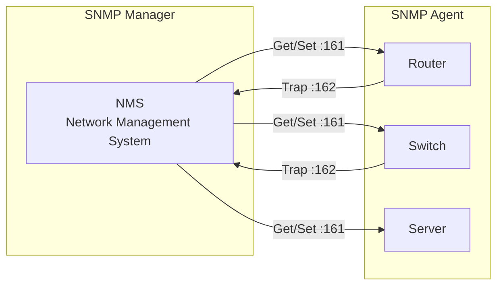

## 🌐 개요 (Overview)

**SNMP (Simple Network Management Protocol)** 는 네트워크 장비를 모니터링하고 관리하기 위한 프로토콜입니다.

## 📋 SNMP 포트

| 포트 | 용도 |
|:----:|------|
| **UDP 161** | 관리 요청 (Agent) |
| **UDP 162** | 트랩 알림 (Manager) |

---

## 🏗️ SNMP 구성 요소



| 구성 요소 | 역할 |
|----------|------|
| **Manager (NMS)** | 네트워크 관리 시스템, 에이전트에 요청 |
| **Agent** | 관리 대상 장비에서 실행, 정보 제공 |
| **MIB** | 관리 정보 베이스, 관리 가능한 객체 정의 |

---

## 📨 SNMP 메시지

| 메시지 | 방향 | 설명 |
|--------|------|------|
| **Get** | Manager → Agent | 특정 객체 값 요청 |
| **GetNext** | Manager → Agent | 다음 객체 값 요청 (트리 순회) |
| **GetBulk** | Manager → Agent | 다수 객체 일괄 요청 (v2c+) |
| **Set** | Manager → Agent | 객체 값 설정 |
| **Response** | Agent → Manager | 요청에 대한 응답 |
| **Trap** | Agent → Manager | 이벤트 알림 (비동기) |
| **Inform** | Agent → Manager | Trap + 확인응답 (v2c+) |

---

## 🔢 SNMP 버전 비교

| 특성 | SNMPv1 | SNMPv2c | **SNMPv3** |
|------|--------|---------|------------|
| **인증** | Community String | Community String | **사용자 기반 (USM)** |
| **암호화** | 없음 | 없음 | **지원 (DES, AES)** |
| **보안** | 취약 | 취약 | **강화** |
| **메시지** | Get, Set, Trap | + GetBulk, Inform | 동일 |

### Community String

SNMPv1/v2c에서 사용하는 **평문 비밀번호**입니다.

| 기본값 | 권한 |
|--------|------|
| **public** | 읽기 전용 (Read-Only) |
| **private** | 읽기/쓰기 (Read-Write) |

**⚠️ 보안 취약점**: Community String이 평문으로 전송되어 스니핑에 취약

---

## 📚 MIB (Management Information Base)

관리 가능한 객체들을 **트리 구조**로 정의한 데이터베이스입니다.

### OID (Object Identifier)

각 객체를 식별하는 **고유 번호**입니다.

```plaintext
OID 트리 구조:
iso(1).org(3).dod(6).internet(1).mgmt(2).mib-2(1).system(1)

예: 1.3.6.1.2.1.1.1.0 = sysDescr (시스템 설명)
```

### 주요 MIB 객체

| OID | 이름 | 설명 |
|-----|------|------|
| 1.3.6.1.2.1.1.1.0 | sysDescr | 시스템 설명 |
| 1.3.6.1.2.1.1.3.0 | sysUpTime | 가동 시간 |
| 1.3.6.1.2.1.1.4.0 | sysContact | 관리자 연락처 |
| 1.3.6.1.2.1.1.5.0 | sysName | 시스템 이름 |
| 1.3.6.1.2.1.2.2.1 | ifTable | 인터페이스 테이블 |

---

## 💡 실무 명령어

```bash
# snmpget - 단일 값 조회
snmpget -v2c -c public 192.168.1.1 sysDescr.0

# snmpwalk - 트리 순회
snmpwalk -v2c -c public 192.168.1.1 system

# snmpset - 값 설정
snmpset -v2c -c private 192.168.1.1 sysName.0 s "Router1"

# SNMPv3 조회 (인증+암호화)
snmpget -v3 -l authPriv -u admin -a SHA -A authpass -x AES -X privpass 192.168.1.1 sysDescr.0
```

---

## ⚠️ SNMP 보안

### 취약점

| 취약점 | 설명 |
|--------|------|
| **평문 인증** | v1/v2c의 Community String |
| **기본값 사용** | public/private 그대로 사용 |
| **정보 노출** | 네트워크 구성 정보 수집 |
| **설정 변경** | Set 권한으로 장비 조작 |

### 보안 권장사항

```plaintext
✅ DO
- SNMPv3 사용 (인증 + 암호화)
- Community String 변경
- ACL로 접근 제한
- 불필요시 SNMP 비활성화
- 읽기 전용 권한만 부여

❌ DON'T
- public/private 기본값 사용
- v1/v2c를 인터넷에 노출
- Write 권한 무분별 부여
```

---

## 🔧 SNMP 설정 예시 (Linux snmpd)

```bash
# /etc/snmp/snmpd.conf

# v2c 설정 (보안 취약)
rocommunity MyReadOnly 192.168.1.0/24
rwcommunity MyReadWrite 192.168.1.100

# v3 설정 (권장)
createUser admin SHA authpass AES privpass
rouser admin priv
```

## 🔗 연결 문서 (Related Documents)

- [[osi-7-layer-model]] - OSI 7계층 (응용 계층)
- [[tcp-udp-protocols]] - UDP 프로토콜
- [[firewall-ids-ips]] - 네트워크 보안
- [[linux-log-management]] - 서버 모니터링
