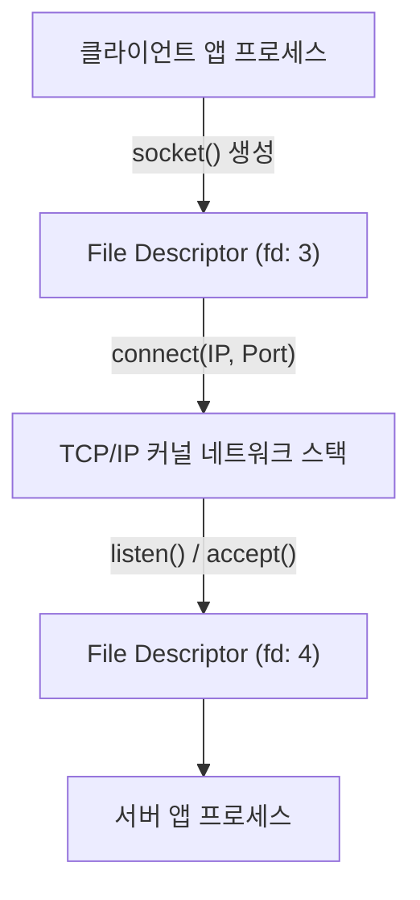

# Socket (네트워크 소켓 & 통신 엔드포인트)

## 1. 개요 (Overview)

**Socket (소켓)** 은 네트워크 상에서 서로 다른 두 호스트 프로세스가 데이터 패킷을 주고받기 위한 **양방향 통신 엔드포인트(Endpoint)의 추상화된 추상체**이다.

Linux 및 Unix 운영체제에서는 **"Everything is a File"** 원칙에 따라 소켓 또한 커널의 **파일 디스크립터(File Descriptor - FD)** 로 관리되며, [시스템 콜](../operating-systems/system-call.md)인 `socket()`, `bind()`, `connect()`, `send()`, `recv()` 를 통해 조작된다.

---

### 초보자를 위한 쉽게 이해하는 비유

* **소켓 (건물 벽에 설치된 220V 전원 플러그 콘센트)**:
  - 전선(IP/포트)을 연결하여 전기(데이터 패킷)를 흘려보내기 위해 벽(프로세스 엔드포인트)에 설치하는 표준 접속 꽂이 구멍(소켓).



---

## 2. 소켓의 3대 구 구성 요소

1. **IP 주소**: 목적지 호스트 기기 식별자.
2. **전송 프로토콜**: TCP (신뢰성 연결) 또는 UDP (고속 비연결).
3. **포트 번호 (Port Number)**: 해당 호스트 내 특정 응용 프로그램 구분자.

---

## 3. 관측 가능 증거 및 Linux CLI 명령어

Linux 및 Android 터미널에서 열려 있는 소켓 및 소켓 파일 디스크립터 상태를 `ss` 또는 `netstat` 으로 관측할 수 있다:

```bash
# 로컬에 열려 있는 모든 TCP/UDP 소켓 및 연결 프로세스 조회
ss -tulpn
```

---

## 4. 연결 문서 (Related Links)

- [시스템 콜 (System Call)](../operating-systems/system-call.md) - socket(), bind() 커널 요청
- [Linux 커널](../../operating-systems/linux-kernel.md) - 소켓 파일 디스크립터 관리 커널
- [eBPF 커널 런타임 엔진](../operating-systems/ebpf.md) - sock_ops / skb 소켓 트래픽 감시
- [DNS-over-TLS (DoT)](dns-over-tls-dot.md) - TLS 암호화 소켓 DNS 통신
