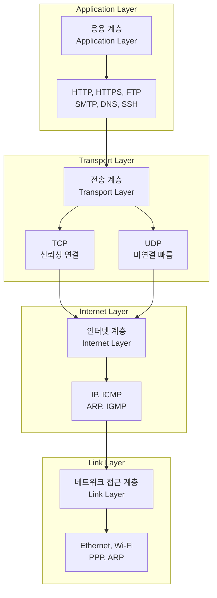
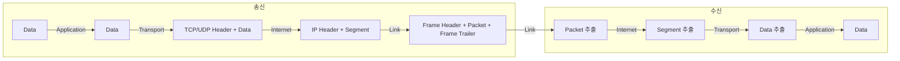
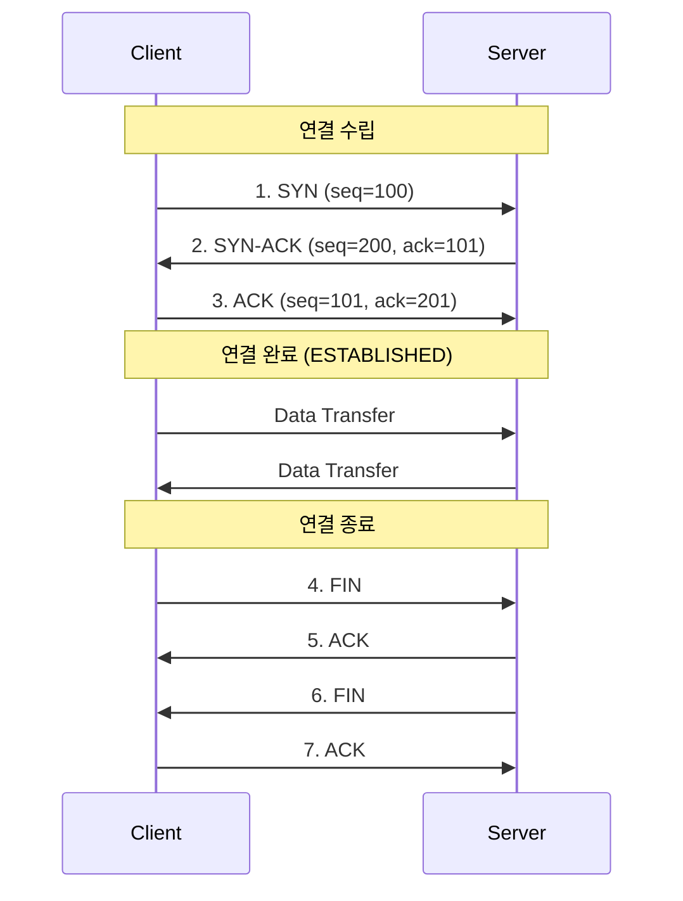

## 🌐개요 (Overview)

**TCP/IP 모델**은 인터넷 통신의 기반이 되는 프로토콜 모음(Protocol Suite)입니다. 1970년대 DARPA(미국 국방부 고등연구계획국)에서 개발한 ARPANET에서 시작되었으며, 현재 인터넷의 표준 통신 프로토콜입니다.

## 🏗️ TCP/IP 4계층 모델 (4-Layer Model)



### 계층별 상세 설명

#### 1. 응용 계층 (Application Layer)
사용자와 직접 상호작용하는 애플리케이션 프로토콜 계층입니다.

**주요 프로토콜**:
- **HTTP/HTTPS** (80/443): 웹 브라우징
- **FTP** (20/21): 파일 전송
- **SMTP** (25): 이메일 전송
- **POP3/IMAP** (110/143): 이메일 수신
- **[[dns-fundamentals|DNS]]** (53): 도메인 이름 해석
- **SSH** (22): 안전한 원격 접속
- **Telnet** (23): 원격 터미널 (비보안)

**역할**:
- 사용자 데이터 포맷팅
- 애플리케이션 간 통신 규약 정의
- 데이터 인코딩/디코딩

#### 2. 전송 계층 (Transport Layer)
end-to-end 통신을 담당하며, 데이터 전송의 신뢰성을 제공합니다.

**TCP (Transmission Control Protocol)**:
- ✅ 연결 지향 (Connection-oriented)
- ✅ 신뢰성 보장 (재전송, 순서 보장)
- ✅ 흐름 제어, 혼잡 제어
- ❌ 오버헤드로 인한 속도 저하
- **사용 예**: 웹, 이메일, 파일 전송

**UDP (User Datagram Protocol)**:
- ✅ 비연결 (Connectionless)
- ✅ 빠른 속도, 낮은 오버헤드
- ❌ 신뢰성 보장 없음 (패킷 손실 가능)
- ❌ 순서 보장 없음
- **사용 예**: 스트리밍, VoIP, DNS, DHCP

**포트 번호**:
- 0-1023: Well-known ports (HTTP: 80, HTTPS: 443)
- 1024-49151: Registered ports
- 49152-65535: Dynamic ports

#### 3. 인터넷 계층 (Internet Layer)
네트워크 간 [[routing-basics|라우팅]]과 [[ip-addressing|주소 지정]]을 담당합니다.

**IP (Internet Protocol)**:
- **IPv4**: 32비트 주소 (예: 192.168.1.100)
- **IPv6**: 128비트 주소 (예: 2001:db8::1)
- **기능**: 패킷 라우팅, 단편화/재조립
- **비연결, 비신뢰성**: Best-effort delivery

**ICMP (Internet Control Message Protocol)**:
- 에러 보고 및 진단
- `ping`, `traceroute` 명령어 사용

**ARP (Address Resolution Protocol)**:
- IP 주소 → MAC 주소 변환
- 로컬 네트워크에서 사용

#### 4. 네트워크 접근 계층 (Link Layer)
물리적 네트워크를 통한 데이터 전송을 담당합니다.

**데이터 링크 계층**:
- **Ethernet**: 유선 LAN 표준
- **Wi-Fi (IEEE 802.11)**: 무선 LAN
- **PPP**: Point-to-Point Protocol

**물리 계층**:
- 전기 신호, 광신호로 변환
- 케이블, 스위치, 허브

## 🆚 OSI 7계층 vs TCP/IP 4계층

| OSI 모델 | TCP/IP 모델 | 설명 |
|----------|-------------|------|
| 7. 응용 (Application) | 응용 (Application) | HTTP, FTP, DNS 등 |
| 6. 표현 (Presentation) | ↑ | 데이터 인코딩, 암호화 |
| 5. 세션 (Session) | ↑ | 세션 관리 |
| 4. 전송 (Transport) | 전송 (Transport) | TCP, UDP |
| 3. 네트워크 (Network) | 인터넷 (Internet) | IP, ICMP, ARP |
| 2. 데이터 링크 (Data Link) | 네트워크 접근 (Link) | Ethernet, Wi-Fi |
| 1. 물리 (Physical) | ↑ | 하드웨어 |

**차이점**:
- **OSI**: 이론적 모델, 7계층
- **TCP/IP**: 실무 사용, 4계층
- TCP/IP의 응용 계층이 OSI의 5~7계층을 포함

## 📦 데이터 캡슐화 (Data Encapsulation)



**각 계층에서의 명칭**:
- **응용 계층**: Data / Message
- **전송 계층**: Segment (TCP) / Datagram (UDP)
- **인터넷 계층**: Packet
- **링크 계층**: Frame

## 🔍 TCP 3-Way Handshake



## 🌍 IoT와 TCP/IP

[[IPv6|IPv6]]는 IoT 환경의 필수 요소입니다:
- **주소 고갈 해결**: 340조 개 이상의 주소
- **자동 구성 (SLAAC)**: DHCP 없이 주소 할당
- **경량화**: [[6LoWPAN]] 등으로 저전력 무선 네트워크 지원

**IoT 프로토콜 스택**:

```plaintext
Matter/Thread (응용)
    ↓
IPv6 (인터넷)
    ↓
6LoWPAN (압축)
    ↓
IEEE 802.15.4 (링크)
```

## 💡 실무 활용 (Practical Usage)

### 패킷 분석

```bash
# TCP 패킷 캡처
sudo tcpdump -i eth0 tcp port 80

# HTTP 요청 확인
sudo tcpdump -i eth0 -A 'tcp port 80'

# ping (ICMP)
ping 8.8.8.8

# traceroute (ICMP/UDP)
traceroute google.com
```

### 네트워크 연결 확인

```bash
# TCP 연결 상태
netstat -tan
ss -tan

# UDP 리스닝 포트
netstat -uan
ss-uan
```

### 포트 스캔

```bash
# nmap으로 열린 포트 확인
nmap -sT 192.168.1.100  # TCP scan
nmap -sU 192.168.1.100  # UDP scan
```

## 🔗 연결 문서 (Related Documents)

- [[ip-addressing]] - IP 주소 체계와 서브넷
- [[dns-fundamentals]] - DNS 프로토콜
- [[routing-basics]] - IP 라우팅 개념
- [[IPv6]] - IPv6 상세 설명
- [[6LoWPAN]] - IoT를 위한 IPv6 압축
