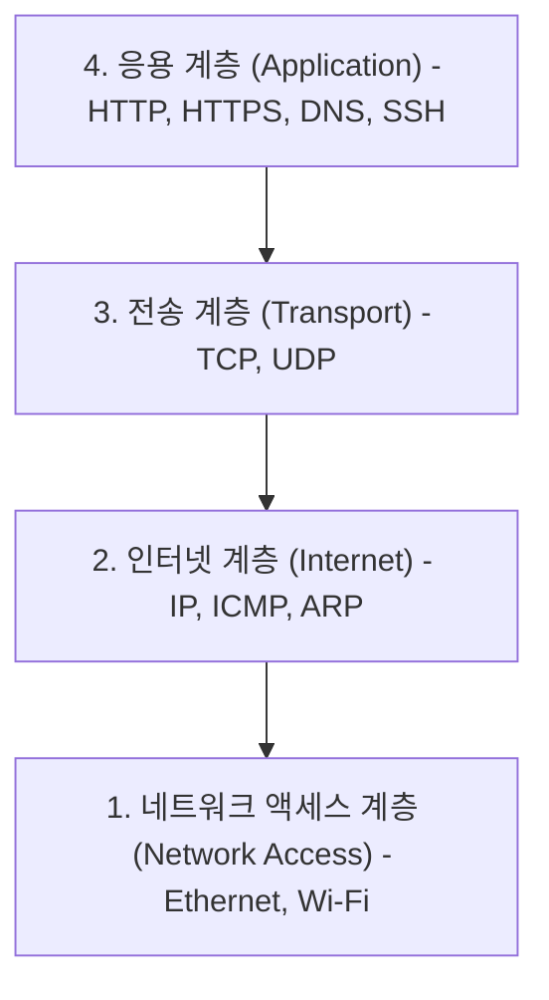

# TCP/IP 모델 (TCP/IP 4계층 아키텍처)

## 1. 개요 (Overview)

**TCP/IP 모델 (TCP/IP 4-Layer Model)** 은 전 세계 모든 컴퓨터가 인터넷 상에서 서로 데이터를 주고받을 수 있도록 만든 **실제 인터넷의 실용 통신 아키텍처 표준**이다.

이론적인 [OSI 7계층 모델](osi-7-layer-model.md)과 달리 실제 소프트웨어(웹 브라우저, OS 커널, 랜카드)로 작동하도록 단순화되어 구현되었다.

---

### 초보자를 위한 쉽게 이해하는 비유

* **응용 계층 (Application)**: 사용자가 보는 **편지 내용과 봉투** (웹 페이지, 이메일)
* **전송 계층 (Transport)**: 우체부의 **배달 규칙** (등기우편 [TCP](tcp-udp-protocols.md) vs 일반투척 [UDP](tcp-udp-protocols.md))
* **인터넷 계층 (Internet)**: 편지 봉투에 적힌 **도로명 주소** (IP 주소)
* **네트워크 액세스 계층 (Network Access)**: 편지를 실어 나르는 **우체국 트럭과 도로** (랜선, Wi-Fi 신호)

---

## 2. TCP/IP 4계층 구조와 역할

```mermaid
graph TD
    App["4. 응용 계층 (Application) - HTTP, HTTPS, DNS, SSH"] --> Trans["3. 전송 계층 (Transport) - TCP, UDP"]
    Trans --> Inet["2. 인터넷 계층 (Internet) - IP, ICMP, ARP"]
    Inet --> NetAccess["1. 네트워크 액세스 계층 (Network Access) - Ethernet, Wi-Fi"]
```

1. **4계층 - 응용 계층 (Application Layer)**:
   - 사용자가 직접 사용하는 웹 브라우저나 앱이 통신하는 계층 (`HTTP`, `HTTPS`, `DNS`, `FTP`, `SMTP`).
2. **3계층 - 전송 계층 (Transport Layer)**:
   - 데이터 전송의 신뢰성과 속도를 관리하는 계층 ([TCP](tcp-udp-protocols.md), [UDP](tcp-udp-protocols.md)).
3. **2계층 - 인터넷 계층 (Internet Layer)**:
   - 데이터 패킷이 어떤 경로를 통해 목적지 컴퓨터까지 가야 하는지 라우팅하는 계층 (`IP`, `ICMP`, `ARP`).
4. **1계층 - 네트워크 액세스 계층 (Network Access Layer)**:
   - 물리적인 랜선, 광케이블, Wi-Fi 전파를 통해 0과 1의 전기 신호를 전달하는 계층 (`Ethernet`, `MAC Address`).

---

## 3. OSI 7계층과의 비교

TCP/IP 4계층과 학술적 [OSI 7계층 모델](osi-7-layer-model.md) 간의 계층 매핑 및 세부 차이점 비교표는 독립된 [OSI 7계층 vs TCP/IP 4계층 비교 문서](osi-vs-tcpip.md)를 참고한다.

---

## 4. 연결 문서 (Related Links)

- [OSI 7계층 vs TCP/IP 4계층 비교](osi-vs-tcpip.md) - 이론적 OSI 모델과 실용적 TCP/IP 모델 세부 비교
- [OSI 7계층 모델](osi-7-layer-model.md) - 학술 표준 OSI 7계층 구조
- [TCP & UDP 프로토콜](tcp-udp-protocols.md) - 전송 계층을 담당하는 두 핵심 프로토콜
