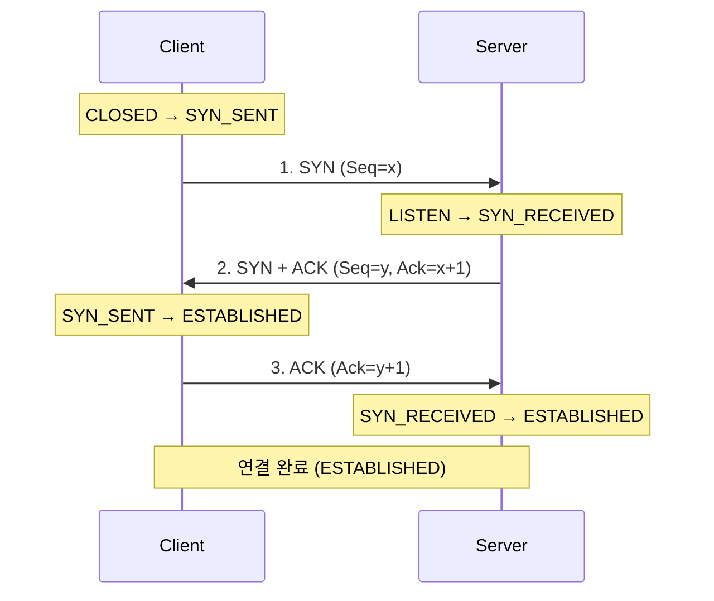
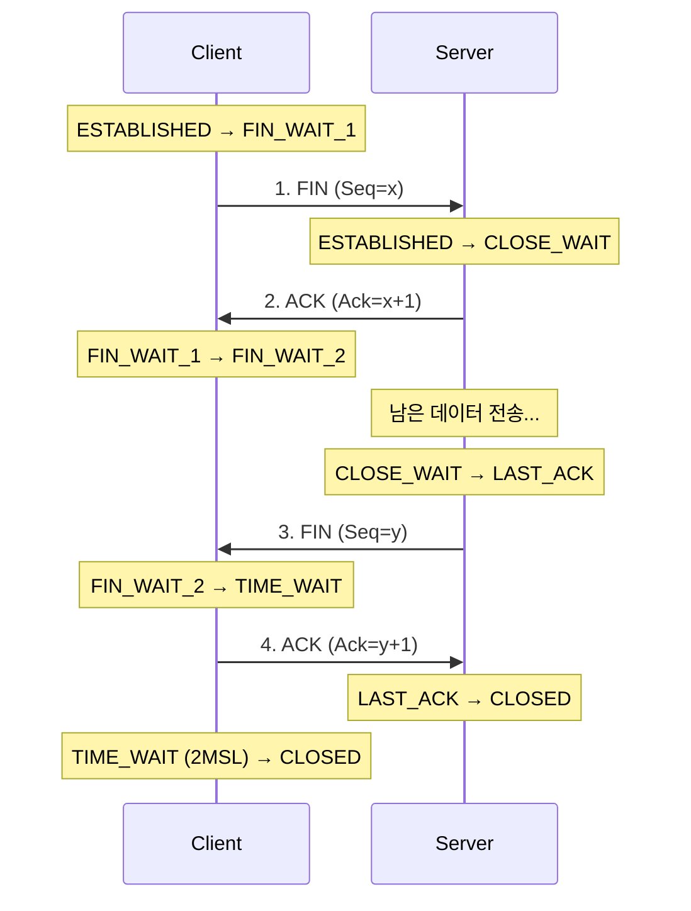

## 🌐 개요 (Overview)

전송 계층의 핵심 프로토콜인 **TCP**와 **UDP**의 헤더 구조, 플래그, 연결 제어 메커니즘을 상세히 다룹니다.

## 📦 TCP (Transmission Control Protocol)

**연결 지향적**이고 **신뢰성 있는** 전송을 보장합니다.

### TCP 헤더 구조 (20~60 Bytes)

```plaintext
 0                   1                   2                   3
 0 1 2 3 4 5 6 7 8 9 0 1 2 3 4 5 6 7 8 9 0 1 2 3 4 5 6 7 8 9 0 1
+-+-+-+-+-+-+-+-+-+-+-+-+-+-+-+-+-+-+-+-+-+-+-+-+-+-+-+-+-+-+-+-+
|          Source Port (16)     |      Destination Port (16)    |
+-+-+-+-+-+-+-+-+-+-+-+-+-+-+-+-+-+-+-+-+-+-+-+-+-+-+-+-+-+-+-+-+
|                    Sequence Number (32)                       |
+-+-+-+-+-+-+-+-+-+-+-+-+-+-+-+-+-+-+-+-+-+-+-+-+-+-+-+-+-+-+-+-+
|                 Acknowledgment Number (32)                    |
+-+-+-+-+-+-+-+-+-+-+-+-+-+-+-+-+-+-+-+-+-+-+-+-+-+-+-+-+-+-+-+-+
| Offset| Res |U|A|P|R|S|F|          Window Size (16)           |
+-+-+-+-+-+-+-+-+-+-+-+-+-+-+-+-+-+-+-+-+-+-+-+-+-+-+-+-+-+-+-+-+
|         Checksum (16)         |       Urgent Pointer (16)     |
+-+-+-+-+-+-+-+-+-+-+-+-+-+-+-+-+-+-+-+-+-+-+-+-+-+-+-+-+-+-+-+-+
|                    Options (가변, 0~40 bytes)                  |
+-+-+-+-+-+-+-+-+-+-+-+-+-+-+-+-+-+-+-+-+-+-+-+-+-+-+-+-+-+-+-+-+
```

### 필드별 설명

| 필드 | 크기 | 설명 |
|------|------|------|
| **Source Port** | 16 bit | 출발지 포트 번호 |
| **Destination Port** | 16 bit | 목적지 포트 번호 |
| **Sequence Number** | 32 bit | 데이터의 순서 번호 (바이트 단위) |
| **Acknowledgment Number** | 32 bit | 다음에 받을 것으로 기대되는 바이트 번호 |
| **Data Offset (Header Length)** | 4 bit | 헤더 길이 (4 byte 단위) |
| **Flags (Control Bits)** | 6 bit | 제어 플래그 |
| **Window Size** | 16 bit | 수신 버퍼의 여유 공간 (흐름 제어) |
| **Checksum** | 16 bit | 오류 검사 |
| **Urgent Pointer** | 16 bit | URG 플래그 시 긴급 데이터 위치 |

---

### TCP 플래그 (Control Bits)

```plaintext
 0   1   2   3   4   5
+---+---+---+---+---+---+
|URG|ACK|PSH|RST|SYN|FIN|
+---+---+---+---+---+---+
```

| 플래그 | 이름 | 설명 |
|--------|------|------|
| **URG** | Urgent | 긴급 데이터 포인터 유효 |
| **ACK** | Acknowledgment | 확인응답 필드 유효 |
| **PSH** | Push | 버퍼링 없이 즉시 상위 계층으로 전달 |
| **RST** | Reset | 연결 강제 재설정 |
| **SYN** | Synchronize | **연결 요청** (동기화) |
| **FIN** | Finish | **연결 종료 요청** |

> **💡 암기**: `UAPRSF` → "**U**nder **A**ny **P**ressure, **R**estart **S**ystem **F**ast"

---

### 3-Way Handshake (연결 수립)



**단계별 설명**:
1. **SYN**: 클라이언트가 서버에 연결 요청 (Seq=x)
2. **SYN+ACK**: 서버가 요청 수락 및 자신도 연결 요청 (Seq=y, Ack=x+1)
3. **ACK**: 클라이언트가 확인응답 (Ack=y+1)

---

### 4-Way Handshake (연결 종료)



**단계별 설명**:
1. **FIN**: 클라이언트가 종료 요청
2. **ACK**: 서버가 확인 (데이터 전송 완료까지 대기)
3. **FIN**: 서버가 종료 요청
4. **ACK**: 클라이언트가 확인 후 TIME_WAIT 상태 진입

> **TIME_WAIT**: 지연된 패킷 처리를 위해 2MSL (Maximum Segment Lifetime) 동안 대기

---

### TCP 상태 전이

| 상태 | 설명 |
|------|------|
| **CLOSED** | 연결 없음 |
| **LISTEN** | 연결 대기 (서버) |
| **SYN_SENT** | SYN 전송 후 응답 대기 |
| **SYN_RECEIVED** | SYN 수신, SYN+ACK 전송 |
| **ESTABLISHED** | 연결 수립됨 |
| **FIN_WAIT_1** | FIN 전송 후 ACK 대기 |
| **FIN_WAIT_2** | ACK 수신, FIN 대기 |
| **CLOSE_WAIT** | FIN 수신, ACK 전송 |
| **LAST_ACK** | FIN 전송, ACK 대기 |
| **TIME_WAIT** | 마지막 ACK 전송, 2MSL 대기 |

---

## 📦 UDP (User Datagram Protocol)

**비연결형**, **비신뢰성** 프로토콜로 속도가 빠르고 오버헤드가 적습니다.

### UDP 헤더 구조 (고정 8 Bytes)

```plaintext
 0                   1                   2                   3
 0 1 2 3 4 5 6 7 8 9 0 1 2 3 4 5 6 7 8 9 0 1 2 3 4 5 6 7 8 9 0 1
+-+-+-+-+-+-+-+-+-+-+-+-+-+-+-+-+-+-+-+-+-+-+-+-+-+-+-+-+-+-+-+-+
|          Source Port (16)     |      Destination Port (16)    |
+-+-+-+-+-+-+-+-+-+-+-+-+-+-+-+-+-+-+-+-+-+-+-+-+-+-+-+-+-+-+-+-+
|            Length (16)        |          Checksum (16)        |
+-+-+-+-+-+-+-+-+-+-+-+-+-+-+-+-+-+-+-+-+-+-+-+-+-+-+-+-+-+-+-+-+
```

### 필드별 설명

| 필드 | 크기 | 설명 |
|------|------|------|
| **Source Port** | 16 bit | 출발지 포트 |
| **Destination Port** | 16 bit | 목적지 포트 |
| **Length** | 16 bit | 헤더 + 데이터 길이 |
| **Checksum** | 16 bit | 오류 검사 (선택) |

---

## 🆚 TCP vs UDP 비교

| 특성 | TCP | UDP |
|------|-----|-----|
| **연결 방식** | 연결 지향 (Connection-oriented) | 비연결 (Connectionless) |
| **신뢰성** | 보장 (재전송, 순서 보장) | 보장 안 함 |
| **흐름 제어** | 있음 (Sliding Window) | 없음 |
| **혼잡 제어** | 있음 | 없음 |
| **헤더 크기** | 20~60 bytes | **8 bytes** |
| **속도** | 느림 | **빠름** |
| **사용 예** | 웹, 이메일, 파일 | 스트리밍, VoIP, DNS |

---

## 🔢 주요 포트 번호

| 포트 | 프로토콜 | 서비스 |
|:----:|:--------:|--------|
| 20 | TCP | FTP (데이터) |
| 21 | TCP | FTP (제어) |
| 22 | TCP | **SSH** |
| 23 | TCP | Telnet |
| 25 | TCP | **SMTP** |
| 53 | TCP/UDP | **DNS** |
| 67/68 | UDP | **DHCP** |
| 80 | TCP | **HTTP** |
| 110 | TCP | POP3 |
| 143 | TCP | IMAP |
| 161/162 | UDP | **SNMP** |
| 443 | TCP | **HTTPS** |

---

## 💡 실무 명령어

```bash
# TCP 연결 상태 확인
netstat -tan
ss -tan

# 특정 포트 리스닝 확인
netstat -tlnp | grep :80
ss -tlnp | grep :80

# 3-Way Handshake 확인 (tcpdump)
sudo tcpdump -i eth0 'tcp[tcpflags] & (tcp-syn|tcp-ack) != 0'

# TCP 패킷 캡처
sudo tcpdump -i eth0 -c 10 tcp port 80
```

## 🔗 연결 문서 (Rellated Documents)

- [[osi-7-layer-model]] - OSI 7 계층 모델
- [[ip-header-structure]] - IP 헤더 구조
- [[icmp-protocol]] - ICMP 프로토콜
- [[network-security-protocols]] - 보안 프로토콜 (TLS/SSL)
