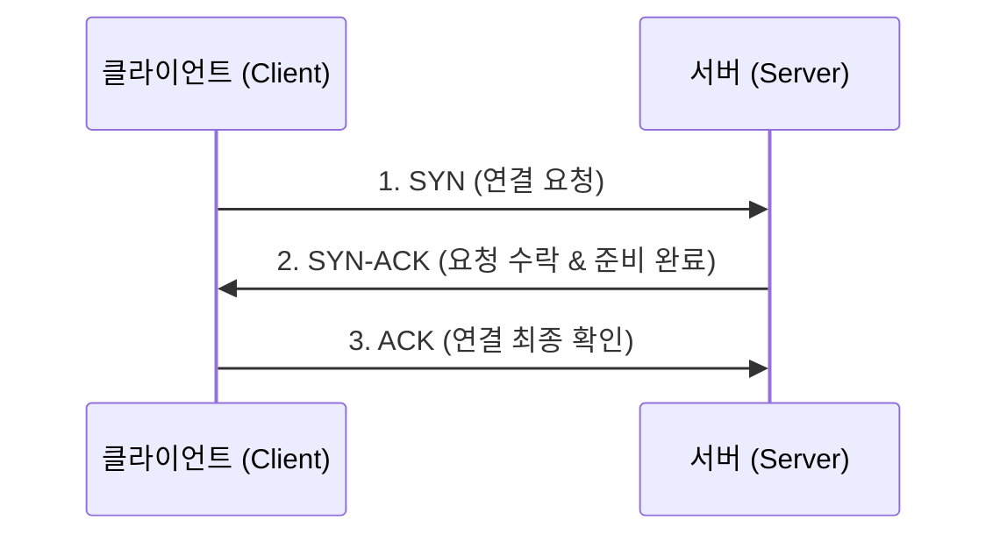

# TCP & UDP 프로토콜 (전송 계층 프로토콜)

## 1. 개요 (Overview)

**TCP (Transmission Control Protocol)** 와 **UDP (User Datagram Protocol)** 는 컴퓨터 네트워크의 **전송 계층(Transport Layer)** 에 위치하여, 송신측 프로세스와 수신측 프로세스 간의 데이터 전송을 담당하는 두 핵심 네트워크 프로토콜이다.

IP(Internet Protocol) 주소가 디바이스(컴퓨터)의 위치를 나타낸다면, TCP와 UDP 는 디바이스 내의 어떤 애플리케이션(포트 번호, Port)으로 데이터를 전달해야 하는지 경로를 지정한다.

---

### 초보자를 위한 쉽게 이해하는 비유

* **IP 주소**: 아파트 건물 주소 (예: 서울시 강남구 테헤란로 123)
* **포트 번호 (Port)**: 아파트 동/호수 (예: 101동 502호)
* **TCP / UDP**: 우체부가 우편물을 배달할 때 쓰는 **배달 방식 (등기우편 vs 전단지 던지기)**

---

## 2. TCP (Transmission Control Protocol) 핵심 메커니즘

TCP 는 **신뢰성 있는 데이터 전송**을 최우선으로 보장한다.

### 1) 3-Way Handshake (연결 수립)
데이터를 주고받기 전 송신자와 수신자가 상대방의 수신 준비 상태를 3단계로 검증한다.

```mermaid
sequenceDiagram
    participant Client as 클라이언트 (Client)
    participant Server as 서버 (Server)
    Client->>Server: 1. SYN (연결 요청)
    Server->>Client: 2. SYN-ACK (요청 수락 & 준비 완료)
    Client->>Server: 3. ACK (연결 최종 확인)
```

### 2) 흐름 제어 및 혼잡 제어 (Flow & Congestion Control)
- **Sliding Window**: 수신자의 메모리 버퍼 용량에 맞춰 데이터 송신량을 조절한다.
- **손실 재전송**: 중간에 유실된 데이터 패킷을 감지하면 수신자가 받지 못했음을 알리고 **즉시 재전송**한다.

---

## 3. UDP (User Datagram Protocol) 핵심 메커니즘

UDP 는 연결 수립이나 손실 재전송 절차 없이 **최소한의 오버헤드로 빠르고 단순하게 패킷(Datagram)을 던지는 프로토콜**이다.

- **체크섬(Checksum)** 외에 순서 제어나 오류 복구 메커니즘이 전혀 없다.
- 속도가 극도로 중요하고 약간의 데이터 손실(화면 깍두기 현상)을 감수할 수 있는 실시간 비디오 스트리밍, 온라인 게임, VoIP 통화에 주로 쓰인다.

---

## 4. TCP 와 UDP 의 상세 기술 비교

TCP 와 UDP 간의 속도, 헤더 구조 및 신뢰성 비교표는 독립된 [TCP vs UDP 비교 문서](tcp-vs-udp.md)를 참고한다.

---

## 5. 연결 문서 (Related Links)

- [TCP vs UDP 비교](tcp-vs-udp.md) - TCP 와 UDP 의 신뢰성, 속도, 헤더 비교표
- [OSI 7계층 vs TCP/IP 4계층](osi-vs-tcpip.md) - 전송 계층이 포함된 네트워크 아키텍처 모델
